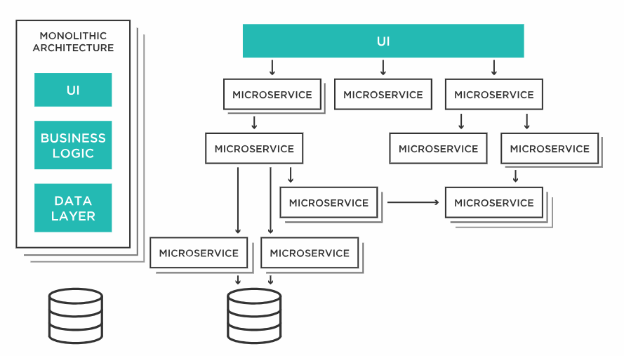

# Microservices
微服務架構是一種可將應用程式拆解成細項服務的技術，各項服務則執行某些具體的業務功能。這些服務通常為「鬆散耦合」，可以日後獨立進行建置、部署和擴充。

每個服務都是通過標準化的應用程式介面(API)與其他服務溝通，因此這些服務能夠以不同的語言或技術編寫，這與建置成單體結構的系統完全不同，單體結構中的各項服務不可分割、相互連結、只能一起調整。

微型服務架構優勢
1. 加快上市時間：各項服務皆可獨立部署，促使團隊可在小型簡易的環境中快速擴展新功能，以敏捷方式研發應用程式，加快產品或服務上市時間，提高客戶滿意度。
2. 故障風險降低：各區塊彼此獨立、互不影響，因此較不容易發生整個應用程式出現失敗或錯誤的情形，若是其中一項服務出現問題，並不會影響到其他功能或整體運作，只要針對故障的服務區塊進行修復，即能快速恢復正常運作，不必擔心服務有停擺的風險。
3. 有利於擴展、開發：可針對個別服務進行獨立更新或擴增新功能，讓開發人員可以不需要再像傳統的單體式應用必須擴充整個應用程式，而是可以更精確地只擴充有需要的元件，將更易於開發、維護和部署。

微服務是一種軟體開發架構，藉由模組化的方式，組成一個複雜的應用程式，而微服務這樣的設計模式正好與容器技術（Container）不謀而合。

藉由容器輕量化的優勢，將微服務依據功能拆解成獨立元件，放置在各個容器中，打造獨立自主的執行環境，並得以降低服務彼此之間的耦合性（Coupling），減少模組之間的依賴程度。此外，在使用微服務架構時，運用容器的 Auto-Scaling（自動擴增）技術，能更準確地針對較為消耗資源的服務做擴展。

微服務架構內各項服務可由不同的人員開發，一但開發完成即進行自動化的整合與部署。因此，基於微服務鬆散耦合狀態，在部署過程中，則通常需要 DevOps 開發維運的程序支援，以整合內部技術、資源及專業人才，有效減少開發服務所需要的時程。