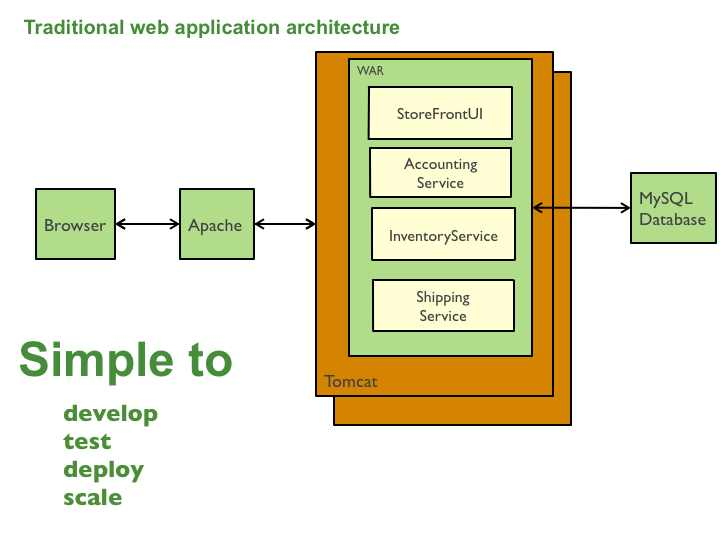

# Monolithic Apps
單體架構（Monolithic Architecture）是一種將所有功能打包在一個容器中運行的設計風格，一個實例中集成了一個系統的所有功能。通過負載均衡軟件/設備實現多實例調用。

這個架構擁有以下優勢：
* 易於開發：當前開發工具與IDE的設計目標即在於支持單體應用的開發。
* 易於部署：你只需要將該WAR（或者目錄層級）部署在合適的運行環境中即可。
* 易於擴展：你可以在負載均衡器後面運行多個應用副本實現擴展。

然而，一旦應用變大、團隊擴大，這種方案的弊端將會變得愈發明顯：
* 巨大的代碼庫可能會讓人望而生畏，特別是對那些團隊新成員來說。應用難以被理解和進行修改，進而導致開發速度減慢。由於沒有清晰的模塊邊界，模塊化會逐漸消失。
* 過載的IDE：代碼庫越大，IDE速度越慢，開發者的生產效率越低。
* 過載的Web容器：應用越大，Web容器啟動時間越長。容器啟動耗費時間，極大影響到開發者的生產效率。對部署工作也有負面影響。
* 持續部署困難：巨大的單體應用本身就是頻繁部署的一大障礙。為了更新一個組件，你必須重新部署整個應用。這會中斷那些可能與更改無關的後台任務（例如Java應用中的Quartz任務）。另外，未被更新的組件有可能無法正常啟動。
* 應用擴展困難：單體應用只能作為一個整體進行擴展，無法根據業務模塊的需要進行伸縮。例如，應用中有的模塊是計算密集型的，它需要強勁的CPU； 有的模塊則是IO密集型的，需要更大的內存。 由於這些模塊部署在一起，不得不在硬件的選擇上做出妥協。
* 難於進行規模化開發：單體應用是規模化開發的障礙。應用一旦達到特定規模，需要將現有組織拆分成多個團隊，每個團隊負責不同的功能模塊。舉例來說，我們可能需要設立UI團隊、會計團隊、庫存團隊等等。單體應用的問題在於它使團隊無法獨立展開工作。團隊需要在工作進度和重新部署上進行協調。
* 需要長期關注同一套技術棧：單體架構迫使我們長期使用在開發初期選定的技術堆棧（在某些情況下，可能是某些技術的特定版本）。另外，如果大家所使用的應用平台框架已經過時，那麽我們將很難將應用遷移到其它更新並且更完善的框架當中。