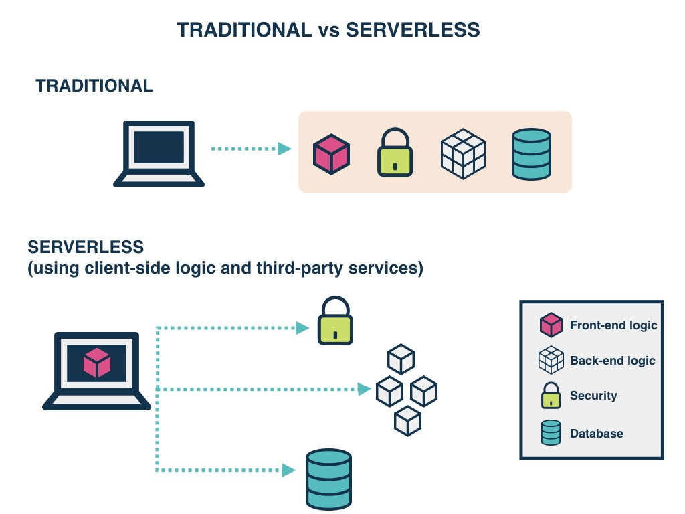

# Serverless
無伺服器運算，然而Serverless 不是不再需要伺服器，而是公司或開發者不用過多考慮伺服器的問題，運算資源僅作為一種服務而不再以物理硬體的形式出現。

免除公司和開發者對伺服器維護的麻煩，因此也不用考慮DevOps 了。公司和開發者只需關注應用的開發和運維即可，因此Serverless 可以在更大程度上節約運維的成本。

舉例來說，以前要建置一個小爬蟲機器，去抓一些定時獲取的資訊。在沒有Serverless 的情況下，會需要在AWS EC2 建置一個instance 然後用Cron Jobs 定期的去獲取資料存到例如S3 或是資料夾中。但這個時候就出現一個問題，你只是要跑一個簡單的爬蟲，就需要一直持續維護一整台EC2，而且不論你有沒有執行這段程式碼都需要收錢。

Serverless 可以讓你不需要再額外架設一個全新的伺服器，而是寫一個 Function 就能夠去定期執行或是轉變成一個API 達到同樣的應用，只有執行的時候才需要收費。

主要的優勢：
* 價格：最大的一項 Serverless 優勢就是價格，因為他只有在觸發的時候才會收費，所以不會有伺服器運算的浪費。
* 減少維護成本：以前需要一個後端工程師去維護伺服器，現在有了 Serverless 的架構可以完全不需要後端工程師的維護成本。
* 可擴充性：使用 Serverless 他會自己自動的擴充到他所需要的 RAM。
* 加速產品開發：由於部署以及撰寫程式碼的流程可以大大減少，加速產品開發
* 安全性：不需要顧慮伺服器整體的安全性，只需要管理好每個 Serverless function 的應用問題。

缺點：
* 綁在雲端供應商環境：由於目前 Serverless 框架都需要仰賴雲端供應商所建置的環境，所以當他們有 API 改變或是應用越來越複雜時可能 Serverless 就不敷使用。
* 價格問題：雲端供應商未來價格可能會異動等問題。
* 效能問題：由於 Serverless 可能會有 cold start 的問題，也就是說當函數在被調用時，一般 Serverless 是在多個 micro-containers 去做管理，當一個呼叫進來的時候函數會去查看有無容器可以執行這個函數。如果有可以用的容器 (warm) 他就會執行，如果沒有他會重新開啟一台容器，此時就叫做 cold start。這會有延遲時間的問題。