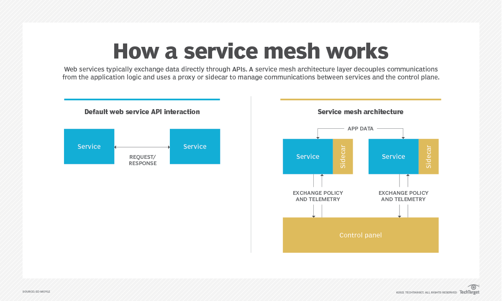

# Service Mesh
service mesh（服務網格）是一個專用的基礎設施層，用於控制網絡上的服務到服務通信。此方法使應用程式的不同部分能夠相互通信。service mesh 通常與基於雲的應用程式、容器和微服務一起出現。

service mesh 控制應用程式中服務請求的交付。提供的常見功能包括服務發現、負載平衡、加密和故障恢復。通過使用由API 而非硬件控制的軟件，高可用性也很常見。service mesh 可以使服務到服務的通信快速、可靠和安全。

組織可以選擇處理協議事務的API 網關，而不是service mesh。但是，每次添加或刪除微服務時，開發人員都必須更新 API 網關。service mesh 通常提供超過傳統API 網關功能的網絡管理可擴展性和靈活性。
## 工作原理
service mesh 架構在使用任何開發範式（通常是容器和/或微服務）中都使用稱為sidecar 的代理實例。在微服務應用程式中，邊車附加到每個服務。在容器中，sidecar 附加到每個應用程式容器、VM或容器編排單元，例如 Kubernetes pod。

sidecar 可以處理從服務本身抽象出來的任務，例如監控和安全。

服務實例與sidecar 交互構成了service mesh 中所謂的數據平面。稱為控制平面的不同層管理諸如創建實例、監控和實施網絡管理和安全策略等任務。控制平面可以連接到 CLI 或GUI 界面以進行應用程式管理。

service mesh 框架通常為容器化和微服務通信提供許多功能：
* 可靠性：通過 sidecar 代理和控制平面管理通信可提高服務請求、策略和配置的效率和可靠性。具體功能包括負載平衡和故障注入。
* 可觀察性：service mesh 框架可以提供對服務行為和健康狀況的洞察。控制平面可以收集和聚合來自組件交互的遙測數據，以確定服務健康狀況，例如流量和延遲、分佈式跟踪和訪問日誌。與 Prometheus、Elasticsearch 和Grafana 等工具的第三方集成可實現進一步的監控和可視化。
* 安全：service mesh 可以自動加密通信並從網絡到應用程式和單個微服務分發安全策略，包括身份驗證和授權。通過控制平面和邊車代理集中管理安全策略有助於跟上分佈式應用程式內部和之間日益複雜的連接。

優點：
1. 簡化微服務和容器中服務之間的通信。
2. 更容易診斷通信錯誤，因為它們會發生在它們自己的基礎設施層上。
3. 支持加密、認證和授權等安全功能。
4. 允許更快地開發、測試和部署應用程式。
5. 放置在容器集群旁邊的sidecar 可以有效地管理網絡服務。

缺點：
1. 運行時實例通過使用service mesh 而增加。
2. 每個服務調用都必須首先通過sidecar 代理運行，這增加了一個步驟。
3. service mesh 不涉及與其他服務或系統的集成，以及路由類型或轉換映射。
4. 網絡管理的複雜性是抽象和集中的，但並未消除，必須有人將service mesh 集成到工作流中並管理其配置。