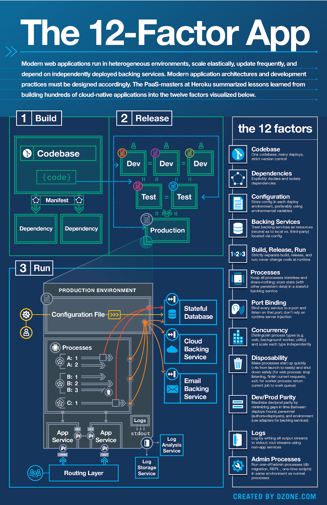

# Twelve-Factor Apps
Twelve-Factor Apps 是一種開發應用程序的方法論，旨在指導構建易於開發、部署、擴展和維護的現代化軟件應用。其提出了12個準則（factors），這些準則涵蓋了應用程序開發過程中的各個方面。

1. 代碼庫（Codebase）：使用版本控制系統管理一個應用程序的唯一代碼庫，避免多個部署的代碼差異化。
2. 依賴（Dependencies）：明確聲明和隔離應用程序的依賴，確保開發、構建和部署的一致性。
3. 配置（Config）：將配置信息與代碼分離，使用環境變量或配置文件管理應用程序的配置，不應將配置硬編碼到代碼中。
4. 後端服務（Backing Services）：將後端服務（數據庫、消息隊列等）視為附加資源，並通過接口與之交互。
5. 構建、發布、運行（Build, Release, Run）：明確區分構建、發布和運行應用程序的階段，並保持這些過程的隔離。
6. 進程（Processes）：將應用程序視為一組相互獨立的進程，各自執行特定的任務。
7. 綁定端口（Port Binding）：通過將應用程序綁定到端口使其成為可部署的服務，使其能夠通過網絡對外提供服務。
8. 並發（Concurrency）：設計應用程序為多個並發進程，提高應用程序的可伸縮性和性能。
9. 啟動、停止（Disposability）：設計應用程序能夠快速啟動和停止，以便適應動態環境的需求。
10. 開發、生產環境一致性（Dev/Prod Parity）：盡可能使開發、測試和生產環境保持一致，減少因環境不一致而導致的問題。
11. 日志（Logs）：將應用程序的日志視為事件流，將其輸出到標準輸出流，並使用專門的日志收集工具進行管理。
12. 管理進程（Admin Processes）：將管理任務作為一次性進程運行，與應用程序本身相分離。