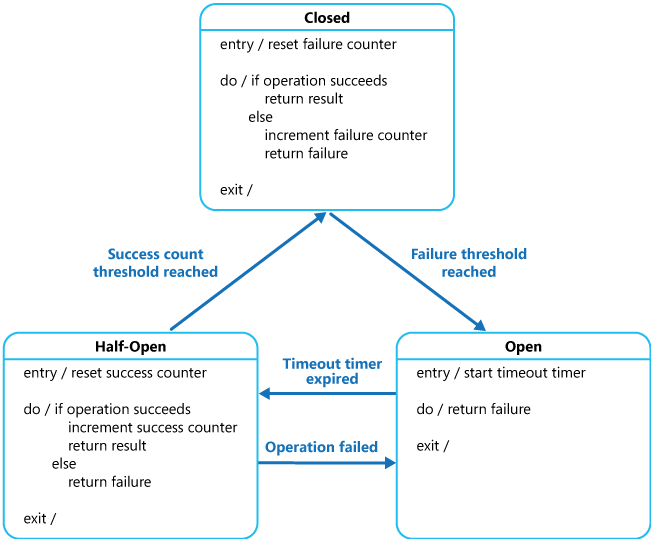

# Circuit Breaker
斷路器(Circuit Breaker) 是系統設計中用於提高系統韌性和防止錯誤擴散的重要機制。它源自於電子電路中的概念，用於隔離故障並防止整個系統因單一組件或服務故障而崩潰。

Circuit Breaker 的工作方式：
1. 監控系統狀態： Circuit Breaker 監控請求的狀態，例如錯誤率、超時率、或是其他可識別的錯誤指標。
2. 狀態轉換： 當系統達到預定的錯誤閾值時，Circuit Breaker 會切換至開啟（Open）狀態，阻止對該服務的進一步請求。
3. 短暫停機： 一旦 Circuit Breaker 開啟，它會暫時停止對服務的請求，避免對失敗的服務進行更多請求，從而減輕其負載。
4. 半開啟機制： 在一段時間後，Circuit Breaker 可以進入半開啟（Half-Open）狀態，允許部分請求通過以檢查服務是否已經修復。
5. 自動修復或恢復： 如果半開啟的請求成功，Circuit Breaker 可以恢復到正常（Closed）狀態，繼續將請求發送到服務。否則，它會繼續保持開啟狀態，直到服務被修復。

Circuit Breaker 的優點：
* 韌性和可靠性： Circuit Breaker 有助於保護系統免於故障擴散，提高整體系統的可靠性和韌性。
* 錯誤隔離： 它可以隔離故障服務，避免故障在系統中蔓延，降低整體系統的影響。
* 自動修復： 允許系統在適當的時機自動恢復正常操作，而不需要手動介入。

Circuit Breaker 的實際應用：
* 微服務架構： 在微服務架構中，用於隔離失敗的服務，避免整個系統受到影響。
* API 或外部服務調用： 用於防止對外部 API 或服務的過度請求，當服務出現問題時，避免對其造成更多壓力。
* 分布式系統： 在分布式系統中，用於確保通信和資源利用的穩定性。