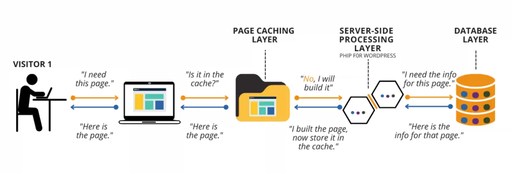

# Caching
凡是位於速度相差較大的兩種硬體之間，用於協調兩者資料傳輸速度差異的結構，均可稱之為快取/緩存。可以視為一種將請求資料的副本儲存在暫存位置中以便在需要時快速存取的過程或方法。

## 伺服器端快取
伺服器快取是瀏覽器和來源伺服器之間的中間層。

伺服器端快取的類型：
### 物件快取
將數據庫查詢存儲在伺服器端快取中，以便下次查詢。
### CDN 快取
內容分發網路（Content Delivery Network或Content Distribution Network) 是一組地理上分佈的代理伺服器。

將內容（如影像、影片或網頁）快取在代理伺服器中，這些代理伺服器比原始伺服器更靠近終端使用者。（代理伺服器是從用戶端接收請求並將其傳遞給其他伺服器的伺服器。）用戶的請求會通過 CDN 的負載均衡系統路由到最接近用戶的服務器。

### 操作碼快取
將源代碼編譯後存儲在快取中，以便在重複頁面加載時更快地執行。在 PHP 中特別常見且有顯著的影響，在不同的編程語言和平台中，操作碼緩存可能具有不同的實現和名稱：
* Java 中的 JIT 緩存（Just-In-Time 緩存）： Java 的 JIT 編譯器將 Java 字節碼轉換為機器碼，JIT 緩存會將已編譯的代碼緩存起來。
* JavaScript 中的 V8 緩存： V8 引擎會將 JavaScript 代碼編譯為機器代碼進行緩存。
* Python 中的 Pyc 緩存： Python 的編譯器將源代碼編譯成字節碼（.pyc 文件）進行緩存。
* C# 中的 .NET 緩存： .NET 框架通過將 C# 代碼編譯成中間語言（IL），然後使用 JIT 編譯器將其轉換為機器碼。已編譯的 IL 代碼可以被緩存以提高性能。

#### 伺服器端快取的缺點
主要問題是延遲。延遲可以定義為資料包從來源傳輸到目的地的總時間。
另一個問題是，如果網頁上的資料發生變化，伺服器必須從頭開始重建。
## 客戶端快取
客戶端快取將 Web 檔案和資料暫時儲存在瀏覽器記憶體中，而不是將其保存在伺服器中。
當使用者造訪網站時，網頁會快取在使用者的瀏覽器記憶體中，這意味著會儲存網頁的副本。

### 瀏覽器緩存
瀏覽器緩存是最常見的客戶端緩存類型之一，它用於存儲從網絡下載的資源，例如 HTML、CSS、JavaScript 文件、圖像和其他媒體文件。根據服務器發送的緩存控制頭（如 Cache-Control、Expires、ETag 等）來決定是否緩存文件以及緩存的有效期限。

### HTTP 緩存
在客戶端和服務器之間使用的緩存機制，使用 HTTP 頭控制緩存行為。常見的頭信息包括 Cache-Control（用於指定緩存的行為）、Expires（指定緩存過期時間）、ETag（實體標簽，用於驗證緩存的有效性）、Last-Modified（上次修改時間）等。

### Cookie
Cookie 是存儲在客戶端（通常是瀏覽器）中的小型文本文件，它們被服務器用來存儲和檢索用戶特定的信息。這些信息可以包括用戶的身份認證、偏好設置等，通過設置 Cookie 的過期時間和域。

### Local Storage 和 Session Storage
HTML5 提供了 localStorage 和 sessionStorage API，用於在客戶端存儲鍵值對數據。localStorage 的數據持久保存在客戶端，而 sessionStorage 的數據在會話結束後被清除。

#### 客戶端快取的缺點
缺點之一是它是特定於瀏覽器的，如果使用多個瀏覽器，同一網頁就會有各種快取檔案。
另一個缺點是它比伺服器端快取更複雜。
## 遠端快取
遠端快取與伺服器端快取類似，但它目標是在遠程位置的緩存系統(通常是一個緩存服務器或緩存服務)，通常用於分布式系統或跨網絡的應用程序。