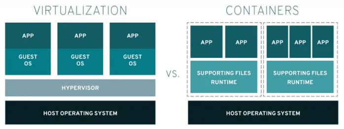

# Containerization vs. Virtualization

1. Hypervisor（虛擬機監控器）是一種軟體、硬體或者一種軟硬體結合體，能夠創建和管理虛擬化的環境，允許多個虛擬機（VM）在單個實體硬體上運行。
2. Supporting Files Runtime 通常是指支持應用程式運行所需的附加檔案、資源或庫，它們在執行時對應用程式是必需的。

## VM
好處
* 安全性較高，因為硬體層以上都虛擬化，因此安全性會相對較高。
* 系統的選擇較多，在VM可以選擇各種不同的OS。
* 應用程式不須要被拆分，因此不需要大幅更改應用程式的架構。簡單來說不需要降低應用程式內服務的耦合性，不需要將程式內的服務個別拆開來部屬。

缺點
* VM的Image大小通常為GB以上，較Container大。
* 啟動速度通常要花個幾分鐘，因此服務重啟的速度較慢。
* 資源使用較多，因為不只給應用程式本身，還要將一部分資源分給VM的作業系統。
## Container
好處
* Image較小，通常幾MB。
* 啟動速度較快，通常幾秒就能生成一個Container。
* 因為免去了去在執行一個OS的資源。所以能將更多資源運用在跑服務上。
* 更新較為容易，只需要利用新的Image重新啟動就會更新了。

缺點
* 安全性較VM差，因為環境和硬體都是與本機共用。
* 在同一台機器中，每個Container的OS都是相同，例如無法一個為windows一個為Linux，還是依賴Host OS。
* Container通常切分成微服務(Microservices)的方式做部署，在各元件中的網路連結會比較複雜。

| VM | Container |
| -------- | -------- |
| 以作業系統為單位 | 以應用程式為單位 |
| 可以隨意選擇OS | 依賴Host OS 的核心(kernel)來運行，因此Windows 的Container 必須在Windows OS 上運行；Linux 的Container 必須在Linux-base OS 上運行 |
| 配置好CPU、RAM 與Storage 的作業系統 | 封裝了相依性資源與應用程式的執行環境 |
| 會因版本不同造成環境的衝突 | 彼此隔離，因此在同一台機器可以執行不同版本的服務 |
| 會先佔用CPU、RAM 等硬體資源，不管有沒有要用都會先佔用 | 以程式為單位，需要的硬體資源更少 |
| 使用較大型的服務 | 多使用於微服務中 |