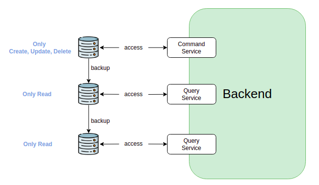

# CQRS
Command Query Responsibility Segregation，是一種軟體架構模式，旨在將應用程式的讀取和寫入操作分離開來。

* 命令（Commands）：代表對系統的修改或更新操作。這可能包括創建、更新或刪除資料等。
* 查詢（Queries）：代表對系統的查詢或讀取操作。這類操作通常不會對資料進行修改，而只是檢索資料並提供結果。

CQRS 的主要思想是將這兩種操作分開處理，因為它們具有不同的需求和特徵。通過分離命令和查詢，系統可以針對不同的需求進行優化，例如針對高度可用性和低延遲進行命令處理，同時對於查詢則可以進行更有效的資料檢索和優化。

如果將資料庫的存取拆分成Command、Query，資料庫的選擇上會有一些變化，如Command 換成寫入較快的，Query 則換成讀取較快的。透過資料庫本身的Master-slaves 模式就可以進而提昇效能。

