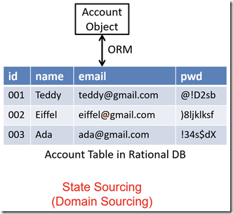
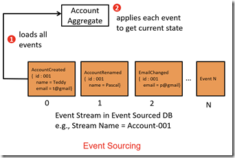
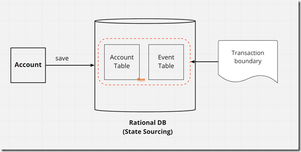
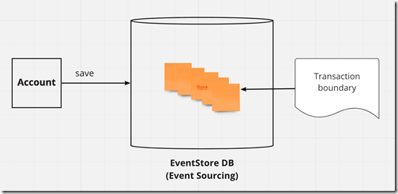
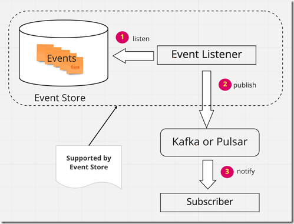

# Event Sourcing
「事件溯源」或「事件來源」，是一種軟體設計模式，用於跟踪和記錄系統狀態的變化，並將這些變化表示為不可變的事件序列。

系統的每次操作都被視為一個事件，這些事件按照發生的時間順序被記錄下來，並成為系統狀態的全面歷史。系統的當前狀態是透過過去的事件序列來建構和重現的。常見範例就是版本控制系統。

* 完全重建：可以完全丟棄應用程式狀態，在空的應用程式上重新運行事件日誌中的事件來重建它。
* 時間查詢：可以確定任意時間點的應用程式狀態。
* 事件重播：如果發現過去的事件不正確，通過重播事件序列來計算後果。

在Event Sourcing 流行之前，大部分的儲存系統狀態的方式稱為State Sourcing（狀態來源）或Domain Sourcing（領域來源）。State Sourcing 採用將系統目前狀態儲存至資料庫中，狀態改變會直接覆寫物件現有的狀態；Teddy 的email 如果改成ted@gmail.com 則在資料庫中id=001 的這一筆資料，其email 欄位的值就被改成ted@gmail.com，舊有的值則被覆蓋掉。

Event Sourcing 在資料庫中保存的不是系統的目前狀態，而是儲存曾經造成系統狀態改變的所有事件。至於系統的目前狀態，則是透過把這些事件從頭到尾重新執行過一次（稱為replay events）所計算出來。儲存事件的資料庫一般稱為Event Store，它可以是關聯式資料庫，例如message-db、NoSQL資料庫，或是專門為Event Sourcing 所設計的特殊用途資料庫，例如EventStoreDB。

在Event Sourcing 系統中，基本上採取append only 的方式來儲存事件。事件只可寫入Event Store，不可刪除或修改。Teddy 的email 如果改成ted@gmail.com，則在資料庫中代表Teddy 帳戶的event stream 會被寫入一筆新的事件：EmailChanged { id=001, email=ted@gmail.com}。

## 與DDD（領域驅動設計）
### 狀態同步
在DDD（領域驅動設計）中，Aggregate 狀態改變會產生領域事件（Domain Event），透過領域事件可以在不同Aggregate 之間達到狀態最終一致性，這個特性正好可以應用在分散式或微服務架構中作為狀態同步之用。
如果DDD的Aggregate 採用State Sourcing，在儲存物件狀態的時候，除了原本物件的目前狀態以外，還需要儲存領域事件，這兩個動作必須要在同一個交易（transaction）中一起完成，系統狀態才不會錯誤。

採用Event Sourcing 的系統在儲存領域事件的同時就等於儲存系統狀態，可以避免這個問題。

Event Store 需要支援客戶端去資料庫中讀取領域事件，然後再將領域事件轉發給其他「下游」的Event Handler 或微服務。

### 資料寫入
在DDD 的情境下採用Event Sourcing，每一個Aggregate 的instance 在Event Store 中會有一個專屬的event stream 用來儲存它的領域事件，這個event stream 通常以Aggregate Type-Aggregate ID 的格式來命名，例如一個Account Aggregate instance，它的id 等於3104ca15-df4a-4878-9342-b6d6d650b4cc，那麼在Event Store 中就會新增一個Account-3104ca15-df4a-4878-9342-b6d6d650b4cc 的event stream，用來儲存該Account instance 的領域事件。

相較於使用關聯式資料庫需要將物件結構轉成關聯式表格（Object Relational Mapping；ORM），Event Sourcing 只需儲存領域事件，省去ORM 繁瑣的設定。另外，由於寫入資料一次只針對一個Aggregate，所以也不會有採用關聯式資料庫在寫入時可能需要鎖定多個表格的現象，因此「理論上」Event Sourcing 的寫入效能會比較高。