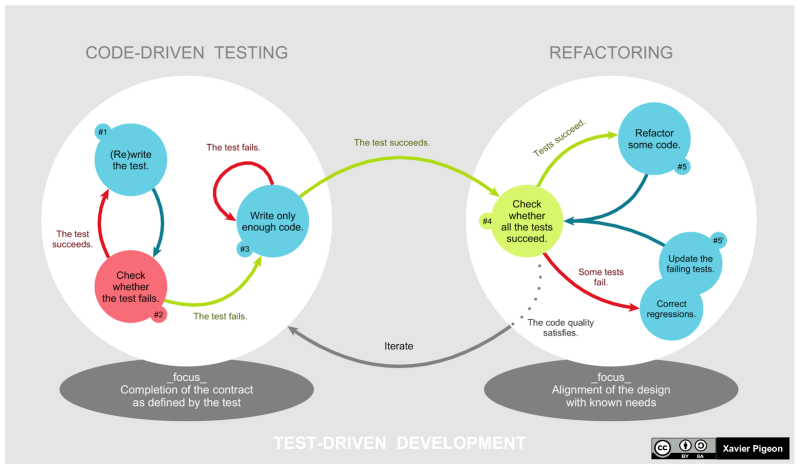

# Test Driven Development
開發團隊寫測試，通常有三種模式：
1. 先寫測試再開發
2. 開發完成再寫測試
3. 不寫測試

測試驅動開發(TDD)著重在以上第一點。

## TDD 流程

步驟一：選定一個功能，新增測試案例
* 重點在於思考希望怎麼去使用目標程式，定義出更容易呼叫的 API 介面。
* 這個步驟會寫好測試案例的程式，同時決定產品程式的 API 介面。
* 但尚未實作 API 實際內容。

步驟二：執行測試，得到 Failed（紅燈）
* 由於還沒撰寫 API 實際內容，執行測試的結果自然是 failed。
* 確保測試程式可執行，沒有語法錯誤等等。

步驟三：實作「夠用」的產品程式
* 這個階段力求快速實作出功能邏輯，用「最低限度」通過測試案例即可。
* 不求將程式碼優化一步到位。

步驟四：再次執行測試，得到 Passed（綠燈）
* 確保產品程式的功能邏輯已經正確地得到實作。
* 到此步驟，將完成一個可運作且正確的程式版本，包含產品程式和測試程式。

步驟五：重構程式
* 優化程式碼，包含產品程式和測試程式（測試程式也是專案需維護的一部份）。
* 提升程式的可讀性、可維護性、擴充性。
* 同時確保每次修改後，執行測試皆能通過。
