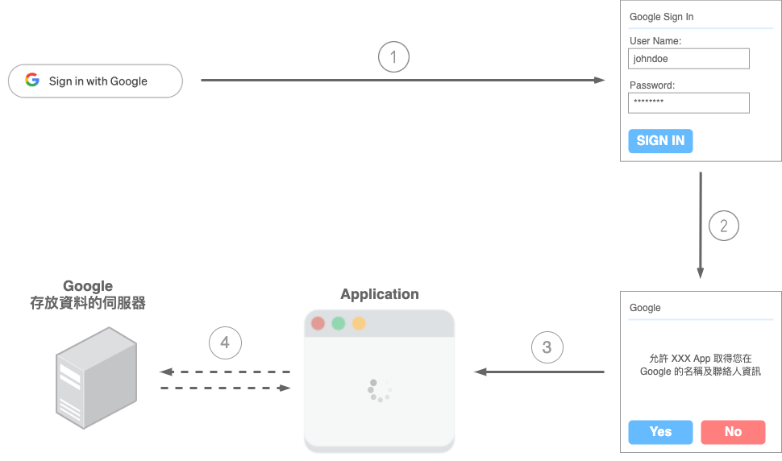
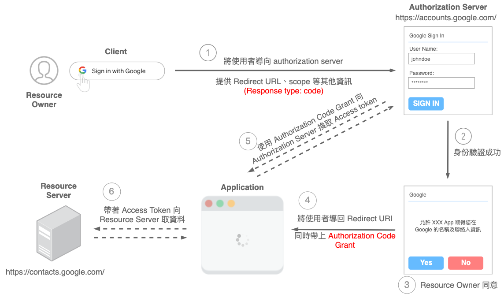
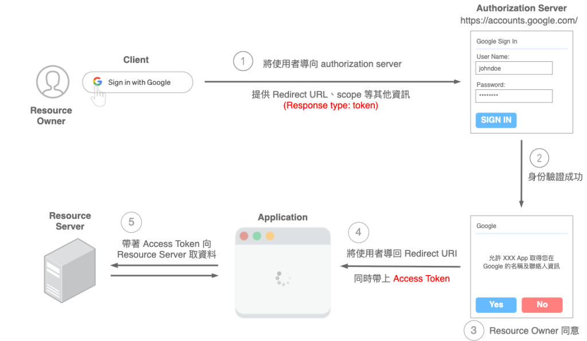
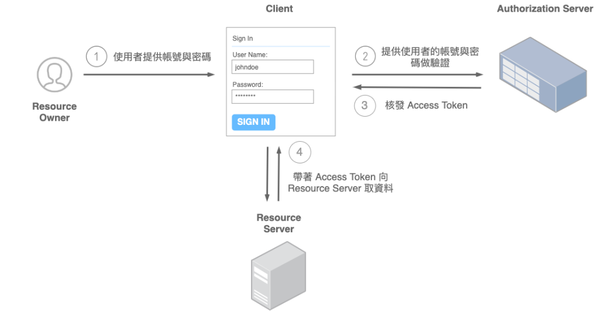
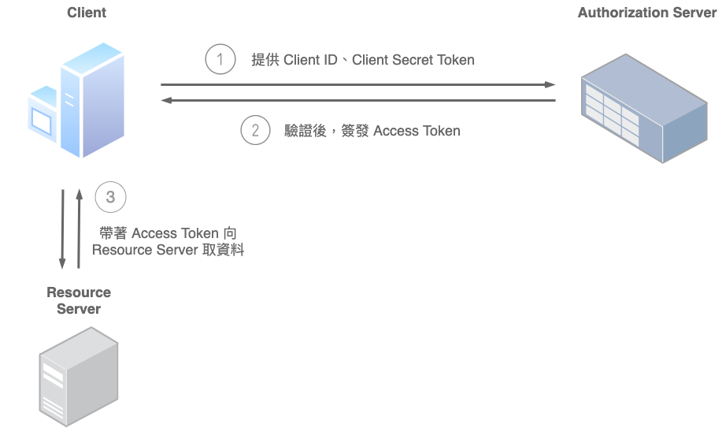

# OAuth
OAuth 有兩個版本：OAuth 1.0 和OAuth 2.0。彼此規範完全不同，並且不能一起使用。

## OAuth 1.0
使用一種簽名方法（signature method）將請求參數和用戶密鑰進行加密，生成一個簽名，以驗證用戶的身份。它需要在每次請求中使用一個加密的簽名。

相對複雜且容易出錯，實現起來較為困難，需要處理簽名和加密等。不多作探討，目前主流也是轉向使用OAuth 2.0 。

## OAuth 2.0
允許並授權當前的應用程式（如 Github）有限度的取得我們在 Facebook、Google 或其他平台的相關資訊。使用者身份驗證的工作基本上是委由選擇的平台完成，當驗證成功，且用戶同意，應用程式才得以前往取得所需要的資源。

能讓使用者能允許第三方應用程式，取得其在另一個平台的資料，而不需要提供驗證資訊給該第三方應用程式。

1. 瀏覽器將使用者導至 Google 身份驗證的頁面，並透過 Google 的服務進行身份驗證。
2. 身份驗證成功後，使用者會被詢問是否同意讓應用程式取得特定的一些資料。應用程式可能會希望能取得使用者在 Google 的名稱、Email、大頭照等。
3. 使用者同意後，瀏覽器將把使用者帶回應用程式當中，；使用者若不同意即流程中斷。
4. 使用者同意的話，應用程式就能順利前往 Google 存放資料的對應地方，去取得所需要的相關資料。

## 常見用詞
### Resource Owner
能授予應用程式取得受保護資料的人，通常就是終端使用者（end-user）。你在 Google 或 Facebook 等平台上擁有許多的資料，你就是 Resource Owner，你有權同意或拒絕應用程式代你取得這些資訊做使用。

⌲ 你就是 Resouce Owner。

### Client
通常指稱想要取得受保護資源的「應用程式」。應用程式必須獲得 Resource Owner 的同意，才能代表使用者去取得相對應的資源。

⌲ Github 就是 Client。

### Authorization Server
驗證 Resource Owner 的身份，並且在獲得同意之後，發放「Access Token」給應用程式（Client）的伺服器。

⌲ 就是指 Google 用來驗證你的身份的伺服器，你會使用 Google 帳號與密碼進行身份驗證，並被詢問是否同意伺服器代表你取得你在 Google 中的資料。

### Resource Server
存放使用者受保護資料的伺服器，應用程式（Client）會需要帶著「Access Token」透過其 API 去取得資料。Resource Server 需要保護資料免於被未授權的他人取得。

⌲ 就是指 Google 存放你相關資料的伺服器。

### Authorization Grant
在流程中，是用來證明使用者同意賦予應用程式一定程度的授權、同意應用程式去做某些事、取得一個範圍內的資源。

⌲ 就是用來證明我已經同意 Github 代我向 Google 取得我在 Google 相關的資料做使用。

### Scope
使用者的授權時常並非一翻兩瞪眼，如果單純只是「可以取得我的所有資料」與「不可以取得我的所有資料」，彈性就相對很低。

也因此通常 Authorization Server 會有個 scope 的清單，例如：可以取得使用者的名稱、可以編輯使用者的大頭貼、可以刪除我的某則貼文等不同權限。

所以當 OAuth 流程一啟動時，Client 能依照需求提供所需要的權限清單。 Authorization Server 也會依照這個清單，尋求使用者的同意（Consent）。

### Redirect URI（Callback URL）
Authorization Server 在驗證完使用者身份並獲得授權同意後，將會把使用者帶回應用程式中指定的路徑。

### Access Token
Access Token 是 Authorization Server 簽發的。應用程式最終能拿著這個 Token 向 Resource Server 取得需要的資源。

## 授權類型
### Authorization Code 授權碼
最常見的類型，Server-side Application （Web server applications）最為適用。
通常會由後端伺服器負責產生頁面（View）回傳給前端渲染。如此一來，大部分的邏輯處理程式碼，以及像應用程式的 Client Secret 等重要機密資訊，都能在伺服器端被保存，而非完全公開。

* 應用程式將使用者導向 Google 進行身份驗證和授權。導頁的 URL 中透過 Query string 提供應用程式的身份，以及需要請使用者授予權限等相關資訊。（response_type=code 代表應用程式請求的是 Authorization Code 這種 Authoriation Grant）
* Google 接著負責使用者身份驗證，並詢問使用者是否同意授權（Consent）。
* 成功後，將依據 Redirect URI 將使用者導回應用程式指定路徑，並附上 Authoriation Grant。以當前類型的流程來說，就是回傳「Authorization Code」。
* 應用程式能拿著 Authorization Code 向 Authorization Server 交換取得 Access Token。
* 最終應用程式就能拿著 Access Token 向 Resource Server 取得資料。

### Implicit 隱式授權
適合 Client-side applications 的類型，通常會是整個應用程式都在前端運行，依需求向後端 API 取得資料。例如單純的靜態網站或 Single Page Application(SPA) 都適用。

由於整個應用程式都在前端運行，所以會缺少「後端伺服器透過 Authorization Code Grant 交換 Access Token 」的步驟。取而代之的是請 Authorization Server 直接核發 Access Token。

* 應用程式將使用者導向 Google 進行身份驗證和授權。導頁的 URL 中透過 Query string 提供應用程式的身份，以及需要請使用者授予權限的相關資訊。（Response Type 為 token 代表應用程式請求的是 Access Token）
* Google 接著負責使用者身份驗證，並詢問使用者是否同意授權（Consent）。
* 成功後，將依據 Redirect URI 將使用者導回應用程式指定路徑，並附上 Authoriation Grant 。以當前類型的流程來說，就是回傳「Access Token」。
* 最終應用程式就能拿著 Access Token 向 Resource Server 取得資料。這邊是由前端獲得與管理 Access Token，並帶著 Access Token 發出請求前往取得資源。

### Resource Owner Password Credentials 密碼授權
由使用者提供帳號與密碼等資訊給應用程式，由應用程式直接向 Authorization Server 交換 Access Token，體驗上和以往的帳號密碼登入雷同。

帳號與密碼等機密資訊（credentials）可能會被應用程式儲存起來，作為往後交換 Access Token 使用。因此「必須是使用者高度信賴的應用程式」才適合使用，且唯有前兩種皆不可行時，才會考慮使用當前類型的流程。因此，適用的情境，可能像公司內部的系統。

* 通常會透過表單或其他形式，讓使用者提供帳號與密碼的身份驗證資訊。
* 應用程式在取得使用者的帳號與密碼後，會提供給 Authorization Server 進行身份驗證。
* Authorization Server 進行身份驗證成功後，就會核發 Access Token。
* 最終應用程式就能拿著 Access Token 向 Resource Server 取得資料。

### Client Credentials 客戶端憑證
適合用在 machine-to-machine (M2M) applications，通常是由應用程式向 Authourization Server 請求取得 Access Token 以獲取「自己」的相關資源，而非使用者的資源。

這個流程已經跳脫使用者，因此，使用者身份驗證的流程將不再需要。取而代之的，是應用程式必須向 Authorization Server 提供驗證所需的自身資訊。

* 應用程式透過提供其 Client ID 及 Client Secret Token 等其他作為驗證的資訊（client credentials）給 Authorization Server 進行身份驗證。
* Authorization Server 驗證成功後，核發 Access Token 給應用程式。
* 應用程式取得 Access Token 後，即能代表自己向 Resource Server 取得自己的相關資料。
