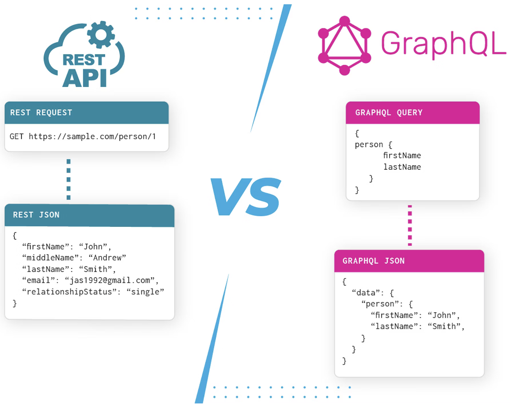
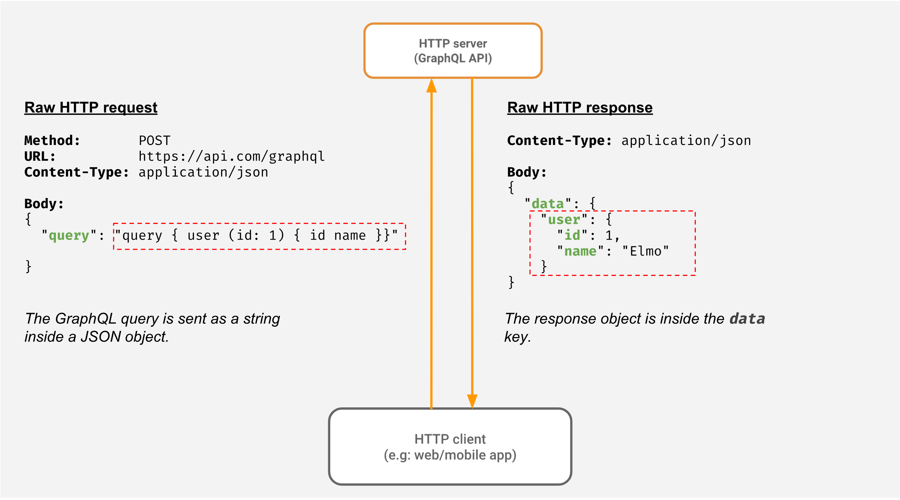
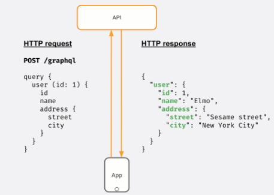

# GraphQL
由 Facebook 開發，一種用於 API 的查詢語言。使用單個端點來提供所有請求的數據，旨在減少不必要的數據傳輸。

允許客戶端可以精確地獲取它們需要的數據，而無需獲取整個資源，也只需要發出一次請求，就可以獲取多個資源的數據。



## 核心概念
* 查詢（Query）：從服務器獲取數據。在查詢中指定所需的數據字段，服務器將按照指定的結構返回相應的數據。
* 變更（Mutation）：在服務器上修改數據，例如添加、更新或刪除資料。變更操作類似於查詢，但具有副作用，通常需要用戶驗證。
* 訂閱（Subscription）：接收服務器上實時數據更新。當數據發生變化時，服務器會主動推送相關的更新給訂閱者。

## Schema
GraphQL需要定義一個Schema來描述數據模型和操作。Schema使用GraphQL的Schema Definition Language（SDL）編寫。
sample：
```graphql=
type User {
  id: ID!
  name: String!
  email: String!
  posts: [Post!]!
}

type Post {
  id: ID!
  title: String!
  content: String!
  author: User!
}

type Query {
  getUser(id: ID!): User
  getPost(id: ID!): Post
  getAllUsers: [User!]!
  getAllPosts: [Post!]!
}
```

而服務端透過自己環境的程式語言，編寫Resolver (函式)處理查詢和變更請求，並返回相應的數據。

## Client-Server 流程

Client 在傳送 QraphQL 的 query 時，並非為真的 JSON 格式，而是一個字串；而 Server 收到字串後會去驗證其 query 的有效性，並和資料庫或許相對應的資料傳回給 Client。




* 性能：雖然 GraphQL 可以減少網絡傳輸，但它也可能導致性能問題。這是因為 GraphQL 查詢語句中可能包含大量嵌套的字段和復雜的查詢，需要服務端長時間的處理。
* 安全性：與 REST API 不同，GraphQL API 允許客戶端查詢需要的任何數據，可能需要採取安全措施。