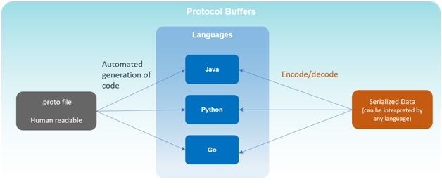
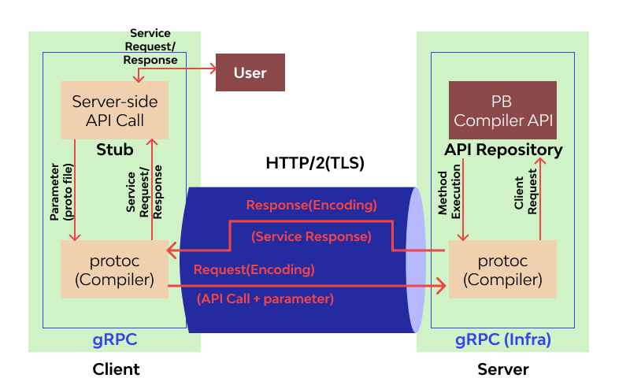

# gRPC
gRPC Remote Procedure Calls 是Google 發起的一個開源遠端程序呼叫（Remote procedure call）系統。該系統基於HTTP/2 協定傳輸，使用協定緩衝區（Protocol Buffers）作為介面描述語言（IDL），並支持多種編程語言。

## 協定緩衝區 Protocol Buffers
由 Google 開發的輕量級、高效的資料交換格式。一種用於序列化結構化數據的方法。
* IDL（Interface Definition Language）： Protocol Buffers 使用自己的介面描述語言來定義數據結構、消息格式和服務接口。gRPC使用 Protocol Buffers 作為介面描述語言，而 .proto 是產生的文件類型。
* 結構化數據： 允許定義結構化的數據模型，包括消息和消息之間的關係。這些消息可以有層級結構，支持嵌套和復雜的數據結構。
* 高效的序列化： Protocol Buffers 將數據序列化為二進制格式，這比 XML 或 JSON 等文字格式更節省空間，並且在序列化和反序列化的過程中更加高效。
* 跨平台、跨語言支持： Protocol Buffers 提供了多種語言的原生支持，包括 C++、Java、Python、Go 等，這使得不同語言的應用能夠通過 Protocol Buffers 進行數據交換。

客戶端和伺服器之間的 gRPC 服務和訊息在 .proto 檔案中定義。Protobuf 編譯器(protoc)產生客戶端和伺服器程式碼，在運行時將 .proto 檔案載入到記憶體中，並使用記憶體中的schema 序列化/反序列化二進位訊息。代碼產生後，每個訊息都會在客戶端和遠端服務之間交換。


## 流Streaming
流是 gRPC 的另一個關鍵概念，其中多個進程可以在單一請求中進行。HTTP/2 的多路復用功能（透過單一 TCP 連線傳送多個回應或同時接收多個請求）使其成為可能。

## 架構
在下面的 gRPC 架構圖中，我們有客戶端和伺服器端。每個用戶端服務都包含一個stub （根據.proto 自動生成gRPC 客戶端程式碼），可以想像成他是一個包含了遠端的程式的介面。客戶端呼叫本機程式、stub 使用 Protobuf 序列化參數，並將請求傳送到伺服器。


伺服器接收資料封包並呼叫伺服器stub 程序，該程序會對接收到的參數解碼並使用 Protobuf 執行相應的程序呼叫。然後，伺服器stub 將編碼後的回應傳回客戶端。客戶端stub 得到回應並解包回給呼叫者。

## 跨平台

```protobuf=
syntax = "proto3";

package tutorial;

message Person {
  string name = 1;
  int32 id = 2;
  string email = 3;
}

service AddressBook {
  rpc AddPerson (Person) returns (Person) {}
  rpc GetPerson (int32) returns (Person) {}
  rpc DeletePerson (int32) returns (google.protobuf.Empty) {}
}
```
由服務端維護一份.proto 文件，.proto 文件可編譯成各種原生程式碼，讓客戶端根據自身的環境呼叫服務端。
```bash=
# 生成 Java 程式碼
protoc --java_out=./java ./addressbook.proto

# 生成 Python 程式碼
protoc --python_out=./python ./addressbook.proto

# 生成 Go 程式碼
protoc --go_out=./go ./addressbook.proto
```
但是存在一定的學習曲線，以及可讀性差：與人類可讀的格式相比（例如 JSON），基於二進制的序列化格式不易讀取和調試。