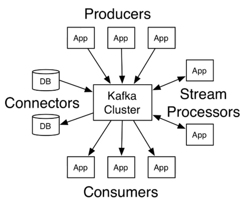
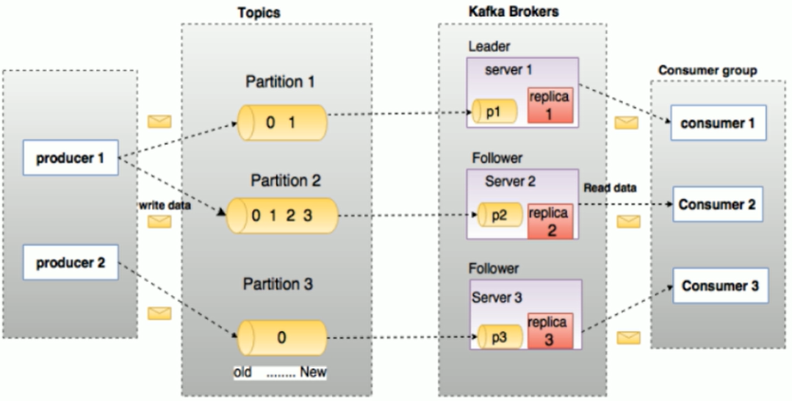

# Kafka
通常 Apache Kafka 應用在兩類程序
1. 建立實時的數據管道，以可靠地在系統或應用程序之間獲取數據
2. 構建實時流應用程序，以轉換或響應數據流



* Producers：可以有很多的應用程序，將消息數據放到 Kafka 的集群中。
* Consumers：可以有很多的應用程序，將消息數據從 Kafka 集群中拉取出來。
* Connectors：Kafka 的連接器可以將數據庫中數據導入到 Kafka，也可以從 Kafka 中導出數據到數據庫中。
* Stream processors：流處理器可以從 Kafka 中拉取數據，也可以將數據寫入到 Kafka 中。



* Producer：生產者即數據的發布者，該角色將消息發布到topic 中。生產者發送的消息，存儲到其一個partition 中，生產者也可以指定數據存儲的partition。
* Consumer：消費者可以從broker 中讀取數據。消費者可以消費多個topic 中的數據。
* Consumer Group：消費者群組包含一組消費者，它們共同消費一個或多個主題。一個主題如果只有一個分區、該分區只能被其中一個消費者消費；有多少分區就可以被多少消費者消費。
* Broker：Kafka 集群包含一個或多個服務器，服務器節點稱為broker。broker 是無狀態的，通過Zookeeper 來維護集群狀態。
* Topic：消息的類別或分類，消息被發布到特定的主題中。每個主題可以有多個分區。
* Partition：topic 中的數據分割為一個或多個partition，每個分區是一個有序的消息序列。如果topic 有多個partition，消費數據時就不能保證數據的順序。在需要嚴格保證消息的消費順序的場景下，需要將partition 數目設為1。
* Partition offset：記錄著分區中下一條將要發給消費者的消息的序號，以確定它們已經消費了哪些消息。
* Replicas of partition：副本是一個分區的備份(至少一個)。副本不會被消費者消費，只用於防止數據丟失，即消費者不從為follower 的partition 中消費數據，而是從為leader 的partition 中讀取數據。副本數量不能超過節點數量。
* Leader Replica：每個partition 有多個副本，其中僅有一個作為Leader，Leader 是當前負責數據的讀寫的partition。
* Follower Replica：Follower 跟隨Leader，所有寫請求都通過Leader 路由，數據變更會廣播給所有Follower，Follower 與Leader 保持數據同步。
* Zookeeper：Zookeeper 負責維護和協調broker。當Kafka 系統中新增了broker 或者某個broker 發生故障失效時，由ZooKeeper 通知生產者和消費者。從Kafka 2.8.0 版本開始，Kafka 引入了KRaft 協議，可以替代ZooKeeper。

### 冪等性
當生產者在發送消息到分區時，Kafka 會返回一個ack 給生產者來表示當前操作是否成功，如果ack 響應的過程失敗了則會導致消息重試，可能讓Kafka 保存重複消息。

在JAVA中，可將enable.idempotence 設置為true 來保證冪等性。實現原理：
* Producer Id (PID)：生產者會生成一個唯一的Producer Id（PID），並將其與每個生產者實例關聯起來。PID是在Kafka集群中保持唯一的，即使生產者實例重啟或更換。
* Sequence Number：每個消息都有一個唯一的序列號（Sequence Number），並且每個生產者實例都有一個本地的、單調遞增的序列號。生產者在發送消息時會將當前的序列號與消息一起發送到Kafka集群。
* Broker端的幂等性控制：當Broker收到消息時，它會檢查Producer Id和Sequence Number，如果Broker已經接收過具有相同Producer Id和Sequence Number的消息，則不會將消息視為新消息。

## 安裝(Windows)
使用 2.8 以上的版本無須另外安裝 zookeeper(內建有，在此使用 2.8.1) 解壓縮 kafka 的目錄名稱不能有空格存在。
在安裝包的根目錄下
1. 先啟動 zookeeper：`.\bin\windows\zookeeper-server-start.bat .\config\zookeeper.properties` 默認 port 號：2181
2. 啟動 kafka：`.\bin\windows\kafka-server-start.bat .\config\server.properties` 默認 port 號：9092
3. 關閉 kafka：`.\bin\windows\kafka-server-stop.bat`
4. 關閉 zookeeper：`.\bin\windows\zookeeper-server-stop.bat`

在 Windows 的命令行里啟動 Kafka 之後，當關閉命令行窗口時，就會強制關閉 kafka。這種關閉方式為暴力關閉，很可能會導致 Kafka 無法完成對日志文件的解鎖。屆時，再次啟動 kafka 的時候，就會提示日志文件被鎖，無法成功啟動。 解決方案：將 kafka 的日志文件全部刪除，再次啟動即可。

### 基本操作
在安裝包的根目錄\bin\windows 下
1. 查看 topic：`kafka-topics.bat --zookeeper 127.0.0.1:2181 --list`
2. 創建 topic：`kafka-topics.bat --create --zookeeper localhost:2181 --replication-factor 1 --partitions 1 --topic mytopic1`：--zookeeper 指定kafka所連接的zookeeper地址 --topic 主題名稱 --partitions 分區個數 --replication-factor 副本因子
3. 查看 topic詳情：`kafka-topics.bat --zookeeper 127.0.0.1:2181 --describe --topic mytopic1`
4. 消費者功能測試：`kafka-console-consumer.bat --bootstrap-server localhost:9092 --topic mytopic1 --from-beginning`：--bootstrap-server 指定連接kafka集群的地址
5. 生產者功能測試：`kafka-console-producer.bat --broker-list localhost:9092 --topic mytopic1`
6. 刪除 topic：`kafka-topics.bat --delete --zookeeper localhost:2181 --topic mytopic1`：執行後會註記為刪除(mytopic1 - marked for deletion)，並在後續清理週期實際清除
## 集群搭建
使用kafka 3.5；3.3版本引入了Apache Kafka Raft （KRaft）用來代替ZooKeeper，因此不需要搭建ZooKeeper了。
1. 建立資料夾
```shell=
mkdir -p kafka/broker{1..3}
chmod -R 777 kafka/
```
2. `nano docker-compose.yml`
```yaml=
version: "3"
services:
  kafka1:
    image: 'bitnami/kafka:3.5'
    container_name: kafka1
    ports:
      - "19092:9092"
      - "19093:9093"
    privileged: true    #不添加的話會啟動報錯（Failed to start thread "GC Thread#0" - pthread_create failed (EPERM) ）
    environment:
      #允許使用kraft,即Kafka替代Zookeeper
      - KAFKA_ENABLE_KRAFT=yes
      - KAFKA_CFG_NODE_ID=1
      #kafka角色,做broker,也要做controller
      - KAFKA_CFG_PROCESS_ROLES=controller,broker
      #定義kafka服務端socket監聽端口（Docker內部的ip地址和端口）
      - KAFKA_CFG_LISTENERS=PLAINTEXT://:9092,CONTROLLER://:9093
      # 定義外網訪問地址，必須填寫宿主機ip地址和端口,ip不能是0.0.0.0 
      - KAFKA_CFG_ADVERTISED_LISTENERS=PLAINTEXT://192.168.191.134:19092 
      #定義安全協議
      - KAFKA_CFG_LISTENER_SECURITY_PROTOCOL_MAP=CONTROLLER:PLAINTEXT,PLAINTEXT:PLAINTEXT
      #集群地址
      - KAFKA_CFG_CONTROLLER_QUORUM_VOTERS=1@kafka1:9093,2@kafka2:9093,3@kafka3:9093
      #指定供外部使用的控制類請求信息
      - KAFKA_CFG_CONTROLLER_LISTENER_NAMES=CONTROLLER
      #設置broker最大內存,和初始內存
      - KAFKA_HEAP_OPTS=-Xmx512M -Xms256M
      #使用Kafka時的集群id,集群內的Kafka都要用這個id做初始化,生成一個UUID即可(22byte)
      - KAFKA_KRAFT_CLUSTER_ID=xYcCyHmJlIaLzLoBzVwIcP
      #允許使用PLAINTEXT監聽器,默認false,不建議在生產環境使用
      #- ALLOW_PLAINTEXT_LISTENER=yes
      # 不允許自動創建主題
      - KAFKA_CFG_AUTO_CREATE_TOPICS_ENABLE=false
      #broker.id,必須唯一,且與KAFKA_CFG_NODE_ID一致
      - KAFKA_BROKER_ID=1
    volumes:
      - ./kafka/broker1:/bitnami/kafka:rw

  kafka2:
    image: 'bitnami/kafka:3.5'
    container_name: kafka2
    ports:
      - "29092:9092"
      - "29093:9093"
    privileged: true
    environment:
      #允許使用kraft,即Kafka替代Zookeeper
      - KAFKA_ENABLE_KRAFT=yes
      - KAFKA_CFG_NODE_ID=2
      #kafka角色,做broker,也要做controller
      - KAFKA_CFG_PROCESS_ROLES=controller,broker
      #定義kafka服務端socket監聽端口（Docker內部的ip地址和端口）
      - KAFKA_CFG_LISTENERS=PLAINTEXT://:9092,CONTROLLER://:9093
      # 定義外網訪問地址，必須填寫宿主機ip地址和端口,ip不能是0.0.0.0 
      - KAFKA_CFG_ADVERTISED_LISTENERS=PLAINTEXT://192.168.191.134:29092
      #定義安全協議
      - KAFKA_CFG_LISTENER_SECURITY_PROTOCOL_MAP=CONTROLLER:PLAINTEXT,PLAINTEXT:PLAINTEXT
      #集群地址
      - KAFKA_CFG_CONTROLLER_QUORUM_VOTERS=1@kafka1:9093,2@kafka2:9093,3@kafka3:9093      #指定供外部使用的控制類請求信息
      - KAFKA_CFG_CONTROLLER_LISTENER_NAMES=CONTROLLER
      #設置broker最大內存,和初始內存
      - KAFKA_HEAP_OPTS=-Xmx512M -Xms256M
      #使用Kafka時的集群id,集群內的Kafka都要用這個id做初始化,生成一個UUID即可(22byte)
      - KAFKA_KRAFT_CLUSTER_ID=xYcCyHmJlIaLzLoBzVwIcP
      #允許使用PLAINTEXT監聽器,默認false,不建議在生產環境使用
      #- ALLOW_PLAINTEXT_LISTENER=yes
      # 不允許自動創建主題
      - KAFKA_CFG_AUTO_CREATE_TOPICS_ENABLE=false
      #broker.id,必須唯一,且與KAFKA_CFG_NODE_ID一致
      - KAFKA_BROKER_ID=2
    volumes:
      - ./kafka/broker2:/bitnami/kafka:rw

  kafka3:
    image: 'bitnami/kafka:3.5'
    container_name: kafka3
    ports:
      - "39092:9092"
      - "39093:9093"
    privileged: true
    environment:
      #允許使用kraft,即Kafka替代Zookeeper
      - KAFKA_ENABLE_KRAFT=yes
      - KAFKA_CFG_NODE_ID=3
      #kafka角色,做broker,也要做controller
      - KAFKA_CFG_PROCESS_ROLES=controller,broker
      #定義kafka服務端socket監聽端口（Docker內部的ip地址和端口）
      - KAFKA_CFG_LISTENERS=PLAINTEXT://:9092,CONTROLLER://:9093
      # 定義外網訪問地址，必須填寫宿主機ip地址和端口,ip不能是0.0.0.0 
      - KAFKA_CFG_ADVERTISED_LISTENERS=PLAINTEXT://192.168.191.134:39092
      #定義安全協議
      - KAFKA_CFG_LISTENER_SECURITY_PROTOCOL_MAP=CONTROLLER:PLAINTEXT,PLAINTEXT:PLAINTEXT
      #集群地址
      - KAFKA_CFG_CONTROLLER_QUORUM_VOTERS=1@kafka1:9093,2@kafka2:9093,3@kafka3:9093      #指定供外部使用的控制類請求信息
      - KAFKA_CFG_CONTROLLER_LISTENER_NAMES=CONTROLLER
      #設置broker最大內存,和初始內存
      - KAFKA_HEAP_OPTS=-Xmx512M -Xms256M
      #使用Kafka時的集群id,集群內的Kafka都要用這個id做初始化,生成一個UUID即可(22byte)
      - KAFKA_KRAFT_CLUSTER_ID=xYcCyHmJlIaLzLoBzVwIcP
      #允許使用PLAINTEXT監聽器,默認false,不建議在生產環境使用
      - ALLOW_PLAINTEXT_LISTENER=yes
      # 不允許自動創建主題
      #- KAFKA_CFG_AUTO_CREATE_TOPICS_ENABLE=false
      #broker.id,必須唯一,且與KAFKA_CFG_NODE_ID一致
      - KAFKA_BROKER_ID=3
    volumes:
      - ./kafka/broker3:/bitnami/kafka:
```
3. 啟動：`docker-compose up -d`
4. 驗證
```shell=
docker exec -it kafka1 bash

$ /opt/bitnami/kafka/bin/kafka-broker-api-versions.sh --bootstrap-server localhost:9092
#可見到三個節點的資訊

$ cat /opt/bitnami/kafka/config/server.properties | grep broker.id
#可見到該節點的broker id
```
### 基本操作
進入容器、/opt/bitnami/kafka/bin 下
1. 查看 topic：`kafka-topics.sh --list --bootstrap-server localhost:9092`
2. 創建 topic：`kafka-topics.sh --create --bootstrap-server localhost:9092 --replication-factor 1 --partitions 1 --topic mytopic1`：--topic 主題名稱 --partitions 分區個數 --replication-factor 副本因子；若不指定參數，通常情況下，默認的副本數為1，默認的分區數取決於Kafka配置
3. 查看 topic詳情：`kafka-topics.sh --bootstrap-server localhost:9092 --describe --topic mytopic1`
4. 消費者功能測試：`kafka-console-consumer.sh --bootstrap-server localhost:9092 --topic mytopic1 --from-beginning`：--bootstrap-server 指定連接kafka集群的地址
5. 生產者功能測試：`kafka-console-producer.sh --broker-list localhost:9092 --topic mytopic1`
6. 刪除 topic：`kafka-topics.sh --delete --bootstrap-server localhost:9092 --topic mytopic1`：執行後會註記為刪除(mytopic1 - marked for deletion)，並在後續清理週期實際清除

#### 監控工具
* Kafka Eagle：主要用於監控 Kafka 集群的健康狀態，查看主題、分區、生產者和消費者的指標，以及執行一些管理操作如創建和刪除主題等。依賴zookeeper，這邊不多作介紹。
* Kafka Tool：則提供了更廣泛的功能，包括查看主題、分區和消息、查詢偏移量、編輯和發送消息、管理ACL（存取控制列表）等。它也可以用於監控，但在監控功能上可能沒有 Kafka Eagle 那麼專業。可在本地安裝 https://www.kafkatool.com/ 。

### 性能測試
#### 生產者
`kafka-producer-perf-test.sh --topic mytopic1 --num-records 50000 --record-size 1000 --throughput -1 --producer-props bootstrap.servers=192.168.191.134:19092,192.168.191.134:29092,192.168.191.134:39092 acks=1`
* --topic mytopic1：指定要發送消息的主題名稱為mytopic1。
* --num-records 50000：指定要發送的消息數量為500萬條。
* --record-size 1000：指定每條消息的大小為1000字節。
* --throughput -1：指定每秒發送消息的速率。這裡設置為-1表示沒有速率限制，即盡可能快地發送消息。
* --producer-props bootstrap.servers=192.168.191.134:19092,192.168.191.134:29092,192.168.191.134:39092 acks=1：指定生產者的配置。bootstrap.servers指定了Kafka集群的地址，這裡列出了三個Broker的地址。acks=1表示生產者將等待Broker的確認後才算消息發送成功。

執行結果：`8881 records sent, 1774.8 records/sec (1.69 MB/sec), 1936.5 ms avg latency, 3151.0 ms max latency.`
* 8881 records sent：表示成功發送了8881條消息。
* 1774.8 records/sec：表示每秒發送的消息數量，約為1774.8條消息。
* (1.69 MB/sec)：表示每秒傳輸的數據量，約為1.69 MB。
* 1936.5 ms avg latency：表示平均延遲時間為1936.5毫秒，即發送消息後到達Broker的平均時間。
* 3151.0 ms max latency：表示最大延遲時間為3151.0毫秒，即發送消息後到達Broker的最大時間。

#### 消費者
`kafka-consumer-perf-test.sh --broker-list 192.168.191.134:19092,192.168.191.134:29092,192.168.191.134:39092 --topic mytopic1 --fetch-size 104876 --messages 50000`
執行結果：
```shell=
start.time, end.time, data.consumed.in.MB, MB.sec, data.consumed.in.nMsg, nMsg.sec, rebalance.time.ms, fetch.time.ms, fetch.MB.sec, fetch.nMsg.sec
2024-04-14 09:04:13:888, 2024-04-14 09:04:23:584, 47.6837, 4.9179, 50000, 5156.7657, 4683, 5013, 9.5120, 9974.0674
```
* start.time：消費者開始消費消息的時間。
* end.time：消費者結束消費消息的時間。
* data.consumed.in.MB：消費者消費的數據量，單位為MB。
* MB.sec：消費者的消費速率，即每秒消費的數據量，單位為MB。
* data.consumed.in.nMsg：消費者消費的消息數量。
* nMsg.sec：消費者的消費速率，即每秒消費的消息數量。
* `rebalance.time.ms`：重新平衡消費者群組所花費的時間，單位為毫秒。
* `fetch.time.ms`：從Broker抓取消息所花費的時間，單位為毫秒。
* fetch.MB.sec：從Broker抓取消息的速率，即每秒抓取的數據量，單位為MB。
* fetch.nMsg.sec：從Broker抓取消息的速率，即每秒抓取的消息數量。

## 分區和副本機制
### 生產者分區寫入策略
1. 輪詢分區策略：默認的策略，也是使用最多的策略，key為null 使用輪詢算法均衡地分配分區
2. 隨機分區策略：基本不使用，可能會造成數據傾斜
3. 按key 分區策略：將根據消息的key進行哈希計算，從而確定消息應該發送到哪個分區
4. 自定義分區策略：生產者可以通過實現org.apache.kafka.clients.producer.Partitioner接口來定義自己的分區器

亂序問題
kafka 中的消息是全局亂序的，局部partition 是有序的，如果我們要實現消息總是有序的，可以將連續的消息放到一個partition。但kafka 就失去了分布式的意義。

### Rebalance 再均衡
確保消費者組中的每個消費者實例處理的分區數量大致相等。觸發時機是消費者、主題、分區數量發生變化時。
在再均衡期間，Kafka會暫停對分區的消費，從而確保不會在分區重新分配期間發生消息重複消費或消息丟失的情況。

### 消費者分區分配策略 
* Range：默認的，確保每個消費者實例處理的分區數量盡可能相等。n=分區數量/消費者數量、m=分區數量%消費者數量，前m個消費者消費n+1個分區、剩餘消費者消費n個。8分區3消費者，前2個消費者消費2+1個分區、剩下1個消費者消費2個分區。
* RoundRobin：將所有partition 按照字典排序，然後輪詢分配。
* Sticky：沒有發生再均衡時，跟輪詢策略一致，當發生再均衡，系統會盡可能保證跟上一次的結果一致，將新的需要分配的分區均勻分配到現有消費者中，從而實現黏性分配。

### 副本機制
"ack" 是指確認（acknowledgement）的意思，用於生產者（producer）發送消息時的確認機制，以確保消息被成功發送到Kafka集群中的分區。
1. acks=0：生產者發送消息後，不等待任何確認，直接將消息發送到網絡。最不可靠、性能最好。
2. acks=1：生產者發送消息後，等待領導者（leader）成功將消息寫入到本地日誌後就立即收到確認。
3. acks=all：生產者發送消息後，等待所有副本都成功接收到消息後才收到確認。最可靠、性能最差。

## 運作原理
### Leader-Follower
創建topic 時，Kafka 會將每個分區的leader 均勻地分配在每個broker 上。follower 也像一個消費者，拉取leader 對應分區的數據並保存下來。

folloer 的狀態：
* Assigned Replicas (AR)：分區中的所有副本。AR 包括 ISR 和 OSR。
* In-Sync Replicas (ISR)：與 Leader 同步的副本集合。ISR 中的副本與 Leader 的日誌完全同步。
* Out-of-Sync Replicas (OSR)：未與 Leader 完全同步的副本。

正常情況下AR = ISR、OSR為空

### Controller
Controller 是一個特殊的 broker，負責管理整個 Kafka 集群的狀態和管理。Controller 主要負責以下幾個方面：
1. Leader 和 ISR 的管理：Controller 負責處理分區的 Leader 和 ISR 的選舉和變更。當 Leader 故障或 ISR 中的副本發生變化時，Controller 負責確保新的 Leader 被選舉並同步 ISR。
2. 副本分配和重新平衡：當有新的 broker 加入集群或現有的 broker 離開集群時，Controller 負責重新平衡分區的副本，以確保各個分區在集群中的分佈均衡。
3. 主題和分區的管理：Controller 負責創建、刪除和管理主題和分區的元數據，並確保它們的狀態是正確的。
4. Broker 的健康檢查：Controller 定期檢查集群中各個 broker 的健康狀態，並在檢測到故障時觸發相應的處理邏輯。
5. Controller 的選舉：如果現有的 Controller 故障或不可用，Kafka 集群會自動進行 Controller 的重新選舉，選舉出一個新的 Controller。

### leader 負載均衡
如果某個broker crash 後，可能導致分區的leader 分布不均勻，就是一個broker 上存在了一個topic 下不同partition 的leader。通過以下指令可以手動將leader 分配到優先的leader 對應的broker，確保leader 是均勻分布的。
`kafka-leader-election.sh --bootstrap-server 192.168.191.134:19092 --topic mytopic1 --partition=2 --election-type preferred`

### 讀寫流程
寫
1. 通過Zookeeper/KRaft 找partition 對應的leader
2. producer 開始寫入數據
3. ISR 中的follower 開始同步數據，並返回ack 給leader
4. 返回ack 給producer

讀
1. 通過Zookeeper/KRaft 找partition 對應的leader
2. 通過Zookeeper/KRaft 找到消費者對應的offset
3. 從offset 往後順序拉取數據
4. 提交offset (自動提交--每隔多少秒提交一次、手動提交--放入事務中提交)

## 文件存儲
一個topic 由多個分區組成
一個分區由多個segment 組成
一個segment 由多個文件組成(log、index、timeindex)

* log：日誌數據文件
* index：索引文件，根據offset 查找數據就是通過該索引
* timeindex：時間索引
* leader-epoch-checkpoint：持久化每個partition leader對應的LEO(Log End Offset、就是日誌文件中下一條待寫入消息的offset)

每個文件的文件名為起始偏移量，ex: 00000000000000000000.index
默認每個文件最大為1G

## 消息不丟失
在消息傳遞系統中，有三種常見的消息傳遞保證級別
1. At Least Once（至少一次）：消息可能會被傳遞多次，但不會丟失。這意味著在系統正常運行的情況下，消息最終會成功傳遞到接收者。這種傳遞保證通常需要一些額外的機制來處理重覆消息。
2. At Most Once（至多一次）：消息要麽傳遞一次，要麽不傳遞。這意味著消息可能會丟失，但不會被傳遞多次。在這種情況下，系統通常不會有處理重覆消息的邏輯。
3. Exactly Once（精確一次）：消息被確保只傳遞一次，不會丟失，也不會傳遞多次。實現精確一次傳遞通常需要覆雜的協議和機制，以確保消息在傳遞過程中不會被重覆發送。
### broker 數據不丟失
通過覆制（replication）機制來確保 broker 數據不丟失，在分區的 leader 寫入數據後，所有 ISR 中 follower 都會從 leader 中複製數據，即使 leader 崩潰了，其他的follower的數據仍然是可用的。
### 生產者數據不丟失
生產者連接 leader 寫入數據時，可以通過 ACK 機制來確保數據已經成功寫入。
* -1/all 時，表示所有的節點（leader和follower）都收到數據
* 1 時，表示leader收到數據（默認配置）
* 0 時，生產者只負責發送數據，不關心數據是否丟失

### 消費者數據不丟失
在消費者消費數據的時候，只要每個消費者記錄好offset值即可，就能保證數據不丟失。

## 數據積壓
消息系統中未能及時處理的消息數量，可能會導致系統性能下降或者消息堆積(lag)的問題。在 Kafka 中，可以通過以下方式來處理數據積壓：

* 增加消費者數量： 如果消費者數量不足以處理高負載情況下的消息，可以考慮增加消費者實例來提高消息處理速度。
* 優化消費者邏輯： 檢查消費者邏輯是否有效率，是否有不必要的延遲或者資源浪費，進行必要的優化。
* 增加分區數量： 如果 Kafka 主題的分區數量較少，可以考慮增加分區數量，以提高消息的並行處理能力。
* 調整消費者組的偏移量提交頻率： 如果消費者組的偏移量提交頻率過低，可能會導致消息積壓。可以調整偏移量提交的頻率，確保及時提交偏移量。
* 監控和調整處理速率： 監控 Kafka 消費者的處理速率和消息產生速率，根據實際情況調整消費者的處理速率，避免消息積壓。
* 增加 Kafka 分區的副本： 增加 Kafka 分區的副本數量，可以提高消息的可靠性和容錯性，避免因為節點故障導致消息丟失。
* 合理設置 Kafka 主題的保留策略： 設置合理的消息保留策略，定期清理過期消息，避免消息過期導致的積壓問題。

## 日誌清理
在broker 或topic 配置`log.cleader.enable true(默認)` 開啟自動清理日誌功能
`log.cleanup.policy delete(默認)/compact/delete,compact` 刪除/壓縮/同時支持

日志刪除（Log Deletion）：按照指定的策略直接刪除不符合條件的日誌
通常由兩個主要參數控制：`log.retention.hours` 和 `log.retention.bytes`。
1. 按時間刪除：`log.retention.hours` 參數指定了消息在日志中保留的最長時間（單位為小時）。當消息在日志中存儲的時間超過這個時間時，刪除這些消息。
2. 按大小刪除：`log.retention.bytes` 參數指定了消息日志文件的最大大小。當日志文件的大小超過這個限制時，刪除舊的消息以釋放空間。

日志壓縮（Log Compaction）：基於鍵的唯一性，保留每個鍵的最新消息，刪除其他消息。