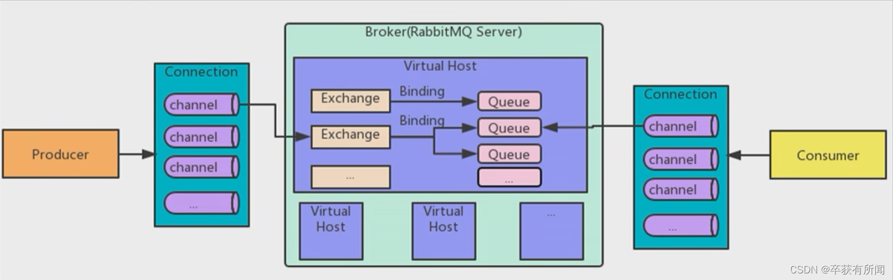
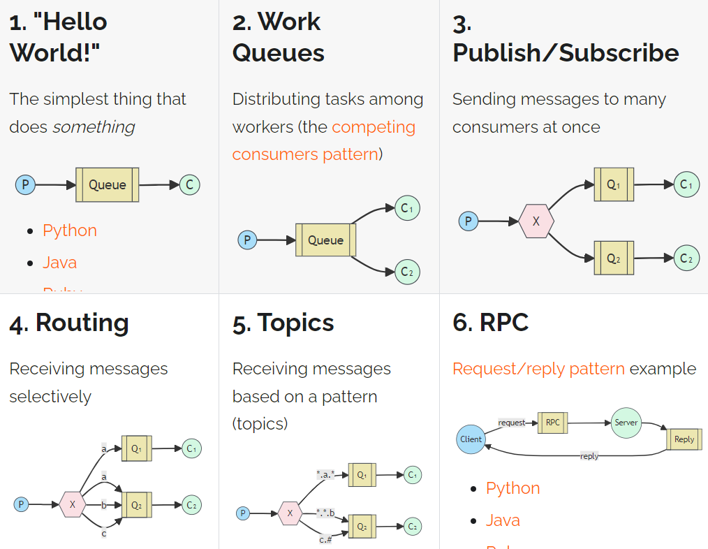
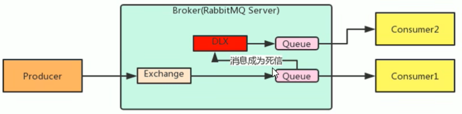
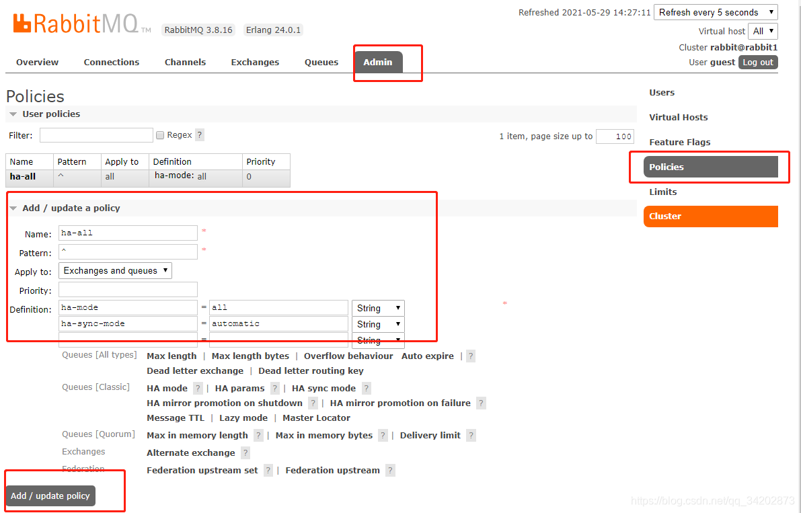

# RabbitMQ
## AMQP
即 Advanced Message Queuing Protocol (高級消息隊列協議)，是一個網絡協議，是應用層協議的一個開放標準，為面向消息的中間件設計。基於此協議的客戶端與消息中間件可傳遞消息，並不受客戶端/中間件不同產品，不同的開發語言等條件的限制。

## 基本概念

* Brocker：接收和分發消息的應用（RabbitMQ Server）
* Virtual host：邏輯分區的概念，類似於網絡中的 namespace，當多個不同用戶使用同一個 RabbitMQ server 提供的服務時，可以劃分出多個 vhost，每個用戶在自己的 vhost 創建 exchange/queue 等
* Connection：publisher/consumer 和 broker 之間的 TCP 連接
* Channel：如果每次訪問 RabbitMQ 都建立 Connection。在消息量大的時候建立 TCP Connection 的開銷將是巨大的，效率也較低。Channel 是connection 內部建立的邏輯連接，如果應用程序支持多線程，每個 thread 創建單獨的 channel 進行通信，AMQP method 包含了 channel id 幫助客戶端和 message broke 識別 channel，所以 channel 之間完全是隔離的。channel 作為輕量級的 connection 極大減少了操作系統建立 TCP connection 的開銷。
* Exchange：message 到達 broker 的第一站，根據分發規則，匹配查詢表中的 routing key，分發消息到 queue 中去
* Queue：消息最終被送到這里等待 consumer 取走
* Binding：exchange 和 queue 之間的虛擬連接，binding 中包含了routing key，binding 信息被包含到 exchange 查詢表中，用戶 message 分發依據

### JMS
* JMS 即 Java 消息服務(JavaMessage Service)應用程序接口，是一個 Java 平台中關於面向消息中間件的 API
* JMS 是 JavaEE 規範中的一種，類比 JDBC
* 很多消息中間件都實現了 JMS 規範，例如：ActiveMQ。RabbitMQ 官方沒有提供 JMS 的實現包

## 安裝(Windows)
基於 Erlang 語言編寫、需安裝 Erlang，環境變數(新增 ERLANG_HOME：安裝的根目錄 / 增加 Path：ERLANG_HOME\bin)；查看rabbitmq和erlang的版本匹配 https://www.rabbitmq.com/which-erlang.html
安裝 RabbitMQ(在此使用 3.12.4)，可透過 cmd(到 RabbitMQ 資料夾中的 sbin 資料夾中執行`.\rabbitmq-server.bat`) 或是工作管理員來開啟/關閉服務

服務管理 UI 需開啟插件(執行 `./rabbit-plugins.bat enable rabbit_management`)
瀏覽器訪問後端 UI 服務默認 port 15672(http://localhost:15672)、默認帳號密碼皆是 guest

啟用 tracing 插件 `./rabbitmq-plugins.bat enable rabbitmq_tracing`
可以於 UI 中 admin/tracing 配置追蹤消息

## 工作模式
RabbitMQ 提供了 6 種工作模式：簡單模式、Work Queues、Publish/Subscribe 發布與訂閱模式、Routing 路由模式、Topics 主題模式、RPC 遠程調用模式(遠程調用，不太算 MQ；暫不作介紹)。

* P：生產者，也就是要發送消息的程序，但是不再發送到隊列中，而是發給X(交換機)
* C：消費者，消息的接收者，會一直等待消息到來
* Queue：消息隊列，接收消息、緩存消息

### 簡單模式
有一個生產者（Producer）將消息發送到一個隊列（Queue），然後有一個消費者（Consumer）從隊列中接收消息並處理它們。這種模式適用於簡單的應用程序，其中消息只需要被一個消費者處理。

### Work Queues
多個消費者共同消費同個隊列的消息，他們兩個只有一個能拿到消息；一個隊列中如果有多個消費者，那麽消費者之間對於同一個消息關係是競爭關係。對於任務過重或任務較多情況使用工作隊列可以提高任務處理速度，比如發短信服務器部署多個，只需要一個交接點成功發送即可。

### Publish/Subscribe 發布與訂閱模式
在訂閱模型中，多了一個 Exchange 交換機(X)。一方面，接收生產者發送的消息。另一方面，知道如何處理消息，例如遞交給某個特別隊列、遞交給所有隊列、或是將消息丟棄。到底如何操作，取決於Exchange的類型。Exchange有常見以下3種類型：
1. Fanout：廣播，將消息交給所有綁定到交換機的隊列
2. Direct：定向，把消息交給符合指定routing key的隊列
3. Topic：通配符，把消息交給符合routing pattern (路由模式) 的隊列

而 Exchange (交換機) 只負責轉發消息，不具備存儲消息的能力，因此如果沒有任何隊列與 Exchange 綁定，或者沒有符合路由規則的隊列，那麽消息會丟失。

### Routing 路由模式
* 隊列與交換機的綁定，不能是任意綁定了，而是要指定一個 Routing Key (路由鍵)
* 消息的發送方在向 Exchange 發送消息時，也必須指定消息的 Routing Key
* 不再把消息交給每一個綁定的隊列，而是根據消息的 Routing Key 進行判斷，只有隊列的 Routing key 與消息的 Routing key 完全一致，才會接收到消息

在發布訂閱模式中，消息被廣播到所有與交換機綁定的隊列中；而在路由模式中，消息的路由取決於消息的路由鍵和隊列的路由鍵。

### Topics 主題模式
可以實現 Pub/Sub 發布與訂閱模式和 Routing 路由模式的功能，只是 Topic 在配置 Routing key 的時候可以使用通配符，顯得更加靈活。

## 高級特性
### 消息可靠性投遞
為了防止消息丟失或者投遞失敗，RabbitMQ 為我們提供了兩種方式來控制消息的投遞可靠性模式。
* confirm 確認模式：消息從 Producer 到 Exchange 則會返回一個 confirmCallback
* return 退回模式：消息從 Exchange 到 Queue 投遞失敗會返回一個 returnCallBack

### Consumer ACK
Ack 表示 Acknowledge，指消費端接收到消息之後的確認方式。
一共有三種確認方式：
1. 自動確認：acknowledge="none"
2. 手動確認：acknowledge="manual"
3. 根據異常情況確認：acknowledge="auto"

### 消費端限流
設置一次拉取未確認消息的最大數量。

### TTL
Time To Live（存活時間/過期時間），單位是毫秒；當消息達到存活時間之後，還沒被消費就會自動清除。
可以針對隊列的統一過期、消息的過期時間個別配置。

### 死信隊列
實際上指的是死信交換機，當消息成為 Dead Message 之後，可以被重新發送到另一個交換機，這個交換機就是死信交換機。也就是讓 Dead Message 能夠再次被利用。

消息成為死信的三種情況：
1. 隊列消息長度達到限制，那麽後面的消息就會成為死信
2. 消費者拒絕消費消息，使用了 basicNack 或 basicReject 並且不把消息重新放回原目標隊列
3. 原隊列存在消息過期設置，消息達到過期時間並且未被消費

### 延遲隊列
指消息進入隊列之後不會立即被消費，只有達到指定時間才會被消費。
比如下單後，30分鐘未支付就取消訂單，回滾庫存；或者新用戶注冊七天後，發送短信問候。
RabbitMQ 本身沒有延遲隊列，但是我們可以通過 TTL 過期時間和死信隊列結合起來實現延遲隊列，比如過期時間30分鐘，30分鐘後成為死信後再進行處理。

## HA
操作系统：Centos7
### 集群搭建
1. docker 拉取帶 management tag 的最新版本：`docker pull rabbitmq:management`
2. 啟動並創建三個同樣 cookie 的 image 實例（同樣的 cookie 才能加入集群）
```shell=
docker run -d --hostname rabbit1 --name myrabbit1 -p 15672:15672 -p 5672:5672 -e RABBITMQ_ERLANG_COOKIE='rabbitcookie' rabbitmq:management
docker run -d --hostname rabbit2 --name myrabbit2 -p 15673:15672 -p 5673:5672 --link myrabbit1:rabbit1 -e RABBITMQ_ERLANG_COOKIE='rabbitcookie' rabbitmq:management
docker run -d --hostname rabbit3 --name myrabbit3 -p 15674:15672 -p 5674:5672 --link myrabbit1:rabbit1 --link myrabbit2:rabbit2 -e RABBITMQ_ERLANG_COOKIE='rabbitcookie' rabbitmq:management
```
3. 兩個從機加入集群
```shell=
docker exec -it myrabbit1 bash
rabbitmqctl stop_app
rabbitmqctl reset
rabbitmqctl start_app
exit
 
docker exec -it myrabbit2 bash
rabbitmqctl stop_app
rabbitmqctl reset
rabbitmqctl join_cluster  rabbit@rabbit1
rabbitmqctl start_app
exit
 
 
docker exec -it myrabbit3 bash
rabbitmqctl stop_app
rabbitmqctl reset
rabbitmqctl join_cluster  rabbit@rabbit1
rabbitmqctl start_app
exit
```
4. 測試集群是否搭建成功：訪問 http://ip:15672 ，可以發現有三個節點

### 鏡像集群配置
1. 透過命令配置，再任意節點上執行
```shell=
docker exec -it myrabbit1 bash
rabbitmqctl set_policy ha-all "^" '{"ha-mode":"all","ha-sync-mode":"automatic"}'
```
2. 或是透過 UI 手動配置

參數含義：
* pattern: 隊列名字的通配符
* ha-mode：鏡像隊列提供了三種模式：
1. all：全部的節點隊列都做鏡像；
2. exactly：指定鏡像隊列的節點最高鏡像數量；
3. nodes：只為指定具體節點配置鏡像隊列；
* ha-sync-mode ：節點之前的同步模式。有自動和手動兩種，默認是手動，這裡設置為自動。

### 導入 HaProxy 做負載均衡
1. 拉取 image：`docker pull haproxy`
2. 創建haproxy.cfg配置文件
```shell=
mkdir /project/haproxy/
vi /project/haproxy/haproxy.cfg

---

global
        log 127.0.0.1 local0 info
        maxconn 5120
        #uid 99
        #gid 99
        daemon
        quiet

defaults
        log global
        #使用4層代理模式，”mode http”為7層代理模式
        mode tcp
        #if you set mode to tcp,then you nust change tcplog into httplog
        option tcplog
        option dontlognull
        retries 3
        option redispatch
        maxconn 2000
        timeout connect 5s
        #客戶端空閒超時時間為 60秒 則HA 發起重連機制
        timeout client 60s
        #服務器端鏈接超時時間為 15秒 則HA 發起重連機制
        timeout server 15s
        #front-end IP for consumers and producters

#對外提供的端口，訪問這個端口就會根據配置的規則對集群下的節點進行相應的負載均衡
listen rabbitmq_cluster
        #通過5678來通信
        bind 0.0.0.0:5678
        #配置TCP模式
        mode tcp
        #balance url_param userid
        #balance url_param session_id check_post 64
        #balance hdr(User-Agent)
        #balance hdr(host)
        #balance hdr(Host) use_domain_only
        #balance rdp-cookie
        #balance leastconn
        #balance source //ip
        #簡單的輪詢
        balance roundrobin
        #rabbitmq集群節點配置 
        #inter 每隔五秒對mq集群做健康檢查， 2次正確證明服務器可用，2次失敗證明服務器不可用，並且配置主備機制
        #如果HaProxy和RabbitMQ在不同ip，須註明ip位址
        server myrabbit1 192.168.191.134:5672 check inter 5000 rise 2 fall 2
        server myrabbit2 192.168.191.134:5673 check inter 5000 rise 2 fall 2
        server myrabbit3 192.168.191.134:5674 check inter 5000 rise 2 fall 2

#haproxy監控界面的訪問的IP和端口
listen stats
        bind 0.0.0.0:8101
        mode http
        option httplog
        stats enable
        #設置haproxy監控地址為http://ip:8101/rabbitmq-stats
        stats uri /rabbitmq-stats
        stats refresh 5s
        stats auth admin:123456

#rabbit的監控頁面
listen rabbitmq_admin
        bind 0.0.0.0:8001
        server myrabbit1 192.168.191.134:15672 check inter 5000 rise 2 fall 2
        server myrabbit2 192.168.191.134:15673 check inter 5000 rise 2 fall 2
        server myrabbit3 192.168.191.134:15674 check inter 5000 rise 2 fall 2      
```
3. 運行 image：`docker run -d --name haproxy-rabbitmq -p 5678:5678 -p 8001:8001 -p 8101:8101 -v /project/haproxy/haproxy.cfg:/usr/local/etc/haproxy/haproxy.cfg haproxy:latest
`