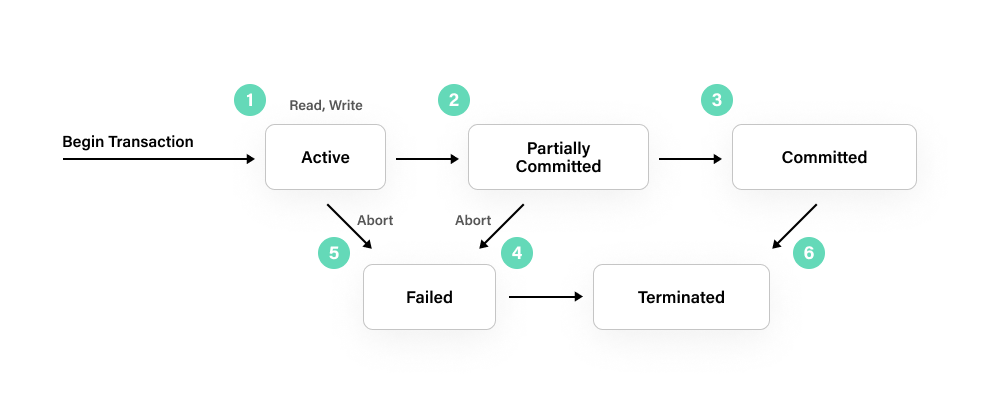

# ACID
現代 SQL 資料庫都使用 ACID 等交易標準來確保資料完整性並防止使用者看到錯誤或過時的數據
1. 原子性（Atomicity）：
   示例：假設銀行轉賬操作是一個交易。當從一個賬戶轉移資金到另一個賬戶時，交易要麼完全執行，要麼完全回滾。
   原子性保證：如果轉賬操作的任何部分失敗，比如扣款成功但存款失敗，整個操作將被回滾，確保資金不會因為部分執行而遺失或重覆。
2. 一致性（Consistency）：
   示例：考慮一個在線購物網站的庫存管理。如果一個用戶下單購買了 5 個商品，但實際庫存只有 3 個，庫存應該保持一致，不允許賣出超過庫存的商品數量。
   一致性保證：交易在執行之前和之後，系統處於一致的狀態，即從一個合法狀態轉移到另一個合法狀態，不會破壞數據完整性和業務規則。
3. 隔離性（Isolation）：
   示例：考慮一個銀行系統，一個客戶正在執行轉賬操作，同時另一個客戶也在執行轉賬。隔離性確保這兩個交易相互隔離，互不干擾。
   隔離性保證：並發執行的交易不會相互影響，每個交易都以獨立、隔離的方式執行，就好像是在系統中順序執行一樣。
4. 持久性（Durability）：
   示例：考慮數據庫提交的數據，如銀行轉賬交易。即使系統崩潰或斷電，已經提交的轉賬交易數據也應該持久保存，不會丟失。
   持久性保證：一旦交易提交，其修改的數據應該永久保存在數據庫中，即使在系統故障情況下也不會丟失。

## 隔離層級
隔離性保證的基本方式是在資料庫層面，對資料庫或相關欄位鎖定，在同一時間內只允許一個交易進行更新或讀取。

可能發生的問題：
### 更新遺失（lost update）
基本上就是指某個交易對欄位進行更新的資訊，因另一個交易的介入而遺失。

例如，兩個以上交易在進行同一欄位的更新時，若沒有對欄位進行鎖定，若交易 A 進行 COMMIT，交易 B 因故 ROLLBACK，則交易 A 所作的更新就會發生遺失的問題：
1. 交易 A 更新欄位 1
2. 交易 B 更新欄位 1
3. 交易 A COMMIT
4. 交易 B ROLLBACK

另一種可能的情況是，如果交易 A 在交易 B 前後進行更新與 COMMIT，則交易 B 所作的更新將會遺失，又稱為二次更新遺失（second lost update），例如：
1. 交易 A 更新欄位 1
2. 交易 B 更新欄位 1
3. 交易 B COMMIT
4. 交易 A COMMIT

### 髒讀（dirty read）
兩個交易同時進行，其中一個交易更新資料，另一個交易讀取了尚未 COMMIT 的資料。例如：
1. 交易 A 更新欄位 1
2. 交易 B 讀取欄位 1
3. 交易 A ROLLBACK
4. 交易 B COMMIT

### 無法重複的讀取（unrepeatable read）
某個交易兩次讀取同一欄位的資料並不一致，例如，如果交易 A 在交易 B 前後進行資料的讀取，則會得到不同的結果。
1. 交易 A 讀取欄位 1
2. 交易 B 更新欄位 1
3. 交易 B COMMIT
4. 交易 A 讀取欄位 1

### 幻讀（phantom read）
如果交易 A 進行兩次查詢，在兩次查詢之中有個交易 B 插入一筆新資料或刪除一筆新資料，第二次查詢時得到的資料多了第一次查詢時所沒有的筆數，或者少了一筆。
1. 交易 A 進行查詢得到五筆資料
2. 交易 B 插入一筆資料
3. 交易 B COMMIT
4. 交易 A 進行查詢得到六筆資料

隔離交易的基本方式是鎖定資料庫，但完全的鎖定資料庫實務上並不會這麼作，因為將導致效能問題，因此實務上會根據資料讀寫更新的頻繁性，設定不同的交易隔離層級（transaction isolation level）：

### read uncommited
至少保證：「A 交易已更新但尚未確認的資料，B 交易僅可作讀取動作」。

基本作法是，A 交易在更新但未提交，B 交易的更新會被延後至 A 提交之後。

至少可避免更新遺失的問題。

交易資料庫引擎會採取的最低隔離層級，這個隔離層級讀取錯誤資料的機率太高，一般不會採用這種隔離層級。

### read commited
比 read uncommited 嚴格一些，至少要保證：「交易讀取的資料必須是已確認的資料」。

基本作法是， 讀取的交易不會阻止其它的交易，一個未確認的更新交易會阻止其它所有的交易，但這影響效能較大，另一個基本作法是交易正在更新，尚未確定前都先操作暫存表格。

至少可避免 dirty read 以下問題。

### repeatable read
比 read commited 嚴格，至少保證：「同一交易內兩次讀取的資料必須相同」。

基本作法是， 讀取交易不會阻止其它讀取的交易，但阻止其它寫入的交易，但這影響效能較大，另一基本作法是，一個交易正在讀取，尚未確認前，另一交易要更新給予暫存表格。

至少可避免 unrepeatable read 以下問題。

### serializable
最嚴格的隔離層級，只要有資料不一致的疑慮，交易必須可以循序，也就是一個一個來（正是 serializable 名稱的由來）。

基本作法是，A 交易讀取時，B 交易若要更新，就必須循序，A 交易更新時，B 交易無論讀取或更新都必須循序。

可避免 phantom Read 以下問題。

read uncommited 出錯的機率太大，大部份的應用程式會選用 read commited 或 repeatable read 的隔離層級，而 serializable 執行完全的鎖定，交易只能循序進行，可能嚴重傷害系統效能。終究還是依據需求制訂。

隔離層級對多個交易並行處理的影響，YES 表示可能會發生問題：
| | Read uncommitted | Read committed | Repreatable read | Serializable |
| -------- | -------- | -------- | -------- | -------- |
| Phantom Read | YES | YES | YES | NO |
| Unrepeatable Read | YES | YES | NO | NO |
| Dirty Read | YES | NO | NO | NO |

## 交易狀態
1. 活動狀態 Active states ：它是交易執行期間的第一個狀態。只要執行其指令（讀取或寫入操作），交易就處於活動狀態。
2. 部分提交 Partially Committed ：在此狀態下已執行更改，但資料庫尚未在磁碟上提交更改。在此狀態下，資料儲存在記憶體緩衝區中，且緩衝區尚未寫入磁碟。
3. 已提交 Committed ：在此狀態下，所有交易更新都永久儲存在資料庫中。因此，在此之後無法回滾交易。
4. 失敗 Failed ：如果交易在活動狀態或部分提交狀態下失敗或被中止(abort)，則進入失敗狀態。
5. 終止狀態 Terminated state ：這是已提交或失敗之後的最後一個也是最終的交易狀態。這代表交易生命週期的結束。
   
