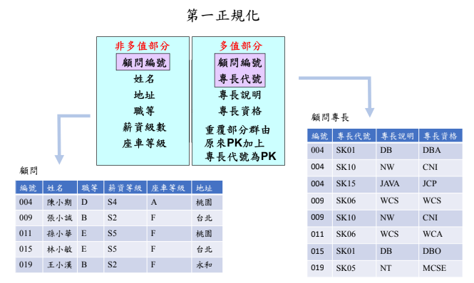
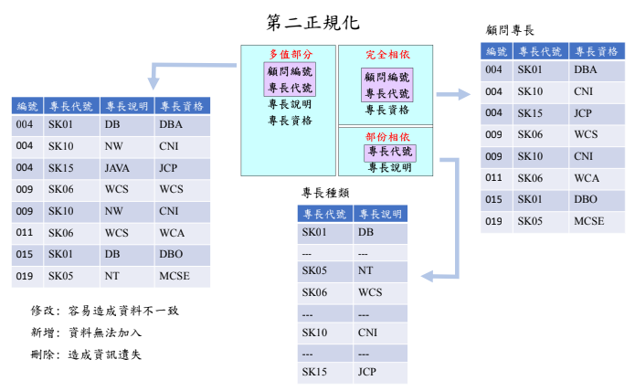
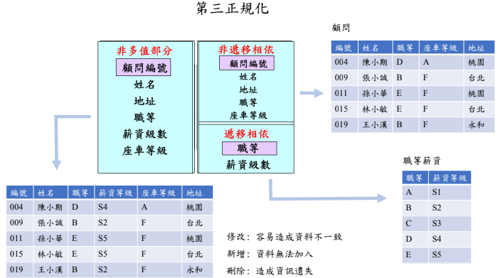

# Database Normalization

鍵定義：

- 超鍵(super key): 能做為唯一標識的屬性集
- 候選鍵(candidate key): 不含有多餘屬性的超鍵稱為候選鍵。也就是在候選鍵中，若再刪除屬性，就不是鍵了。
- 主鍵(primary key): 從候選鍵中選擇出來的特定鍵
- 外鍵(foreign key)：如果 table R 中屬性 K 是其它 table 的主鍵，那麽 K 在 table R 中稱為外鍵

**非正規化結構**
例：假設一家公司想要儲存員工的姓名和聯絡資訊。
| emp_id | emp_name | emp_address | emp_mobile |
|--------|----------|-------------|------------------|
| 101 | Herschel | New Delhi | 8912312390 |
| 102 | Jon | Kanpur | 8812121212   9900012222 |
| 103 | Ron | Chennai | 7778881212 |
| 104 | Lester | Bangalore | 9990000123   8123450987 |

## 第一正規化(1NF)

去除重複群組，表格的每一筆資料中的 cell 不能包含多個值。
| emp_id | emp_name | emp_address | emp_mobile |
|--------|----------|-------------|------------|
| 101 | Herschel | New Delhi | 8912312390 |
| 102 | Jon | Kanpur | 8812121212 |
| 102 | Jon | Kanpur | 9900012222 |
| 103 | Ron | Chennai | 7778881212 |
| 104 | Lester | Bangalore | 9990000123 |
| 104 | Lester | Bangalore | 8123450987 |

或是橫向擴展，將 emp_mobile 拆成 emp_mobile_1、emp_mobile_2

## 第二正規化(2NF)

去除部分相依，確保非主屬性完全依賴於候選鍵(具唯一性的一個/組屬性)。
例：假設一所學校想要儲存教師及其所教授科目的資料。
| teacher_id | subject | teacher_age |
|------------|-----------|-------------|
| 111 | Maths | 38 |
| 111 | Physics | 38 |
| 222 | Biology | 38 |
| 333 | Physics | 40 |
| 333 | Chemistry | 40 |

候選鍵： {teacher_id, subject}
非主屬性： teacher_age

將其分成兩個表
teacher_details table:
| teacher_id | teacher_age |
|------------|-------------|
| 111 | 38 |
| 222 | 38 |
| 333 | 40 |

teacher_subject table:
| teacher_id | subject |
|------------|-----------|
| 111 | Maths |
| 111 | Physics |
| 222 | Biology |
| 333 | Physics |
| 333 | Chemistry |

## 第三正規化(3NF)

消除傳遞依賴，確保每列只依賴於主鍵。
例：假設一家公司想要儲存每位員工的完整地址。
| emp_id | emp_name | emp_zip | emp_state | emp_city | emp_district |
|--------|----------|---------|-----------|----------|--------------|
| 1001 | John | 282005 | UP | Agra | Dayal Bagh |
| 1002 | Ajeet | 222008 | TN | Chennai | M-City |
| 1006 | Lora | 282007 | TN | Chennai | Urrapakkam |
| 1101 | Lilly | 292008 | UK | Pauri | Bhagwan |
| 1201 | Steve | 222999 | MP | Gwalior | Ratan |

超鍵: {emp_id}, {emp_id, emp_name}, {emp_id, emp_name, emp_zip}...
候選鍵: {emp_id}
非主屬性：除 emp_id 以外的所有屬性都是，因為它們不屬於任何候選鍵。

這裡，emp_state、emp_city 和 emp_district 依賴 emp_zip。並且 emp_zip 依賴 emp_id，這使得非主屬性（emp_state、emp_city 和 emp_district）傳遞依賴超級鍵（emp_id）
將該表分成
employee table：
| emp_id | emp_name | emp_zip |
|--------|----------|---------|
| 1001 | John | 282005 |
| 1002 | Ajeet | 222008 |
| 1006 | Lora | 282007 |
| 1101 | Lilly | 292008 |
| 1201 | Steve | 222999 |

employee_zip table:
| emp_zip | emp_state | emp_city | emp_district |
|---------|-----------|----------|--------------|
| 282005 | UP | Agra | Dayal Bagh |
| 222008 | TN | Chennai | M-City |
| 282007 | TN | Chennai | Urrapakkam |
| 292008 | UK | Pauri | Bhagwan |
| 222999 | MP | Gwalior | Ratan |

大多數情況下，第三正規化已經能夠解決數據模型中的大部分問題。

## BC 正規化 Boyce Codd normal form (BCNF)

也稱為 3.5NF，要求每個非主屬性都直接依賴於候選鍵，不可以出現由部分主屬性也可以唯一確定、或者由另一個或者另一些非主屬性唯一確定的情況。
例：假設有一家公司，其員工在多個部門工作。
| emp_id | emp_nationality | emp_dept | dept_type | dept_no_of_emp |
|--------|-----------------|-----------------------------|-----------|----------------|
| 1001 | Austrian | Production and planning | D001 | 200 |
| 1001 | Austrian | stores | D001 | 250 |
| 1002 | American | design and technical support| D134 | 100 |
| 1002 | American | Purchasing department | D134 | 600 |

上表中的函數依賴關係：
emp_id -> emp_nationality
emp_dept -> {dept_type, dept_no_of_emp}
候選鍵： {emp_id, emp_dept}
不符合 BCNF 中，因為 emp_id 和 emp_dept 分別都不是鍵。

拆分成
emp_nationality table:
| emp_id | emp_nationality |
|---------|---------|
| 1001 | Austrian |
| 1002 | American |

emp_dept table:
| emp_dept | dept_type | dept_no_of_emp |
|-----------------------------|-----------|----------------|
| Production and planning | D001 | 200 |
| stores | D001 | 250 |
| design and technical support| D134 | 100 |
| Purchasing department | D134 | 600 |

emp_dept_mapping table:
| emp_id | emp_dept |
|--------|-----------------------------|
| 1001 | Production and planning |
| 1001 | stores |
| 1002 | design and technical support|
| 1002 | Purchasing department |

依賴：
emp_id -> emp_nationality
emp_dept -> {dept_type, dept_no_of_emp}

候選鍵：
第一個表：emp_id
第二個表：emp_dept
第三個表：{emp_id, emp_dept}

## 其他正規化

去除多值屬性的 4NF、去除冗餘關聯相依的 5NF、甚至是針對於多維數組和多值依賴的設計的 6NF，會因數據關係表的增加而令資料庫 IO 更易繁忙，在實務上並不會去實現。

