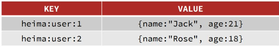
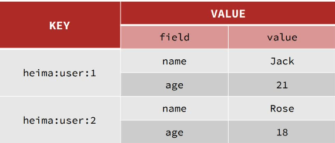
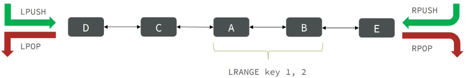
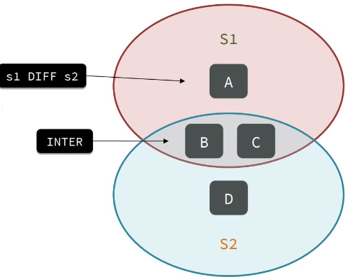
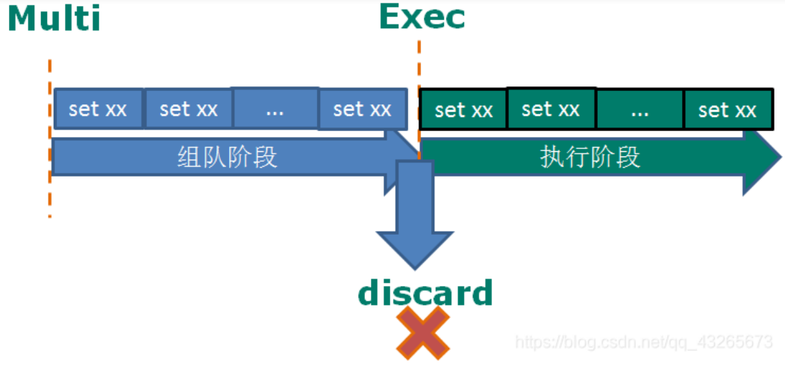
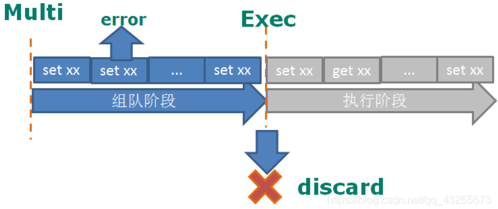
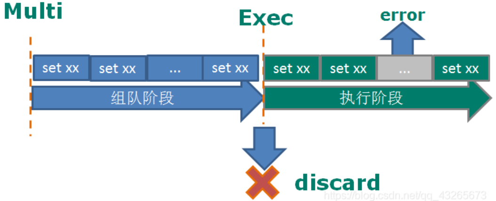
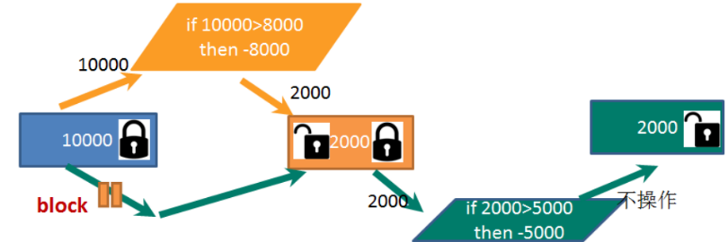
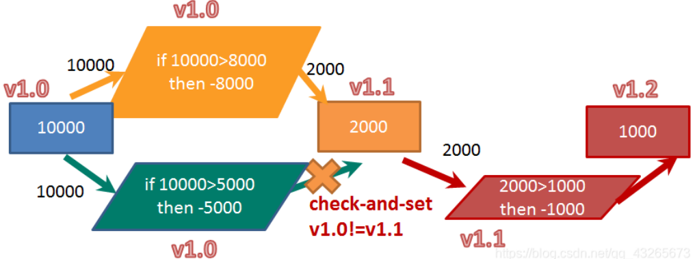

# Redis
* 鍵值（key-value）型，value 支持多種不同數據結構，功能豐富
* 單線程，每個命令具備原子性
* 低延遲，速度快（基於內存、IO 多路復用、良好的編碼）
* 支持數據持久化（定期將內存搬運到磁盤）
* 支持主從集群、分片集群（數據拆分）
* 支持多語言客戶端

## 安裝
以CentOS 7 示範，這裡使用Redis 6.2.14
1. 安裝Redis 依賴`yum install -y gcc tcl`
2. 將redis-6.2.14.tar.gz 上傳到虛擬機的任意目錄，這裡放到/usr/local/src
3. 解壓`tar -zxvf redis-6.2.14.tar.gz`
4. `cd redis-6.2.14/`、`make && make install` (默認安裝目錄在/usr/local/bin)

安裝目錄下
redis-benchmark：性能測試工具
redis-check-aof：修復有問題的aof 文件
redis-check-rdb：修復有問題的rdb 文件
redis-sentinel：集群使用
redis-server：服務器啟動命令
redis-cli：客戶端，操作入口

### 啟動方式
#### 默認啟動
任意目錄執行`redis-server`，需要一直掛著頁面
#### 指定配置啟動
以後台方式啟動，修改redis.conf
1. `cd /usr/local/src/redis-6.2.14/`
2. `cp redis.conf redis.conf.bak` 備份原始檔案
3. `vi redis.conf`
```
#監聽的地址，默認是只能在本地訪問，修改為0.0.0.0則可以再任意IP訪問，正式環境不要這樣設
#bind 127.0.0.1 -::1
bind 0.0.0.0

#守護進程，yes可在後台運行
#daemonize no
daemonize yes

#密碼，設置後訪問redis必須輸入密碼
requirepass password

### 以下說明其他常用的配置
#監聽端口
port 6379

#工作目錄(默認當前目錄)，也就是運行redis-server時的命令，日誌、持久化等文件會保存在這下
dir ./

#資料庫數量(默認16個，編號0-15)
databases 16

#最大內存
# maxmemory <bytes>

#日誌文件，默認不紀錄
#logfile ""
logfile "redis.log"
```
4. `cd /usr/local/src/redis-6.2.14`、`redis-server redis.conf` 啟動
5. `ps -ef | grep redis` 驗證，會得到redis-server 0.0.0.0:6379
6. `kill -9 進程號` 關閉(強制但是不安全)，或是在命令行客户端中使用`shutdown`

#### 開機自動啟動
1. `vi /etc/systemd/system/redis.service` 新建文件
```
[Unit]
Description=redis-server
After=network.target

[Service]
Type=forking
ExecStart=/usr/local/bin/redis-server /usr/local/src/redis-6.2.14/redis.conf
PrivateTmp=true

[Install]
WantedBy=multi-user.target
```
2. `systemctl daemon-reload` 重新加載系統服務
3. `systemctl start redis` 啟動
4. `systemctl status redis` 驗證
5. `systemctl stop redis` 關閉
6. `systemctl restart redis` 重啟
7. `systemctl enable redis` 設置開機自啟

## Redis 客戶端
### 命令行客户端
Redis 安裝完成後就自帶了命令行客戶端，`redis-cli [options] [commonds]`
其中常見的options有：
* `-h 127.0.0.1`：指定要連接的redis 節點的IP 地址，默認是127.0.0.1
* `-p 6379`：指定要連接的redis 節點的端口，默認是6379
* `-a 123321`：指定redis 的訪問密碼，若沒輸入密碼爾後要再透過`AUTH password` 輸入

commonds 就是Redis 的操作命令，例如：`ping`；不指定commond 時，會進入redis-cli 的交互控制台

### 圖形化桌面客戶端
使用RedisDesktopManager(非官方提供)
https://github.com/lework/RedisDesktopManager-Windows
這裡下載2022.5 ，解壓後即可安裝

### Java 客戶端
Jedis、SpringDataRedis

## 命令
以下舉例一些常用的
### key
* KEYS pattern：查找所有符合給定模式(pattern)的key
* DEL key：若key 存在時刪除key
* EXISTS key：檢查key 是否存在
* EXPIRE key seconds：為key 設置過期時間，以秒計
* TTL key：查看過期時間
* TYPE key：查看key 類型
* UNLINK key：非阻塞刪除，先將key 從keyspace 元數據中刪除、真正的刪除會在後續異步執行

#### 庫
* SELECT：切換庫(默認使用0)
* DBSIZE：查看當前庫的數量
* FLUSHDB：清空當前庫
* FLUSHALL：清空所有庫

### String
其value 是字符串，不過根據字符串格式，可分三類：string(普通字符串)、int(整數，可做自增減)、float(浮點數，可做自增減)；底層都是字節數組型式存儲，只不過是編碼方式不同(最大空間不能超過512m)

* SET：添加或者修改已經存在的一個String 類型的鍵值對
* GET：根據key 獲取String 類型的value
* APPEND：將給定的value 追加到原值末尾
* STRLEN：獲取值的長度
* MSET：批量添加多個String 類型的鍵值對
* MGET：根據多個key 獲取多個String 類型的value
* MSET key value [key value ...]：同時設置一個或多個 key-value 對，有原子性
* INCR(DECR)：讓一個整型的key 自增減1
* INCRBY(DECRBY):讓一個整型的key 自增減並指定步長，例如：incrby num 2 讓num值自增2
* INCRBYFLOAT(DECRBYFLOAT)：讓一個浮點類型的數字自增並指定步長
* SETNX：添加一個String 類型的鍵值對，前提是這個key 不存在，否則不執行
* SETEX：添加一個String 類型的鍵值對，並且指定有效期
* GETRANGE key <起始位置> <結束位置>：獲取key 的起始位置到結束位置的值
* SETRANGE key <起始位置> value：將value 的值覆蓋起始位置開始
* GETSET：用新值換舊值，並取得舊值

Redis 的key 允許有多個單詞形成層級結構，多個單詞之間用':'隔開，例如：項目名:業務名:類型:id。
例如我們的項目名稱叫foo，有user 和product 兩種不同類型的數據，我們可以
這樣定義key：
* user相關的key：foo:user:1
* product相關的key：foo:product:1

### Hash
也叫散列，其value 是一個無序字典，類似於Java 中的HashMap 結構。
String 結構是將對象序列化為JSON 字符串後存儲，當需要修改對象某個字段時很不方便

而Hash 結構可以將對象中的每個字段獨立存儲，可以針對單個字段做CRUD。


* HSET key field value：添加或者修改hash 類型key 的field 的值
* HGET key field：獲取一個hash 類型key 的field 的值
* HEXISTS key field：查看key 中，指定的field 是否存在
* HMSET：批量添加多個hash 類型key 的field 的值
* HMGET：批量獲取多個hash 類型key 的field 的值
* HGETALL：獲取一個hash 類型的key 中的所有的field 和value
* HKEYS：獲取一個hash 類型的key 中的所有的field
* HVALS：獲取一個hash 類型的key 中的所有的value
* HINCRBY:讓一個hash 類型key 的字段值自增並指定步長
* HSETNX：添加一個hash 類型的key 的field 值，前提是這個field 不存在，否則不執行

### List
與Java 中的LinkedList 類似，可以看做是一個雙向鏈表結構。既可以支持正向檢索和也可以支持反向檢索。特征也與LinkedList 類似：有序、元素可以重復、插入和刪除快、查詢速度一般。

* LPUSH key element ...：向列表左側插入一個或多個元素
* LPOP key：移除並返回列表左側的第一個元素，沒有則返回nil，值光鍵亡
* RPUSH key element ...：向列表右側插入一個或多個元素
* RPOP key：移除並返回列表右側的第一個元素，值光鍵亡
* LRANGE key star end：返回一段角標範圍內的所有元素
* LINDEX key index：通過索引獲取列表中的元素
* BLPOP 和BRPOP：與LPOP 和RPOP 類似，只不過在沒有元素時等待指定時間，而不是直接返回nil
* RPOPLPUSH source destination：移除列表的最後一個元素，並將該元素添加到另一個列表並返回
* LINSERT key BEFORE|AFTER value newvalue：在列表的元素前或者後插入元素
* LLEN key：獲取列表長度
* LSET key index value：通過索引設置列表元素的值
* LREM key count value：移除列表元素



### Set
與Java 中的HashSet 類似，可以看做是一個value 為null 的HashMap。因為也是一個hash 表，因此具備與HashSet 類似的特征：無序、元素不可重復、查找快、支持交集和聯集和差集等功能。

* SADD key member ...：向set 中添加一個或多個元素
* SREM key member ... :移除set 中的指定元素
* SCARD key：返回set 中元素的個數
* SISMEMBER key member：判斷一個元素是否存在於set 中
* SMEMBERS：獲取set 中的所有元素
* SPOP key：移除並返回集合中的一個隨機元素
* SRANDMEMBER key [count]：返回集合中一個或多個隨機數
* SMOVE source destination member：將member 元素從source 集合移動到destination 集合
* SINTER key1 key2 ...：求key1 與key2 的交集
* SDIFF key1 key2 ...：求key1 與key2 的差集(key1 中的，不存在key2 中)
* SUNION key1 key2 ...：求key1 和key2 的聯集



### SortedSet(Zset)
可排序的set 集合，與Java 中的TreeSet 有些類似，但底層數據結構卻差別很大。SortedSet 中的每一個元素都帶有一個score 屬性，可以基於score 屬性對元素排序，底層的實現是一個跳表（SkipList）加hash 表。具備特性：可排序、元素不重復、查詢速度快。

* ZADD key score member：添加一個或多個元素到sorted set，如果已經存在則更新其score 值
* ZREM key member：刪除sorted set 中的一個指定元素
* ZSCORE key member :獲取sorted set 中的指定元素的score 值
* ZRANK key member：獲取sorted set 中的指定元素的排名
* ZCARD key：獲取sorted set 中的元素個數
* ZCOUNT key min max：統計score 值在給定範圍內的所有元素的個數
* ZINCRBY key increment member：讓sorted set 中的指定元素自增，步長為指定的increment 值
* ZRANGE key min max [WITHSCORES]：按照score 排序後，獲取指定排名範圍內的元素
* ZRANGEBYSCORE key min max [WITHSCORES]：按照score排序後，獲取指定score 範圍內的元素
* ZDIFF、ZINTER、ZUNION：求差集、交集、聯集

注意：所有的排名默認都是升序，如果要降序則在命令的Z 後面添加REV 即可。

### Bitmaps
本身是一個字符串，不是數據類型，但是它可以對字符串的位進行操作。可以把Bitmaps 想像成一個以位為單位的數組，數組的每個單元只能存放0和1，數組的下標在Bitmaps 中稱為偏移量(從0開始)。合理使用操作位可以有效地提高內存使用率和開發使用率。

* SETBIT key offset value：設置某個偏移量的值(0或1)
* GETBIT key offset：獲取某個偏移量的值
* BITCOUNT key [start] [end]：統計值為1的bit 數
* BITOP AND/OR/NOT/XOR destkey [key...]：將多個Bitmaps 進行and(交集)、or(聯集)、not(非)、xor(抑或)操作，並把結果保存在destkey 中

### HyperLogLog
只會根據輸入元素來計算基數，而不會儲存輸入元素本身，不能像集合那樣，返回輸入的各個元素。假如資料集{1,3,5,7,5,7,8}、那麼這個資料集的基數集為{1,3,5,7,8}，基數(不重複元素)為5。

* PFADD key element...：向HLL 加元素
* PFCOUNT key...：計算基數
* PFMERGE destkey sourcekey...：將多個HLL 合併後的結果存到另一個HLL

### Geographic
提供經緯度設置，查詢範圍，距離查詢等。有效經度-180到180、緯度-85.05112878到85.05112878、超出範圍會返回錯誤。

* GEOADD key longitude latitude member：添加地理位置
* GEOPOS key member：獲得座標值
* GEODIST key member1 member2 [m|km|ft|mi]：取得兩個位置的直線距離(單位默認為m)
* GEORADIUS key longitude latitude radius m|km|ft|mi：以給定的經緯度為中心，找出某一半徑內的元素

## 發布和訂閱
Redis 客戶端可以訂閱任意數量的頻道
第一個客戶端，訂閱
```
redis 127.0.0.1:6379> SUBSCRIBE mych

Reading messages... (press Ctrl-C to quit)
1) "subscribe"
2) "mych"
3) (integer) 1
```
第二個客戶端，發送
```
redis 127.0.0.1:6379> PUBLISH mych "Learn redis"

(integer) 1

# 訂閱者的客戶端會顯示如下消息
 1) "message"
2) "mych"
3) "Learn redis"
```

## 事務
* Redis 事務是一個單獨的隔離操作：事務中的所有命令都會序列化、按順序地執行。事務在執行的過程中，不會被其他客戶端發送來的命令請求所打斷
* 沒有隔離級別的概念：事務提交前所有指令都不會被執行
* 無原子性：事務組隊時具有原子性，但在執行階段出錯某段指令、事務過程中的其他指令仍然會生效

Redis 事務的主要作用就是串聯多個命令防止別的命令插隊。

### 命令
* MULTI：用於開啟一個事務塊，表示之後的命令將被放入事務隊列中，但並不會立即執行
* EXEC：用於執行事務隊列中的所有命令。執行事務後，事務隊列會被清空
* DISCARD：用於取消事務，清空事務隊列中的命令

事務分2個階段：組隊階段、執行階段
* 組隊階段：將所有命令加入命令隊列
* 執行階段：依次執行隊列中的命令，期間不會被其他客戶端發送的請求命令插隊或打斷



```
127.0.0.1:6379> multi
OK
127.0.0.1:6379(TX)> set k1 v1
QUEUED
127.0.0.1:6379(TX)> set k2 v2
QUEUED
127.0.0.1:6379(TX)> exec
1) OK
2) OK
127.0.0.1:6379> multi
OK
127.0.0.1:6379(TX)> set k3 v3
QUEUED
127.0.0.1:6379(TX)> set k4 v4
QUEUED
127.0.0.1:6379(TX)> discard
OK
127.0.0.1:6379> keys *
1) "k1"
2) "k2"
```

### 錯誤處理
組隊中某個命令出現了報告錯誤，執行時整個的所有隊列會都會被取消

如果執行階段某個命令出了錯誤，則只有報錯的命令不會被執行，其他的命令都會執行，不會回滾


### 衝突處理
悲觀鎖(Pessimistic Lock)：每次去拿數據的時候都認為別人會修改，所以每次在拿數據的時候都會上鎖，這樣別人想拿這個數據就會block 直到它拿到鎖。傳統的關係資料庫就用到了很多這種鎖機制，比如行鎖，表鎖等，讀鎖，寫鎖等，都是在做操作之前先上鎖。


樂觀鎖(Optimistic Lock)：每次去拿數據的時候都認為別人不會修改，所以不會上鎖，但是在更新的時候會判斷在此期間別人有沒有更新這個數據，可以使用版本號等機製。樂觀鎖適用於多讀的應用類型，這樣可以提高吞吐量。Redis 就是利用這種check-and-set 機制實現事務。


* WATCH key [key...]：在執行multi 之前，先執行watch key，可以監視一個(或多個)key，如果在事務執行之前這個(或這些)key 被其他命令所改動，那麽事務將被打斷
* UNWATCH：取消WATCH 命令對key 的監視。如果在執 WATCH 命令之後，EXEC 命令或DISCARD 命令先被執行了的話，那麽就不需要再執行UNWATCH

客戶端1
```
127.0.0.1:6379> WATCH key
OK
127.0.0.1:6379> MULTI
OK
127.0.0.1:6379(TX)> INCR key
QUEUED
127.0.0.1:6379(TX)> EXEC
1) (integer) 11
```
客戶端2
```
127.0.0.1:6379> WATCH key
OK
127.0.0.1:6379> MULTI
OK
127.0.0.1:6379(TX)> INCR key
QUEUED
127.0.0.1:6379(TX)> exec
(nil)
```

### 併發測試
VM 安裝Apache HTTP Server 相關的工具的包`yum install httpd-tools`
這個工具包含許多功能如：創建和更新用於基本身份驗證的用戶認證文件(htpasswd 工具)、管理摘要認證（Digest Authentication）密碼文件(htdigest 工具)、基準測試(ApacheBench 工具)等等；以下僅介紹ab 工具

`ab -n 100 -c 10 http://www.example.com/`
* -n 選項表示要執行的請求總數
* -c 選項表示並發請求的數量
* http://www.example.com/ 是你要測試的 URL

搭配Java 代碼範例，在VM 中執行`ab -n 1000 -c 100 http://192.168.125.1:8080/secKill`

1. 連接超時問題：透過連線池解決
2. 執行緒安全問題：透過事務命令和WATCH 解決
3. 樂觀鎖更新衝突問題：透過lua 腳本解決

#### lua 腳本
作為嵌入式腳本語言使用，lua 腳本就是將複雜的或者多步的Redis 操作，寫成一個腳本，一次提交給Redis 執行，減少反覆連接的次數。也類似Redis 事務，有一定的原子性，不會被其他命令插隊。只有在Redis 2.6 以上的版本才可以使用。
ex:
```lua=
local userId=KEYS[1];
local prodId=KEYS[2];
local qtKey="sk:"..prodId..":qt";
local userKey="sk:"..prodId..":usr";
local userExists=redis.call("sismember",userKey,userId);
if tonumber(userExists)==1 then
  return 2;
end;
local num=redis.call("get",qtKey);
if tonumber(num)<=0 then
  return 0;
else
  redis.call("decr",qtKey);
  redis.call("sadd",userKey,userId);
end;
return 1;
```

## 持久化
官方推薦兩個都啟用，如果對數據不敏感、可單獨使用RDB，但不建議單獨用AOF、因為可能出現bug。如果只是單純做緩存功能、可以都不用。
### RDB（Redis Database）
默認的持久化方式，用於將Redis 中的數據定期保存到磁盤。它生成一個快照文件，保存Redis 數據庫在某個時間點的狀態。這個文件通常具有`.rdb`擴展名。

流程：
1. 觸發快照保存（Snapshotting）：通過兩種方式觸發，自動觸發(通過配置文件中的`save`選項)；手動觸發(使用`BGSAVE`或`SAVE`命令)
2. 創建子進程（forking）：子進程負責將內存中的數據寫入RDB 文件，而主進程繼續處理客戶端請求
3. 生成RDB 文件：子進程將當前內存中的所有數據寫入一個臨時文件，寫入完成後，臨時文件會被原子性地重命名為`dump.rdb`文件
4. 清理工作：當子進程完成RDB文件的生成後，會向主進程發送信號通知其完成，主進程收到信號後，會清理子進程的相關資源

通過修改Redis 的配置文件`redis.conf`來配置RDB 持久化：
* stop-writes-on-bgsave-error：在後臺保存出現錯誤時，停止寫操作。默認yes 開啟
* dbfilename：指定RDB文件的文件名，默認是`dump.rdb`
* dir：指定RDB文件的存儲目錄，預設的路徑是啟動Redis 伺服器時所在的路徑
* save：指定在多長時間內有多少次寫操作時觸發RDB持久化
```
save 900 1   # 如果900秒（15分鐘）內有至少1次寫操作
save 300 10  # 如果300秒（5分鐘）內有至少10次寫操作
save 60 10000  # 如果60秒（1分鐘）內有至少10000次寫操作
```
* rdbcompression：是否對RDB 文件進行壓縮，默認yes 啟用。啟用壓縮可以減少RDB文件的大小，但可能會增加CPU的使用量
* rdbchecksum：是否在對RDB 文件進行校驗，檢測RDB 文件在寫入和讀取過程中有無數據損壞，默認yes 開啟

演示：
1. `redis.conf`設置`save 20 3`，表示20秒內有超過3次寫操作即持久化
2. 重啟Redis，若沒指定`dir`、`dump.rdb`會出現在啟動Redis 指令的目錄(`systemctl start redis`會在`/`；`cd /usr/local/src/redis-6.2.14`、`redis-server redis.conf`啟動會在`/usr/local/src/redis-6.2.14`)
3. 實際進入客戶端寫入資料，`dump.rdb`會增長
4. 關閉Redis
5. 將`dump.rdb`改名，例如`dump123.rdb`
6. 啟動Redis 會發現原來的資料都不見了
7. 關閉Redis 在將`dump123.rdb`名稱改回來
8. 啟動Redis 會發現原來的資料回來了，這就是持久化的效果

優點
* 快速恢復：RDB 文件是緊湊的二進製文件，可以快速恢復大數據集
* 減少性能影響：與AOF 相比，RDB 持久化對性能影響較小，因為它不會在每次寫操作後持久化數據

缺點
* 數據丟失風險：由於RDB 快照是定期生成的，如果Redis 在兩次快照之間崩潰，所有在上次快照之後的寫操作都會丟失
* 創建快照耗時：在大數據集上生成RDB 快照可能會消耗大量時間和資源

### AOF（Append Only File）
以日誌的形式記錄每個執行過的寫指令，只許追加文件但不可以改寫文件，Redis 啟動之初就會讀取該檔案重新建構數據，換言之，Redis 重啟的話會根據日誌檔案的內容將寫入指令從前到後執行一次以完成資料的復原工作。

流程：
1. 命令追加：每當有寫操作（如SET、HSET等）發生時，Redis 會將該命令以文本格式追加到AOF 緩衝區
2. 寫入磁盤：Redis 不會在每次追加命令後立即將數據寫入磁盤，而是先將命令寫入操作系統的內存緩存中。可以通過配置文件中的`appendfsync`選項來控製AOF 文件的寫入策略
3. AOF 重寫：為了避免AOF 文件過大，Redis支持AOF 文件重寫機製，即對現有AOF 文件進行壓縮，生成一個新的、內容相同但更緊湊的AOF 文件。重寫是通過創建一個新的子進程來完成的，子進程在不阻塞主進程的情況下將當前內存中的數據寫入一個新的文件。

通過修改Redis 的配置文件`redis.conf`來配置AOF 持久化：
* appendonly：啟用或禁用AOF 持久化，默認是禁用的。若AOF 和RDB 同時開啟，系統預設取AOF 的數據
* appendfilename：指定AOF 文件的文件名，默認是`appendonly.aof`，文件路徑同RDB
* appendfsync：指定寫入AOF 文件時的fsync 頻率，有三個選項：always，每次寫操作後都進行fsync（最安全，但性能最低）。everysec，每秒進行一次fsync（折中，推薦設置）。no，依賴操作系統來決定何時進行fsync（性能最高，但最不安全）。
* auto-aof-rewrite-percentage：指定自動觸發AOF 重寫的條件之一，即當前AOF 文件大小相對於上一次重寫後AOF 文件大小的百分比增長量。默認值100（表示當AOF 文件大小達到上一次重寫後大小的兩倍時觸發重寫）。假設上一次重寫後的AOF 文件大小為50MB，若當前AOF 文件大小達到100MB 時（增長了100%），Redis 將自動觸發AOF 重寫。
* auto-aof-rewrite-min-size：指定自動觸發AOF 重寫的條件之二，即當前AOF 文件的最小大小。只有當AOF 文件大小超過此閾值時，auto-aof-rewrite-percentage 配置才會生效。默認值64MB。假設上一次重寫後的AOF 文件大小為20MB，即使當前AOF 文件大小增長了100%達到40MB，也不會觸發自動重寫，除非AOF 文件大小超過64MB。

演示：
1. `redis.conf`設置`appendonly yes`
2. 重啟Redis，會發現資料是空的，因為若AOF 和RDB 同時開啟，系統會取AOF 的數據
3. 實際進入客戶端寫入資料，`appendonly.aof`會增長
4. 關閉Redis
5. 將`appendonly.aof`改名，例如`appendonly123.aof`
6. 啟動Redis 會發現原來的資料都不見了
7. 關閉Redis 在將`appendonly123.aof`名稱改回來
8. 啟動Redis 會發現原來的資料回來了，這就是持久化的效果

異常修復：
1. 將`appendonly.aof`文件末尾加上文字hello
2. 重啟Redis，會發現連接遭拒
3. 執行`/usr/local/bin/redis-check-aof --fix appendonly.aof`，會發現文件末尾的錯誤文字被恢復了
4. 重啟Redis，即可正常使用

優點
* 高持久性： AOF 通過記錄每個寫操作來提供高持久性，數據丟失風險較小
* 更靈活的持久化策略： 可以根據需求選擇 fsync 策略，以平衡性能和數據安全性
* 日誌格式： AOF 文件使用易於理解和分析的日誌格式，方便排查問題。

缺點
* 文件較大： 由於記錄了每個寫操作，AOF 文件比 RDB 文件大得多
* 恢復速度較慢： 恢復時需要重放所有寫操作，速度比加載 RDB 文件慢
* 性能開銷： fsync 操作會帶來一定的性能開銷，特別是在選擇 always 模式時

## 主從架構
在此實作一主兩從：


1. 從伺服器掛了：再重啟該從服務器，該從伺服器會變成獨立的主服務器。就會脫離了原有的主從架構。需要透過`slaveof <ip> <port>`命令其設定為從服務器，設定完成後即會從頭開始複製主服務器的資料。
2. 主伺服器掛了：從服務器知道主服務器的狀態，但是從服務器不會自動上位，主服務器重新啟動之後還是主服務器。

### 薪火相傳
在一主多從的情況下，當從服務器太多情況下，一個主服務器管理不了那麼多從服務器，可以透過從服務器來管理從服務器

### 反客為主
當一個主服務器宕機後，後面的從服務器可以立刻升為主服務器，其他後面的從服務器不用做任何修改

## 哨兵模式
為了解決主從架構中，主服務宕機之後，其餘從伺服器不能主動晉升為主伺服器的問題，接著說明哨兵模式。該模式監聽主服務器，在宕機之後自動從各個從服務器中選出一個作為新的主服務器。哨兵可以設定一個，也可以設定多個，一般而言會設定大於1個的奇數個哨兵，以防止哨兵自身宕機的情況發生。

挑選出新的主服務器後sentinel 向原主服務器的從服務器發送slaveof 指令，當下線的服務重新上線時，sentinel 會向其發送slaveof 指令，讓其成為新主的從服務器。

### 選舉條件
1. 選擇優先順序靠前的：優先權在`redis.conf`中配置，預設`replica-priority 100`，值越小優先權越高
2. 選擇偏移量最大的：偏移量是指獲得原主機資料最全的
3. 選擇runid 最小的：每個Redis 實例啟動後都會隨機產生一個40位元的runid

## 集群
Redis 集群是去中心化的，意思是沒有中心服務器，每個寫入操作都可以自由的落到任意的主機上，此過程不需要代理服務器就能實現；缺點是不支援多鍵操作。
在此實作三個主節點和三個從節點(至少也是要這個數量)：

### slot
管理和分配資料的一種機制。Redis 集群將資料分片，以便在多個節點之間分佈和儲存資料。Redis 集群將整個鍵空間分為16384個插槽（slots）。每個鍵根據其哈希值映射到一個插槽上，然後由特定的節點來管理和儲存這個插槽內的資料。

如果所有某一段插槽的主從節點都宕掉了，Redis 服務是否還能繼續：`redis.conf`中的參數`cluster-require-full-coverage`為yes(默認)、那麼整個叢集都掛掉；為no、那麼該插槽的資料全部不能使用，也無法儲存

## 應用問題
### 緩存穿透
key 的請求從緩存獲取不到，請求都會訪問到資料庫，導致資料壓力增加
1. 緩存空值： 對查詢結果為空的資料進行緩存，並設定較短的過期時間，最長不超過5分鐘。這種方式是一種臨時的處理方式
2. 設定可訪問的名單（白名單）：使用bitmap 類型定義一個可以存取的名單，名單id 作為bitmaps 的偏移量，每次訪問與其做比較，如果訪問id 不在bitmaps 裡面，則進行攔截不允許訪問
3. 使用布隆過濾器（Bloom Filter）：在請求到達快取之前使用布隆過濾器進行快速判斷。如果判定資料不存在，則直接返回，不存取快取和資料庫
### 緩存擊穿
key 對應的資料存在，但在Redis 中過期，此時若有大量的並發請求過來直接存取資料庫，則造成資料庫壓力驟增
1. 預先/監控設定熱門資料：把一些熱門資料提前存入到Redis 裡面，加大這些key 的時長
2. 互斥鎖（Mutex）：透過加鎖機制控制對資料庫的訪問，確保在同一時間只有一個請求可以查詢資料庫並刷新緩存

### 緩存雪崩
大量的key 對應的資料存在，但在Redis 中過期，此時若有大量並發請求過來直接存取資料庫，則造成資料庫壓力驟增
1. 多層緩存架構：可能是Nginx + Redis快取 + 其他快取
2. 快取過期時間分散化：設定快取的過期時間為隨機值，避免大量快取同時過期
3. 使用鎖或隊列（訊息中間件）： 用加鎖或隊列的方式來確保不會有大量的執行緒對資料庫一次性進行讀寫，不適用於高併發情況
4. 設定過期標誌更新緩存：記錄緩存資料是否即將過期，如果即將過期會通知另外的執行緒做更新緩存

## 分布式鎖
常見的分布式鎖實作方式有以下幾種：
* 基於資料庫的分布式鎖：使用資料庫的事務機制來實現，透過在資料庫插入一個唯一的記錄來實現鎖定，其他進程嘗試獲取鎖時會阻塞等待
* 基於緩存的分布式鎖定：利用緩存服務器來實現鎖定，例如使用Redis 的SETNX 或RedLock 演算法來實現，其中RedLock 是一種多重鎖定方式，能夠在不同節點之間避免競爭條件
* 基於ZooKeeper 的分布式鎖定：使用ZooKeeper 叢集節點來實現，ZooKeeper 提供了順序節點以及watch 機制來實現分布式鎖定的獲取和釋放

Redis 能做到分布式鎖，主要也是基於單線程的特性。

衍生問題，業務還沒執行完鎖就過期了怎麼辦？鎖刪除的時候報錯了怎麼辦？透過Redisson 解決(見代碼範例)
### 過期時間
每個鍵的過期時間是保存在一個獨立的過期字典（expiration dictionary）中的。這個字典與儲存實際鍵值對的資料字典（main dictionary）分開。過期字典的鍵與主字典的鍵相同，值是一個以 UNIX 時間戳記形式儲存的過期時間。

在Redis 中我們可以透過四個不同的指令來給鍵設定過期時間
1. EXPIRE key seconds：單位為秒
2. PEXPIRE key milliseconds：單位為毫秒
3. EXPIREAT key timestamp：指定為一個 UNIX 時間戳，單位為秒
4. PEXPIREAT key milliseconds-timestamp：指定為一個 UNIX 時間戳，單位為毫秒

檢查鍵是否過期
1. 檢查給定鍵是否存在於過期時間，如果存在則取鍵的過期時間，如果當前UNIX 時間戳記大於鍵的過期時間，那麼鍵已經過期
2. 使用`TTL`指令或`PTTL`指令，如果返回的值為負數，那麼該鍵已經過期

當服務器運行在主從模式下時，從服務器的過期刪除動作由主服務器控制：
1. 主服務器在刪除一個過期鍵後，會明確地向從服務器發送一個del 命令，告知從服務器刪除這個過期鍵
2. 從服務器執行客戶端發送的讀取命令時，即使碰到過期鍵也不會將過期鍵刪除
3. 從服務器只有在接到主服務器發來的del 指令後，才會刪除過期鍵

#### RDB 對過期鍵的處理
* 產生rdb 檔：產生時，程式會對鍵進行檢查，過期鍵不會放入rdb 檔
* 載入rdb 檔：載入時，如果以主服務器模式運行，程式會對檔案中儲存的鍵進行檢查，過期鍵不會載入資料庫；如果以從服務器模式運行，無論鍵過期與否，都會載入資料庫中，過期鍵會透過與主伺服器同步而刪除。
#### AOF 對過期鍵的處理
* 當服務器以AOF 持久化模式運作時，如果鍵已經過期，但它還沒被刪除，那麼aof 檔案不會因為這個過期鍵而產生任何影響；當過期鍵被刪除後，程式會向aof 檔案追加一條del 指令來明確記錄該鍵已被刪除
* aof 重寫過程中，程式會對資料庫中的鍵進行檢查，已過期的鍵不會被儲存到重寫的aof 檔案中

### 刪除策略
1. 惰性刪除：當客戶端嘗試存取一個鍵時，Redis 會檢查這個鍵是否已經過期。如果過期，會立即刪除這個鍵並傳回一個不存在的結果。這個策略的優點是簡單和高效，因為它只在必要時檢查鍵的過期時間；缺點是刪除前佔用的記憶體不會主動釋放
2. 定時刪除：在設定鍵的過期時間的同時，建立一個定時器（timer），讓定時器在鍵的過期時間來臨時執行對鍵的刪除操作。可以確保過期鍵會被盡快刪除，但在過期鍵比較多的情況下，會佔用相當一部分CPU時間
3. 定期刪除：Redis 會定期（預設每 100 毫秒）隨機檢查一部分設定了過期時間的鍵，並刪除那些已經過期的鍵。這種方式算是前兩者的一個折中方案，可以透過調整定時掃描的時間間隔和每次掃描的限定耗時，平衡效能及緩存資源。
流程：
    1. 遍歷所有的db
    2. 從過期字典的key 的集合中隨機檢查20個key
    3. 刪除檢查中發現的所有過期key
    4. 如果檢查結果中25%以上的key 已過期，則繼續重複執行步驟2和步驟3，否則繼續遍歷下一個db
    
而Redis 中同時使用了惰性過期和定期過期兩種過期策略。

#### 內存淘汰策略
1. volatile-lru：使用最近最少使用（LRU Least Recently Used）演算法，從設定了過期時間的鍵中淘汰最近最少使用的鍵
2. allkeys-lru：使用 LRU 演算法，從所有按鍵中淘汰最近最少使用的鍵，不論這些鍵是否設定了過期時間，通常使用該方式
3. volatile-lfu：使用最近最少使用（LFU Least Frequently Used）演算法，從設定了過期時間的鍵中淘汰使用頻率最低的鍵
4. allkeys-lfu：使用 LFU 演算法，從所有鍵中淘汰使用頻率最低的鍵，不論這些鍵是否設定了過期時間
5. volatile-random：隨機淘汰設定了過期時間的鍵
6. allkeys-random：隨機淘汰所有鍵，不論這些鍵是否設定了過期時間
7. volatile-ttl：從設定了過期時間的按鍵中淘汰即將過期的鍵（剩餘生存時間最短的鍵）
8. noeviction：不淘汰任何鍵。當記憶體不足以滿足寫入操作時，傳回錯誤；默認選項，一般不會選用
