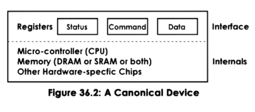

# I/O Management
應用程式的執行不僅依賴CPU和內存，還依賴其他硬體組件。其中一些組件專門用於接收輸入或引導輸出，這些組件稱為I/O 設備；例如：鍵盤、麥克風、顯示器、揚聲器、滑鼠、網路介面卡。

一般來說，這些裝置會有一組可由 CPU 存取並允許 CPU 與之互動的控制暫存器(control registers)。這些暫存器通常分為：
1. 命令暫存器：讓 CPU 控制設備
2. 資料暫存器：讓 CPU 將資料傳入和傳出設備
3. 狀態暫存器：讓 CPU 了解裝置上發生的情況

## 控制器
負責管理 CPU 和外部設備之間通信的硬件組件。它們通常包含自己的處理器和內存，以便高效地處理數據傳輸。
## 驅動程式
操作系統與硬件設備之間的中介軟件組件。驅動程式負責理解系統對 I/O 設備發出的指令，並轉化成 I/O 硬體能理解的內容以執行工作。
## 設備類型
* 輸入設備：鍵盤、滑鼠、觸控板、數位板等。
* 輸出設備：顯示器、印表機、音響設備。
* 存儲設備：傳統硬碟（Hard Disk Drive，HDD）、固態硬碟（Solid State Drive，SSD）、USB 隨身碟。
* 通信設備：網絡介面卡（Network Interface Card，NIC）、語音/視頻攝像頭（Webcam）。
* 處理設備：中央處理器（Central Processing Unit，CPU）、圖形處理器（Graphics Processing Unit，GPU）： 專門處理圖形和影像處理相關的任務。
* 其他設備：感應器（Sensors）、控制設備（Control Devices）。

## 控制流程
1. 請求發出： 生成一個 I/O 請求，可能是讀取或寫入文件、從網絡接收數據、向打印機發送打印命令等。
2. 請求傳遞到內核(kernel)： 生成的 I/O 請求被傳遞到操作系統的內核。內核是操作系統的核心部分，負責管理系統資源和執行各種任務。
3. I/O 請求緩存： 在內核中，這些請求可能被緩存。緩存可以將多個小型請求合併成更大的塊，以減少對設備的訪問次數。
4. 請求調度： 如果有多個請求競爭設備的訪問，內核中的 I/O 調度程序會根據不同的算法（如先進先出，優先級等）來決定請求的執行順序。
5. 設備驅動程序激活： 內核通過相應的設備驅動程序與設備進行通信。將內核請求轉換為特定於設備的命令和控制信號。
6. 設備控制： 設備驅動程序向設備發送必要的命令和控制信號，啟動設備執行特定的操作（如讀取、寫入等）。
7. 數據傳輸： 設備開始進行所需的操作，例如，從磁盤讀取數據，從鍵盤接收輸入，或者將數據傳輸到打印機等。
8. 數據傳回： 如果需要，設備將所需數據傳回給設備驅動程序，然後傳遞到內核和最終的應用程序或進程。
9. 完成和通知： 當設備操作完成時，設備驅動程序通知內核，然後內核通知相應的應用程序或進程操作已經完成。
10. 清理和釋放： 內核和設備驅動程序釋放用於處理此 I/O 請求的資源，並準備處理下一個請求。

## 控制方法
* Process直接控制（Programmed I/O）： CPU 通過直接的程序控制設備的 I/O 操作。它需要 CPU 執行指令來監控和管理每個設備的數據傳輸，因此效率可能較低。
* Polling I/O： CPU 負責定期輪詢設備，查詢是否有數據準備好進行輸入或輸出操作。可能會造成 CPU 資源的浪費，因為它持續查詢設備狀態而無法執行其他任務。
* Interrupted I/O： 當設備準備好進行 I/O 操作時，它向 CPU 發送中斷信號。這讓 CPU 可以繼續執行其他任務，而不必持續監控設備狀態。當中斷信號到達時，CPU 暫停正在執行的任務，轉而處理設備的請求。
* DMA I/O（Direct Memory Access I/O）： 設備可以直接與系統內存通信而無需 CPU 的介入。DMA 控制器允許設備直接存取內存中的數據，這樣 CPU 可以專注於其他任務，同時數據的傳輸由 DMA 控制器處理。