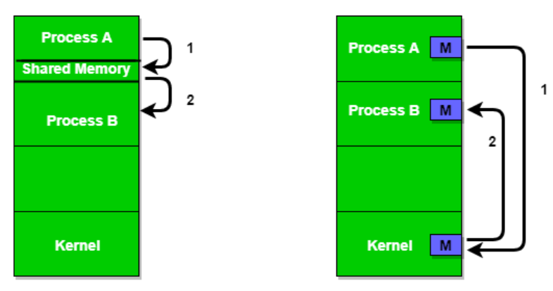
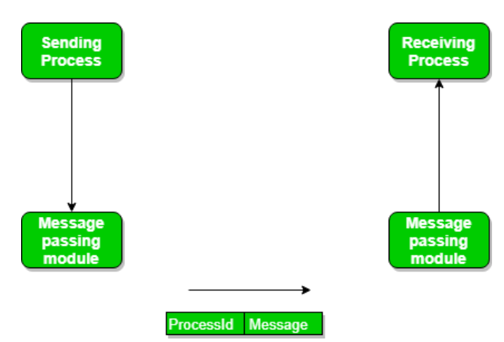

# Interprocess Communication
現代作業系統中，通常不會只有一個Process存在於作業系統內，通常有好幾個Processes同時存在並同時執行。
這些執行的Process可以分成兩大類
* Independent process(獨立進程)： 該Process無法影響其它Process的執行，同時它也不受其他Process影響，獨立的Process之間不會有任何共享資料。
* Co-operating process(合作進程)：該Process能夠影響其它Process，或是受其它Process影響，故Process之間會有共享的資料，需要有進行資訊交換的管道

Process間的溝通就是透過IPC(interprocess communication) 達成。

## 進程溝通方式
以生產者(Producer) 跟消費者(Consumer) 間的關係來解釋以下兩種模式，Producer 會產生資料放在有限或是無限的 buffer(緩衝區) 中等 Consumer 來消費。

Process在傳輸資料時，buffer有三種型態:
* zero capacity：一定要收完之後才能再送，沒有地方給資料排隊。
* bounded capacity：有限度的空間給資料排隊，若是滿了就必須要等。
* unbounded capacity：無限的空間給資料，發送者可以一直送資料。
### 共享記憶體 Shared Memory
Process 之間共享一部分的記憶體(共享變數 Shared Variables)，透過存取記憶體達到彼此溝通、交換資訊的目的。
用 read 跟 write 資料來完成資訊交換：
producer 會把資料放進 buffer 內(write)，而 consumer 會去同一個 buffer 把資料取出來(read)

### 訊息傳遞 Message passing
Process 間會建立連接通道(Communication Link)、分做傳送(send)方與接收(receive)方來溝通，非借助共享變數。
過程會是：
* 建立Communication Link
* 互傳訊息 (Message)
* 傳輸完畢，中斷連接通道 (release link)

標準的訊息可以由兩部分組成： header 和 body。 
header 儲存訊息類型、目的地 id、來源 id、訊息長度和控制資訊。控制資訊像是緩衝區空間耗盡時該怎麼辦、序號、優先權等資訊。一般情況下，訊息是採用先進先出（FIFO）方式發送的。

## 通訊方式
### 直接通訊(Direct)
當進程使用特定的進程標識符進行通信時，就實現了直接通信鏈接，但很難提前識別發送者；例如列印伺服器。
在這種通訊方法中，連接通道自動建立，可以是單向的，也可以是雙向的，並且一對發送方和接收方不應擁有多於一對的通道。

還可以實現發送和接收之間的對稱和不對稱，即兩個進程將互相命名以發送和接收訊息，或者僅發送者對接收者命名以發送訊息。這種通訊方法的問題是，如果進程的名稱發生更改，通訊將不起作用。
### 間接通訊(Indirect)
透過共用郵箱（連接埠）完成的，該郵箱由訊息佇列組成。寄件者將保存在信箱中，收件者領取訊息。

每個郵箱都有一個唯一的 ID，只有共用郵箱的程序才能進行通訊。只有當進程共享公共郵箱且單一連結可以與多個進程關聯時，才會建立連結。每對進程可以共享多個連接通道，並且這些通道可以是單向的或雙向的。

間接傳遞的過程中，通訊的同步非常重要，根據阻塞(block)可分作三種形式：

* Blocking send and blocking receive
* Non-blocking send and Non-blocking receive
* Non-blocking send and Blocking receive (最常見)

Blocking send：訊息傳遞出去，Process 被 Block 阻擋，直到對方訊息收到才可再傳送。
Blocking receive：不做任何動作，直到訊息送來，再回傳收到的資訊。
Non-blocking send：不管對方有無收到訊息，持續發送訊息給對方。
Non-blocking receive：接收者只接收有效訊息，或是沒有訊息。

而多個 Process 間，如何確定是哪個 Process 接收到訊息：
* 規定在某一時間內，只有一個 Process 可以接收訊息。
* 由系統決定，是哪個 Process 接收，再回傳訊息告知是誰收到。