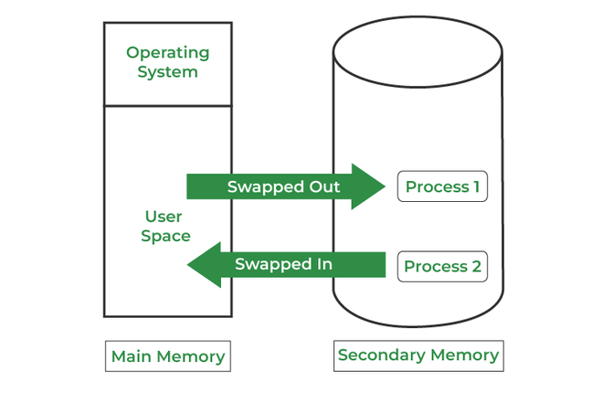
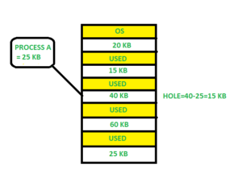
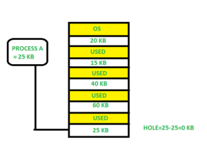
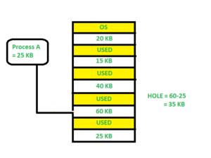

# Memory Management
記憶體是計算機系統中用來存儲數據和指令的硬體設備。它是計算機中用來保存程序運行所需資訊的地方，包括正在運行的程式碼、數據和中間結果等，以供中央處理器（CPU）快速訪問和處理。

記憶體管理的主要目的是在不同進程之間實現記憶體的高效利用。 

## 主記憶體
主記憶體也稱為RAM（隨機存取記憶體）或物理內存，是計算機中用來存儲當前運行程序所需數據和指令的主要記憶體。

是CPU直接可以訪問的記憶體，其中存儲著當前正在運行的操作系統、應用程式以及它們所需要的數據。這些數據包括程序的指令、變量、中間計算結果等，CPU會不斷地向主記憶體讀取數據並將結果寫回主記憶體。
* 隨機存取性質（RAM）：支持隨機存取，這意味著CPU可以隨機訪問存儲在內存中的任何數據，而不需要按照順序進行訪問。
* 易失性：主內存是易失性記憶體，當計算機關閉或斷電時，其中的數據將會丟失。
* 快速存取速度：存取速度相對於其他永久性存儲設備（例如硬盤驅動器或固態硬盤）要快得多。

## 地址空間
* 邏輯地址空間（Logical Address Space）：這是程序（或進程）看到的虛擬記憶體空間，它是程序中使用的地址範圍。當一個程序運行時，它使用的地址是邏輯地址，這些地址由程序內部產生並由操作系統轉換或映射成物理地址。邏輯地址空間可以比實際的物理記憶體空間大，因為它可以使用虛擬記憶體技術（例如分頁或分段），這使得程序看起來擁有比真正可用的物理記憶體更大的記憶體空間。
* 物理地址空間（Physical Address Space）：這是實際存在於硬體中的記憶體地址範圍，它表示電腦中的實際 RAM 或其他存儲設備中的地址。物理地址是硬體層面的真實記憶體位置，它對應著 RAM 模組或其他存儲設備中的實際位址。

在許多情況下，操作系統使用記憶體管理單元（MMU，Memory Management Unit）來處理邏輯地址和物理地址之間的映射和轉換。MMU 將邏輯地址轉換為相應的物理地址，以便程序可以正確地訪問和使用記憶體。

## 負載
* 靜態負載（Static Loading）：在程式執行前，所有的程式碼和所需的資源都被加載到記憶體中。優點是可以在執行時節省時間，因為所有的內容都已經在記憶體中並且不需要在執行時再加載。缺點是可能會浪費記憶體空間，特別是當不是所有的資源都被用到時。
* 動態負載（Dynamic Loading）：在程式執行過程中根據需要，從磁盤或其他存儲設備中動態地加載資源。這樣做可以節省記憶體空間，因為只有當資源真正需要時才會加載，但可能會增加一些運行時的開銷，因為需要在執行時動態地加載資源。

## 鏈接
* 靜態鏈接（Static Linking）：在編譯時將所有相關的函式庫和模組以及所需的資源直接綁定到可執行文件中，意味著不需要在執行時再引入外部函式庫。這樣做的好處是執行時不需要考慮外部依賴，但也會使得執行檔變得較大，並且更新庫文件時需要重新編譯程式。
* 動態鏈接（Dynamic Linking）：在執行時才將程式碼和函式庫與執行檔連接。這樣做可以節省空間，因為函式庫在內存中只需要一份，並且使得更新函式庫不需要重新編譯程式。但執行時需要動態加載，可能會稍微增加一些運行時的開銷。

## 交換(Swapping)
將計算機內存中的某些資料移出並暫時存放到輔助記憶體或其他永久性存儲設備中的過程。
如果較高優先權的進程需要服務，記憶體管理器可以換出較低優先權的進程，然後載入並執行較高優先權的進程。完成較高優先順序的工作後，較低優先順序的進程會交換回記憶體並繼續執行進程。

## 管理方式
### 單道程序設置（Monoprogramming）
只允許一個程序運行在系統中，整個計算機系統的記憶體空間都被分配給單個程序，這個程序完全控制系統的所有資源，包括 CPU 和記憶體。

簡單易懂，但存在一些明顯的限制，例如無法同時運行多個程序。當一個程序執行時，其他程序無法同時在系統中運行，這導致了資源利用率低下。單道程序設置常見於早期的計算機系統，但隨著多道程序設置的出現，逐漸變得不常見。

### 固定分割多道程序設置（Multiprogramming with Fixed Partitions）
記憶體被劃分成多個固定大小的區塊（分割），每個區塊可以容納一個程序。

當一個程序進入系統時，系統會將其放置在一個分割中，並分配相應的資源。這樣可以同時運行多個程序，每個程序都獲得了自己的固定記憶體空間。然而，這種方式會導致內存碎片化問題，因為如果程序的大小不符合分割的大小，會產生未使用的記憶體碎片。

可以實現多個程序之間的並發執行，提高了系統資源的利用率。但是，由於固定分割大小可能會導致內存碎片化，因此會浪費一些記憶體空間。後來的記憶體管理技術如動態分割和虛擬記憶體等被引入以解決這些問題。

## 連續記憶體分配(Contiguous Memory Allocation)
是一種記憶體管理技術，當一個程序或進程需要記憶體時，系統會尋找一個足夠大且連續的記憶體區塊來滿足其要求。這個記憶體區塊大小需與程序所需的大小相符或更大，而且要求連續的分配。

程序可以順序地佔用連續的記憶體空間，這有助於簡化內存管理。但也帶來了一些限制和挑戰，例如：
* 碎片化問題：當程序分配後釋放記憶體時，可能會產生內部碎片或外部碎片。內部碎片指的是已分配的記憶體中，未被使用的部分，而外部碎片指的是已被使用的記憶體區域之間的空隙。
* 限制了動態內存分配：因為需要連續的記憶體區塊，所以有時可能會限制了動態內存分配的靈活性。

一些現代作業系統已經開發了更靈活的記憶體管理技術，如分頁、分段、虛擬記憶體等，來解決連續分配可能引起的問題。

## 記憶體分配
### 多道程序分割（Multiple Partition Allocation）
主記憶體被分成許多固定大小的分區，其中每個分區應僅包含一個進程。當分割區空閒時，從輸入佇列中選擇一個程序並將其載入到空閒分割區中。當進程終止時，該分區可供另一個進程使用。
### 固定分割分配（Fixed Partition Allocation）
在這種方法中，作業系統維護一個表，該表指示記憶體的哪些部分可用以及哪些部分被進程佔用。可用記憶體稱為“孔”(Hole)。當進程到達並需要記憶體時，我們會尋找一個足夠大的孔來儲存該進程。在分配記憶體時，有時會出現動態儲存分配問題，而這個問題有一些解決方案：
* First Fit（首適應算法）：
在可用記憶體區塊列表中選擇第一個足夠大的區塊來滿足程序的需求。

* Best Fit（最佳適應算法）：
在可用記憶體區塊列表中選擇最小且足夠大的區塊來滿足程序的需求。

* Worst Fit（最壞適應算法）：
在可用記憶體區塊列表中選擇最大的區塊來滿足程序的需求。它會選擇最大的可用區塊分配給程序，即使其大小超過程序所需。

## 分頁(Paging)
是一種記憶體管理技術，用於虛擬記憶體系統中，將主存儲器和虛擬記憶體劃分為固定大小的頁面（Page）和相同大小的頁框（Frame），使得程序的內存需求不必連續，而是可以按頁分割並且不需要全部存放在主存儲器中。
1. 固定大小的頁和頁框：虛擬記憶體和主存儲器被劃分為相同大小的頁和頁框。典型的頁大小為 4KB 或 8KB。
2. 虛擬記憶體分割：程序內部的記憶體地址空間被劃分為大小相同的頁。當程序需要更多記憶體時，它會被分為多個頁。
3. 分頁表：系統維護了一個分頁表（Page Table），記錄了虛擬記憶體中每個頁對應到實際頁框的映射關係。這允許系統找到頁在主存儲器中的位置。
4. 地址轉換：當程序訪問虛擬記憶體中的某個地址時，系統使用分頁表將虛擬地址轉換為實際的物理地址。這個轉換過程利用了分頁表中的映射關係。
5. 頁置換：當主存儲器無法容納所有需要的頁時，系統會使用頁置換算法（如最近最少使用算法 LRU）來選擇一些頁框中的頁進行替換，釋放空間以容納新的頁。

## 虛擬記憶體
是一種計算機科學概念，允許一個程序或應用程式似乎擁有比實際物理記憶體更大的地址空間。它創建了一個抽象的、更大的記憶體空間，讓程序可以訪問比實際可用物理內存更多的內存位置。

* 存儲器分段：程序被分為不同的段或頁。當程序運行時，只有當需要時才將相應的段或頁載入到實際的物理內存中。
* 地址轉換：系統使用地址轉換技術將程序產生的虛擬地址轉換為實際的物理地址。這樣的轉換是透明的，程序可以不需要關心物理內存的實際位置。
* 需求分頁/分段：虛擬記憶體系統根據程序的需求動態地將頁或段放置到物理內存中，而不是一次性將所有內容都載入。
* 擴展可用內存：虛擬記憶體可以擴展可用的內存空間，允許運行大型程序或多個程序同時運行，即使實際可用的內存不夠。
* 頁置換：當物理內存不足時，虛擬記憶體系統會使用頁置換算法，從內存中移除某些頁以騰出空間以容納新的頁。