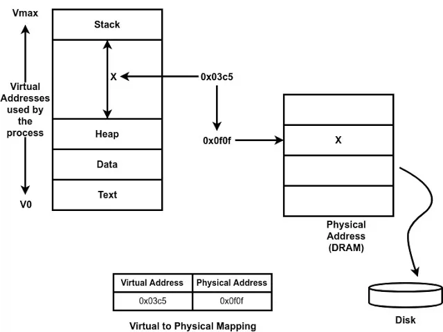
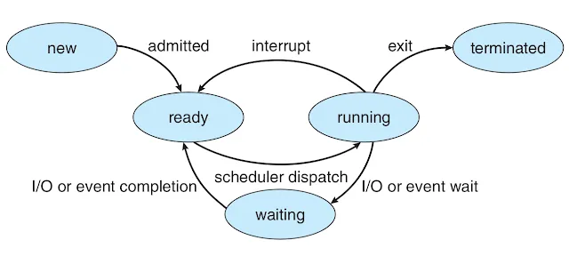

# Process Management
進程就是正在執行的應用程式的一個實例，當應用程式啟動時，它被載入到記憶體中並成為一個進程，因此它是一個活動實體。如果同一個程序啟動多次，則會建立多個進程來執行同一個程序，但狀態會截然不同。

* Stack（棧）： 棧是用於存儲程序運行時的局部變量、函數調用和返回地址等信息的區域。當函數被調用時，會在棧上創建一個稱為「棧幀」的區域，存儲該函數的局部變量和函數調用信息。棧是一種後進先出（LIFO）的數據結構，因此先進入的數據會在後面被處理。
* Heap（堆）： 堆是用於動態分配內存的區域，用於存儲程序運行時需要動態分配的數據。通常，當需要創建一個對象或者動態分配記憶體時，會在堆上進行動態分配。堆的內存空間通常比較大，並且它的分配和釋放由程序員手動控制。

## 位置空間
進程的每個元素都帶有其位址的唯一標識，作業系統將所有進程資料封裝在位址空間中。位址空間由 V0~Vmax 對應了一個虛擬位址，不同類型的進程狀態將出現在該位址空間的不同部分。記憶體管理硬體和作業系統元件將這些虛擬位址對應到實體位址。

## 進程控制塊(PCB，Process Control Block)
PCB 是用於管理和追蹤進程的重要數據結構，其中包含了進程的各種信息，幫助操作系統進行進程調度、管理和控制。
PCB 的功能和內容：
* 進程狀態信息： 包含了描述進程狀態的信息，比如進程是否正在運行、就緒、等待、終止等。這些狀態的轉換由操作系統管理。
* 程式計數器（Program Counter，PC）： 進程運行時，PCB 中保存了程序計數器的值，指示了下一條要執行的指令地址。
* 暫存器內容： 存儲了進程的暫存器內容，包括通用暫存器、堆棧指針、標誌位和其他重要的暫存器信息。
* 進程優先級： 有些操作系統會為進程分配優先級，PCB 中也可能包含了這個信息，用於調度和分配 CPU 資源。
* 進程識別和狀態： 包含了進程的唯一識別號（Process ID，PID）以及其他識別和管理進程所需的信息。
* 記憶體管理信息： 可能包含了進程所使用的內存區域的信息，比如指向程式段、數據段和堆棧段的指針。
* CPU 資源使用情況： 可能記錄了進程使用 CPU 資源的情況，比如已運行時間、剩餘時間片等。

PCB 的作用：
* 上下文切換（Context Switching）： 當操作系統需要將 CPU 從一個進程切換到另一個進程時，PCB 扮演了重要角色，保存了當前進程的狀態和資源信息，以便稍後恢復執行。
* 進程同步和通信： PCB 中存儲了進程相關的同步和通信信息，用於處理進程之間的通信和同步問題。

## 生命週期
* 新建：可能是由操作系統初始化或由現有進程（父進程）通過 fork() 或 spawn() 等系統調用創建的。
* 就緒：進程正在佇列中等待 CPU 資源。
* 運行：當操作系統從就緒佇列中選擇一個進程並將 CPU 資源分配給它時，該進程進入運行狀態，開始執行其指令。
* 終止：一旦進程完成執行，或遇到一些錯誤，它就會進入終止狀態，等待從主記憶體中刪除。

## 進程創建機制
* Fork：作業系統使用 PCB 建立一個新的子進程，然後將父進程 PCB 的所有值複製到子進程 PCB 中。隨後，子進程和父進程繼續執行指令
* Exec：將一個新的程序映射到當前進程的地址空間中，替換掉原始的程序映像。這通常在 fork 之後的子進程中使用，以運行一個新的程序。

建立新程式的機制就像呼叫 fork 建立一個與父進程具有完全相同 PCB 的子進程，然後呼叫 exec 以新程式的映像取代子進程的映像。

## CPU調度
由於同時可以有多個進程在就緒佇列中等待，CPU 調度程序透過演算法、決定哪個程序應該被調度到 CPU 上執行。

進行進程切換時會涉及上下文切換。上下文切換是指保存當前進程的狀態（如暫存器內容、程序計數器等）並恢復另一個進程的狀態。這會增加一些開銷，包括保存/恢復狀態的時間和內存開銷。