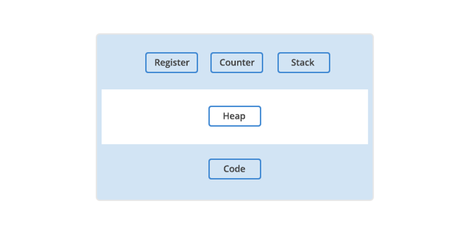
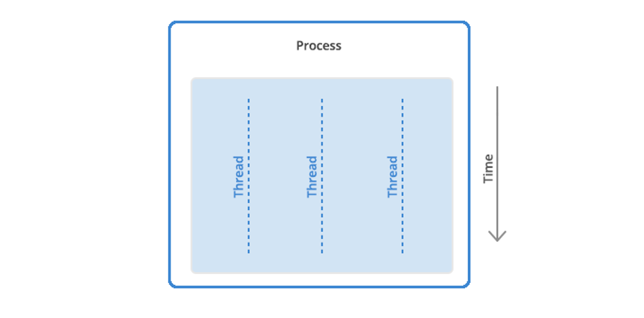
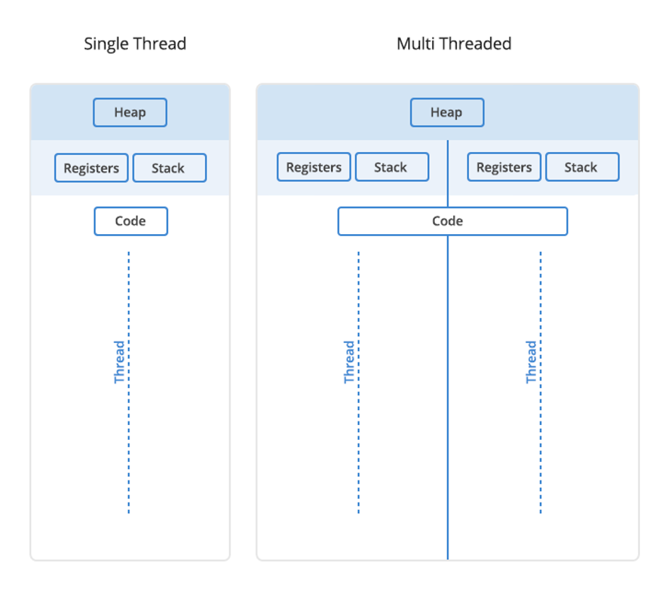
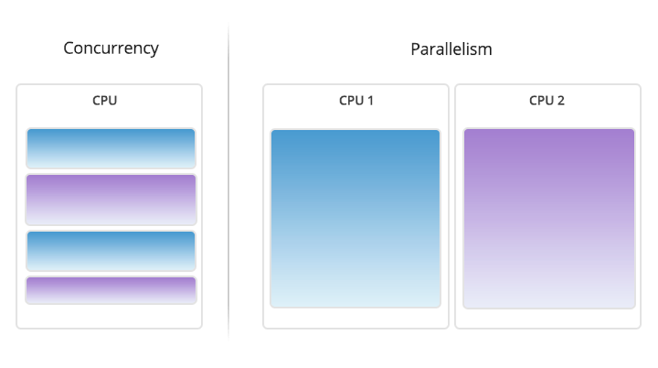

# Threads and Concurrency
## 程式
儲存在電腦上的可以完成特定任務的程式碼，程式有很多類型，包括作業系統內建的程式和完成特定任務的程式。
通常，特定於任務的程式稱為應用程式。例如，您可能正在使用網頁瀏覽器應用程式閱讀這篇文章。其他常見應用程式包括電子郵件用戶端、文字處理器和遊戲。

### 編譯型程式（Compiled Programs）
首先由編譯器將整個源代碼文件一次性編譯成機器碼或者其他可執行的形式（比如中間碼），形成獨立的可執行文件。這個可執行文件可以直接在特定平台上運行，而不需要再次編譯。C、C++、Java（在某些情況下）等語言的程式經常採用這種方式。

優點是執行速度可能更快，因為編譯後的代碼通常直接在機器上運行，不需要再解釋或轉譯。但是，這需要針對不同平台進行編譯，所以同一份程式碼可能需要在不同平台上重新編譯才能執行。
### 解釋型程式（Interpreted Programs）
通常由解釋器逐行讀取並執行源代碼。例如，Python、JavaScript、Ruby 等語言的程式通常以這種方式運行。

優點是更具可移植性，因為它們可以在不同平台的解釋器中運行，而不需要重新編譯。然而，解釋型程式的執行速度可能較慢，因為它們在運行時需要即時轉譯和執行代碼。

最終，兩種程式都以二進位形式運行並載入到記憶體中。程式必須以二進位運行，因為電腦的中央處理單元 (CPU) 只能理解二進位指令。當一個程式連同它運行所需的所有資源一起加載到記憶體中時，就被稱為進程。

這邊提到的資源可能是：
* 暫存器：包含進程可能需要的數據，例如指令、儲存位址或其他數據。
* 程式計數器。也稱為指令指針，追蹤計算機在其程式序列中的位置。
* 棧(stack)：儲存有關電腦程式的活動子例程的資訊。它用作進程的暫存空間。與為進程動態分配的記憶體堆（heap）不同。
## 進程
您可能有一個程式的多個實例。在這種情況下，正在運行的程式的每個實例都是一個進程。每個進程都有一個獨立的記憶體位址空間。然而，進程不能直接存取其他進程中的共享資料。

電腦進程的主要組成部分：

## 執行緒
執行緒是進程內的執行單元。一個進程可以有一個到多個執行緒。

當進程啟動時，它會收到記憶體和其他計算資源的分配。進程中的每個執行緒共享該記憶體和資源。

stack 和 heap，是線程或進程可用的兩種記憶體。區分這些類型的記憶體很重要，因為每個執行緒都有自己的 stack。然而，進程中的所有執行緒將共享 heap。

流程：
1. 程式以程式碼的文本檔開始。
2. 該程式被編譯或解釋為二進制形式。
3. 程式被載入到記憶體中。
4. 程式變成一個或多個正在運行的進程。進程通常是相互獨立的。
5. 執行緒作為進程的子集而存在。
6. 執行緒之間的通訊比進程更容易。
7. 執行緒更容易受到同一進程中其他執行緒引起的問題的影響。

## 併發(Concurrency)與併行(parallelism)
在具有多個處理器或 CPU 核心的系統上（現代處理器很常見），可以並行執行多個進程或執行緒。然而，在單一處理器上，不可能讓進程或執行緒真正同時執行。

在這種情況下，進程調度演算法會劃分 CPU 的處理時間、產生並行執行的假象。分配給每個任務的時間稱為「時間片」。任務之間的來回切換發生得如此之快，通常難以察覺。「並行」（真正的同時執行）和「並發」（進程在時間上交錯以給出同時執行的外觀）。

