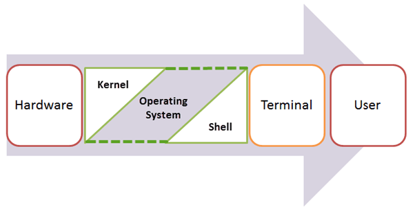

# What is an operating system?

作業系統(OS)是一種軟體、扮演了電腦硬體元件和使用者之間的介面。每台電腦系統都必須至少有一個作業系統來運作其他程式。

作業系統可以幫助您在不知道如何使用電腦語言的情況下與電腦進行通訊。使用者無法在沒有作業系統的情況下使用任何電腦或行動裝置。

## 作業系統 (OS) 的類型

1. 批次作業系統（Batch Operating System）
   主要設計用於批次處理作業，它接受一批作業集合，然後依次執行而無需用戶交互。主要用於大型主機和大型計算環境中。
   例子：IBM OS/360，UNIVAC OS1100 等。
2. 多任務/時間共享作業系統（Multitasking/Time Sharing OS）
   允許多個程序在同一時間共享計算機資源。它可以輪流執行多個程序，每個程序占用一小段時間，以此實現多任務。
   例子：Unix/Linux、Windows、macOS 等現代操作系統都支持多任務和時間共享。
3. 多處理器作業系統（Multiprocessing OS）
   設計用於多處理器系統，能夠同時利用多個處理器進行並行計算。它能夠更高效地分配任務和資源。
   例子：Windows NT/2000/XP、Linux（某些內核版本支持多處理器）等。
4. 實時作業系統（Real-Time OS）
   滿足時間約束，能夠在特定的時間範圍內完成任務。通常用於需要快速響應和確定性的應用，如航空航天、醫療設備等。
   例子：VxWorks、FreeRTOS、QNX 等。
5. 分布式作業系統（Distributed OS）
   用於分布在不同地理位置的多台計算機之間進行通信和協作。它允許多台計算機共享資源和信息。
   例子：Amoeba、Plan 9 等。
6. 網絡作業系統（Network OS）
   用於管理網絡設備，如路由器、交換機等。負責管理網絡連接和通信。
   例子：Cisco IOS、Juniper Junos 等。
7. 移動作業系統（Mobile OS）
   專門為移動設備設計的，例如智能手機、平板電腦等。它們通常需要考慮能耗、移動性和觸摸屏等特殊需求。
   例子：Android、iOS、Windows Phone 等。

## 作業系統的功能

1. 進程管理：建立和刪除進程、並提供進程間同步和通訊的機制。
2. 記憶體管理：向需要該資源的程式分配記憶體空間。
3. 文件管理：管理文件的儲存、檢索、命名、共享和保護等相關的活動。
4. 設備管理：追蹤所有設備、並執行設備間的分配任務。
5. I/O 系統管理： 向使用者隱藏硬體設備的特性。
6. 二級存儲管理：系統有多個層級的存儲，包括主存儲、二級存儲和快取存儲。指令和資料必須儲存在主記憶體或快取中，以便運行的程式可以引用它。而二級儲存負責的通常是硬盤或固態硬盤等永久性存儲介質。
7. 安全性：保護電腦系統的資料免受惡意軟體威脅。
8. 命令解釋：解釋由系統資源給出的命令並處理該命令。
9. 網路： 分散式系統是一組不共享記憶體、硬體設備或時脈的處理器。而處理器透過網路相互通訊。
10. 工作統計：追蹤各種工作和使用者使用的時間和資源。
11. 通訊管理：電腦系統各個使用者的編譯器、解釋器和其他軟體資源的協調和分配。

## 内核（Kernel）

操作系統的內核是操作系統的核心部分，負責管理軟體和硬體之間的通訊。它是操作系統與硬件之間的介面，負責執行操作系統的基本功能。

### 內核的類型：

- 單體內核（Monolithic Kernel）：所有的核心功能都運行在一個單獨的地址空間中，所有服務都在內核空間運行。
- 微內核（Microkernel）：將核心功能分割成小的、可以獨立運行的模塊，這些模塊運行在用戶空間，與內核進行通信。
- 混合內核（Hybrid Kernel）：結合了單體內核和微內核的優點，有些核心服務在內核空間運行，而其他一些服務在用戶空間運行。

## 韌體和作業系統之間的區別

| 韌體                                             | 作業系統                               |
| ------------------------------------------------ | -------------------------------------- |
| 韌體是一種程式，嵌入在設備的晶片上以控制特定設備 | 作業系統提供的功能超出了韌體提供的功能 |
| 由 IC 等製造商編碼的程序，無法更改               | 可以由使用者安裝並且可以更改的程式     |
| 儲存在非揮發性記憶體中                           | 儲存在硬碟上                           |

## 32-Bit 和 64-Bit 作業系統

|            | 32 位元                                                   | 64 位元                                              |
| ---------- | --------------------------------------------------------- | ---------------------------------------------------- |
| 架構和軟體 | 允許同時處理 32 位元數據                                  | 允許同時處理 64 位元數據                             |
| 相容性     | 需要 32 位元作業系統和 CPU                                | 需要 64 位元作業系統和 CPU                           |
| 可用系統   | Windows 8、Windows 7、Windows Vista、Windows XP、Linux 等 | Windows XP Professional、Vista、7、Mac OS X 和 Linux |
| 記憶體限制 | RAM 限制為 3.2 GB                                         | 允許最大 170 億 GB RAM                               |

## Semaphore（號誌、信號量）

作業系統中用於控制對共享資源訪問的同步機制。它是一種用於多線程編程的同步原語，確保多個線程或進程能夠按照一定的規則順序地訪問共享資源。

Semaphore 主要有兩種類型：二進制信號量（Binary Semaphore）和計數信號量（Counting Semaphore）。

1. 二進制號誌（Binary Semaphore）
   也稱為互斥鎖（Mutex），它只能取兩個值：0 或 1。用於控制對臨界區（Critical Section）的訪問，保證在同一時刻只有一個線程可以進入臨界區，避免多個線程同時修改共享資源而導致數據不一致或競爭（Race Condition）的問題。

2. 計數號誌（Counting Semaphore）
   可以取多個非負整數值，用於控制多個線程或進程對一組資源的訪問。它允許一定數量的線程同時訪問共享資源，例如，允許同時有幾個線程訪問數據庫連接池或有限數量的資源。

Semaphore 主要包含兩個基本操作：

P（Wait）操作：如果號誌的值大於 0，則將其減一並允許訪問共享資源；如果值為 0，則線程或進程會阻塞等待直到有可用資源。
V（Signal）操作：將號誌的值加一，釋放資源並喚醒可能在等待資源的線程或進程。
