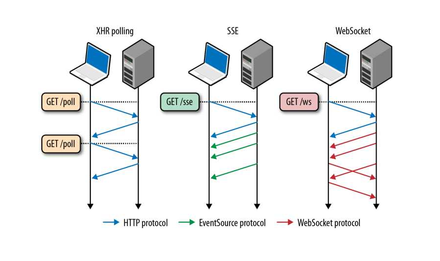

# Web sockets
是 HTML5 提供的一種網路傳輸協定，提供了瀏覽器與伺服器之間進行全雙工通信的能力。與傳統的HTTP通訊不同，WebSocket 允許在單個 TCP 連接上進行持久的、雙向的通信。

主要特點包括：
* 全雙工通信： WebSocket 允許客戶端和伺服器之間實現全雙工的通信。這意味著它們可以同時向對方發送和接收數據。
* 持久連接： 一旦建立 WebSocket 連接，它將保持打開狀態，允許在客戶端和伺服器之間持續傳輸數據。
* 低延遲： WebSocket 提供了一個低延遲的通信機制，因為它避免了 HTTP 請求和響應的開銷。
* 輕量和效率： 由於不需要大量的 HTTP header 信息，WebSocket 通常比一些其他較重的通信協議更輕量和高效。

工作原理：
* 握手協議： 剛開始，客戶端與伺服器之間會進行一個握手協議（handshake）以建立 WebSocket 連接。這個握手遵循 HTTP 協議，但使用的是 Upgrade 和 Connection 標頭。
* 雙向通信： 一旦握手完成，伺服器和客戶端之間的通信就變得全雙工，它們可以通過同一個 TCP 連接進行互相發送數據。
* 持久連接： WebSocket 連接保持打開狀態，不需要在每次通信時都重新建立連接。



## 伺服器端（Java - 使用 javax.websocket）
```java=
import javax.websocket.*;
import javax.websocket.server.ServerEndpoint;
import java.io.IOException;

@ServerEndpoint("/websocket")
public class WebSocketServer {

    @OnOpen
    public void onOpen(Session session) {
        System.out.println("WebSocket opened: " + session.getId());
        sendMessage(session, "Hello, Client! This is from server.");
    }

    @OnMessage
    public void onMessage(String message, Session session) {
        System.out.println("Received message: " + message);
    }

    @OnClose
    public void onClose(Session session) {
        System.out.println("WebSocket closed: " + session.getId());
    }

    @OnError
    public void onError(Session session, Throwable throwable) {
        System.err.println("Error on WebSocket: " + throwable);
    }

    private void sendMessage(Session session, String message) {
        try {
            session.getBasicRemote().sendText(message);
        } catch (IOException e) {
            e.printStackTrace();
        }
    }
}
```
這個範例定義了一個 WebSocket 伺服器端點 /websocket。當有客戶端建立連接時，它會在控制台輸出“WebSocket opened”，並向客戶端發送一條消息。當收到客戶端發來的消息時，會在控制台輸出“Received message”。
## 客戶端（使用JavaScript）
```javascript=
const socket = new WebSocket('ws://localhost:8080/websocket'); // 請確保URL與你的伺服器地址一致

socket.onopen = function(event) {
    console.log('WebSocket connected');
    // 向伺服器發送消息
    socket.send('Hello, Server! This is from client.');
};

socket.onmessage = function(event) {
    console.log('Received message:', event.data);
};
```
使用了 JavaScript 的 WebSocket 物件來建立與伺服器的連接並處理伺服器發送的消息。