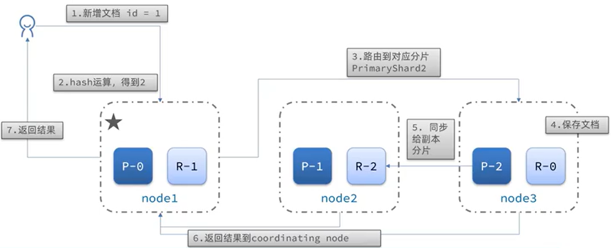
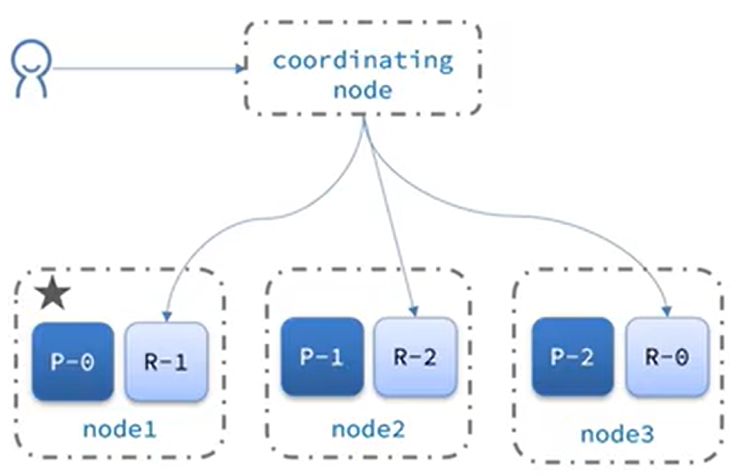

# Elasticsearch
## 安裝
### 單點安裝
1. 創建網路：要讓es 和kibana 容器互連，需要創建網路
`docker network create es-net` (需要先啟用Docker `service docker start`)
2. 部屬
```
docker run -d \
    --name es \
    -e "ES_JAVA_OPTS=-Xms512m -Xmx512m" \
    -e "discovery.type=single-node" \
    -v es-data:/usr/share/elasticsearch/data \
    -v es-plugins:/usr/share/elasticsearch/plugins \
    --privileged \
    --network es-net \
    -p 9200:9200 \
    -p 9300:9300 \
elasticsearch:7.12.1
```
* -d: 在後台（detached mode）運行容器。
* --name es: 為容器指定名稱為"es"。
* -e "ES_JAVA_OPTS=-Xms512m -Xmx512m": 設置Java虛擬機的內存參數，這里將最小堆內存和最大堆內存都設置為512MB。
* -e "discovery.type=single-node": 設置Elasticsearch為單節點模式，適用於單機測試或者開發。
* -v es-data:/usr/share/elasticsearch/data: 將一個名為es-data的Docker卷掛載到Elasticsearch容器的/usr/share/elasticsearch/data目錄，用於持久化存儲Elasticsearch的數據。
* -v es-plugins:/usr/share/elasticsearch/plugins: 將一個名為es-plugins的Docker卷掛載到Elasticsearch容器的/usr/share/elasticsearch/plugins目錄，用於安裝插件。
* --privileged: 給予容器更高的權限，一般情況下不建議使用，除非必要。
* --network es-net: 將容器連接到名為"es-net"的Docker網絡，這允許該容器與在同一網絡下的其他容器進行通信。
* -p 9200:9200: 將主機的9200端口映射到容器的9200端口，用於訪問Elasticsearch的HTTP REST API。
* -p 9300:9300: 將主機的9300端口映射到容器的9300端口，用於Elasticsearch節點之間的通信。
* elasticsearch:7.12.1: 指定要運行的鏡像，這裡使用7.12.1 版。

訪問http://{host}:9200 確認是否啟動成功

### kibana
1. 部屬
```
docker run -d \
--name kibana \
-e ELASTISEARCH_HOSTS=http://es:9200 \
--network=es-net \
-p 5601:5601 \
kibana:7.12.1
```
* --name kibana: 將容器命名為 "kibana"。
* -e ELASTISEARCH_HOSTS=http://es:9200: 設置一個環境變量 ELASTISEARCH_HOSTS，告訴 Kibana 如何連接到 Elasticsearch。在這里，指定 Elasticsearch 的地址為 http://es:9200，其中 es 是你之前創建的 Elasticsearch 容器的名稱。
* --network=es-net: 將容器連接到名為 "es-net" 的 Docker 網絡，這樣 Kibana 容器就可以與 Elasticsearch 容器通信。
* -p 5601:5601: 將主機的5601端口映射到容器的5601端口，這樣你可以通過主機的5601端口訪問 Kibana 的 Web 界面。
* kibana:7.12.1: 指定要運行的 Kibana 鏡像，版本為7.12.1。

訪問{host}:5601 確認是否啟動成功，如果失敗查看log `docker logs kibana`
如果是Unable to revive connection: http://elasticsearch:9200/ 要確認配置文件(kibana.yml)
1. `docker exec -it kibana bash` 進入容器
2. `vi /usr/share/kibana/config/kibana.yml`
3. elasticsearch.hosts 修改成正確的HOST
4. 退出容器並重啟`docker restart kibana`

## 分詞器
創建倒排索引時需要對文檔分詞。在搜尋時需要對用戶輸入內容分詞。但默認的分詞規則對中文處理並不友好。

在kibana 的Dev tools 發送
```
POST /_analyze
{
    "analyzer":"standard",
    "text":"elasticsearch太棒了，我家門前有小河，奧力給"
}
```
POST：請求方式
/_analyze：請求路徑，省略了http://{host}:9200，有kibana 補充
請求參數：analyzer - 分詞器類型，使用默認standard 分詞器；text - 要分詞的內容

安裝ik 分詞器(對中文較友善)
1. `docker exec -it es bash`
2. `elasticsearch-plugin install https://github.com/medcl/elasticsearch-analysis-ik/releases/download/v7.12.1/elasticsearch-analysis-ik-7.12.1.zip`
3. 退出並重啟`exit`、`docker restart es`

ik_smart - 以較精簡的方式進行分詞，盡可能保留更多的語義信息
ik_max_word - 盡可能地將文本分得更細致

### 拓展/停用詞庫
修改ik 分詞器目錄中的IKAnalyzer.cfg.xml
```
<?xml version="1.0" encoding="UTF-8"?>
<!DOCTYPE properties SYSTEM "http://java.sun.com/dtd/properties.dtd">
<properties>
        <comment>IK Analyzer 扩展配置</comment>
        <!--用户可以在这里配置自己的扩展字典 -->
        <entry key="ext_dict"></entry>
         <!--用户可以在这里配置自己的扩展停止词字典-->
        <entry key="ext_stopwords"></entry>
        <!--用户可以在这里配置远程扩展字典 -->
        <!-- <entry key="remote_ext_dict">words_location</entry> -->
        <!--用户可以在这里配置远程扩展停止词字典-->
        <!-- <entry key="remote_ext_stopwords">words_location</entry> -->
</properties>
```
1. `docker exec -it es bash`
2. `vi /usr/share/elasticsearch/config/analysis-ik/IKAnalyzer.cfg.xml` 添加擴展詞庫(指定並新增ext.dic)、或是停用詞庫(指定stopword.dic)
3. 在詞庫中添加要擴展/停用的詞彙
4. 退出並重啟es

## 概念
與關連式資料庫的對比
| MySQL | Elasticsearch | 說明 |
| -------- | -------- | -------- |
| Table | Index  | 索引(index)，就是文檔的集合，類似資料庫的表(table) |
| Row | Document | 文檔(document)，就是一條條的資料，類似資料庫中的行(row)，文檔都是JSON 格式 |
| Column | Field | 字段(field)，就是JSON 文檔中的字段，類似資料庫中的列(column) |
| Schema | Mapping | mapping(映射)是索引中文檔的約束，例如字段類型約束。類似資料庫中的表結構(schema) |
| SQL | DSL  | DSL 是Elasticsearch 提供的JSON 風格的請求語句，用來操作Elasticsearch，實現CRUD |

### Mapping
對索引庫中文檔的約束。以下是一些常見的Mapping屬性：

type：字段數據類型，常見的簡單類型有：
* 字符串：text(可分詞的文本)、keyword(精確值，例如：品牌、國家、IP位址)
* 數值：long、integer、short、byte、double、float
* 布爾：boolean
* 日期：date
* 物件：object

index：是否創建索引，默認為true
analyzer：使用哪種分詞器
properties：該字段的子字段

### 索引庫操作
#### 新增
```json=
PUT /tutorial //索引庫名稱
{
    "mapping":{
        "properties":{
            "info":{ //字段名
                "type":"text",
                "analyzer":"il_smart"
            },
            "email":{ //字段名2
                "type":"keyword",
                "index":false
            },
            "name":{ //字段名3
                "preoperties":{
                    "furstName":{ //子字段
                        "type":"text"
                    }
                }
            },
            // ... 略
        }
    }
}
```
#### 查詢
`GET /tutorial #索引庫名`

#### 刪除
`DELETE /tutorial #索引庫名`

#### 修改
索引庫和mapping 一旦創建無法修改，但是可以添加新的字段
```json=
PUT /tutorial/_mapping
{
    "properties":{
        "age":{ //新字段名
            "type":"integer"
        }
    }
}
```

### 文檔操作
#### 新增
不寫id 的話，Elasticsearch 會自動添加
```json=
POST /tutorial/_doc/1 //索引庫名/_doc/文檔id
{
    "info":"JAVA 課程",
    "email":"test@abc.com",
    "name":{
        "firstName":"小明",
        "lastName":"王"
    }
}
```
#### 查詢
`GET /tutorial/_doc/1 #索引庫名/_doc/文檔id`
返回的數據，比較重要的filed：
* _index：索引庫
* _id：文檔id
* _version：文檔版本
* _source：原始文檔
#### 刪除
`DELETE /tutorial/_doc/1 #索引庫名/_doc/文檔id`
#### 修改
1. 全量修改，會刪除舊文檔、添加新文檔；若宣告的id 對應的文檔不存在，則會直接新增文檔
```json=
PUT /tutorial/_doc/1 //索引庫名/_doc/文檔id
{
    "info":"JAVA 課程",
    "email":"hello@abc.com",
    "name":{
        "firstName":"大壯",
        "lastName":"陳"
    }
}
```
2. 增量修改，只修改指定字段值
```json=
POST /tutorial/_update/1 //索引庫名/_doc/文檔id
{
    "doc":{
        "email:"hello@abc.com"
    }
}
```

## 客戶端操作
### 事前準備
MySQL
```sql=
CREATE TABLE `tb_hotel` (
    `id` bigint(20) NOT NULL PRIMARY KEY COMMENT '飯店ID',
    `name` VARCHAR(255) NOT NULL COMMENT '飯店名稱',
    `address` VARCHAR(255) NOT NULL COMMENT '地址',
    `price` int(10) NOT NULL COMMENT '價格',
    `score` int(2) NOT NULL COMMENT '評分',
    `brand` VARCHAR(32) NOT NULL COMMENT '品牌',
    `city` VARCHAR(32) NOT NULL COMMENT '城市',
    `star_name` VARCHAR(16) DEFAULT NULL COMMENT '星級',
    `business` VARCHAR(255) DEFAULT NULL COMMENT '商圈',
    `latitude` VARCHAR(32) NOT NULL COMMENT '緯度',
    `longitude` VARCHAR(32) NOT NULL COMMENT '經度',
    `pic` VARCHAR(255) DEFAULT NULL COMMENT '圖片',
    `isAD` int(1) NOT NULL COMMENT '廣告'
);
```
對應的DSL
```json=
PUT /hotel
{
  "mappings": {
    "properties": {
      "id": {
        "type": "keyword"
      },
      "name": {
        "type": "text",
        "analyzer":"ik_max_word",
        "copy_to":"all"
      },
      "address": {
        "type": "keyword",
        "index": false
      },
      "price": {
        "type": "integer"
      },
      "score": {
        "type": "integer"
      },
      "brand": {
        "type": "keyword",
        "copy_to":"all"
      },
      "city": {
        "type": "keyword"
      },
      "star_name": {
        "type": "keyword"
      },
      "business": {
        "type": "keyword",
        "copy_to":"all"
      },
      "location": {
        "type": "geo_point"
      },
      "pic": {
        "type": "keyword",
        "index": false
      },
      "all":{
        "type":"text",
        "analyzer":"ik_max_word"
      }
    }
  }
}
```
ES 中支持兩種地理座標資料類型
* geo_point：由緯度和經度確定的一個點
* geo_shape：有多個geo_point 組成的複雜幾何圖形，例如一條直線

字段拷貝可以使用copy_to 屬性將當前字段拷貝到指定字段
```json=
"all":{
    "type":"text",
    "analyzer":"ik_max_word"
},
"brand":{
    "type":"keyword",
    "copy_to":"all"
}
```

## DSL
* 查詢所有：查詢出所有資料，一般測試用。例如：match_all
* 全文檢索(full text)查詢：利用分詞器對用戶輸入內容分詞，然後在倒排索引庫中匹配。例如：match_query、multi_match_query
* 精確查詢：根據精確詞條值查找資料，一般是查找keyword、數值、日期、boolean 等類型字段。例如：ids、range、term
* 地理(geo)查詢：根據經緯度查詢，例如：geo_distance、geo_bounding_box
* 複合(compound)查詢：可以將上述各種條件組合起來，例如：bool、function_score

基本語法
```json=
GET /indexName/_search  //索引名稱/_search
{
  "query": {
    "查詢類型": {
      "查詢條件": "條件值"
    }
  }
}
```
1. 查詢所有
```json=
GET /hotel/_search
{
  "query": {
    "match_all": {}
  }
}
```
2. 全文檢索 - match查詢
```json=
GET /hotel/_search
{
  "query": {
    "match": {
      "all": "台北善導寺"  //在之前有將name/brand/business copy_to 到all字段中
    }
  }
}
```
3. 全文檢索 - multi_match
```json=
GET /hotel/_search
{
  "query": {
    "multi_match": {
      "query": "台北",
      "fields"; ["brand", "name", "business"]
    }
  }
}
```
4. 精確查詢 - term(根據詞條精確值查詢)
```json=
GET /hotel/_search
{
  "query": {
    "term": {
      "city": {
        "value": "台北市"  
      }
    }
  }
}
```
5. 精確查詢 - range(根據值的範圍查詢)
```json=
GET /hotel/_search
{
  "query": {
    "range": {
      "price": {
        "gt": 1000,  // <
        "lte": 5000  // >=
      }
    }
  }
}
```
6. 地理查詢 - geo_bounding_box：查詢geo_point 值落在某個矩形範圍的所有文檔
```json=
GET /hotel/_search
{
  "query": {
    "geo_bounding_box": {
      "location": {
        "top_left": {
          "lat": 40.73,
          "lon": -74.1
        },
        "bottom_right": {
          "lat": 40.01,
          "lon": -71.12
        }
      }
    }
  }
}
```
7. 地理查詢 - geo_distance：查詢到指定中心點小於某個距離值的所有文檔
```json=
GET /hotel/_search
{
  "query": {
    "geo_distance": {
      "distance": "10km",
      "location": "40.7128, -74.0060"
    }
  }
}
```
8. 複合查詢 - function_score：可以控制文檔相關性算分、控制文檔排名
```json=
GET /hotel/_search
{
  "query": {
    "function_score": {
      "query": {  //原始查詢條件，搜索文檔並根據相關性打分(query score)
        "match": {
          "all": "台北"
        }
      },
      "functions": [
        {
          "filter": {  //過濾條件，符合條件的文檔才會被算分
            "term": {
              "brand": "喜來登"
            }
          },
          "weight": 3  //算分函數
        }
      ],
      "boost_mode": "multiply"  //加權模式
    }
  }
}
```
算分函數：算分函數的結果稱為function score，將會與query score 運算，得到新分數，常見的有：
* weight 給一個常量值，作為函數結果
* field_value_factor 用文檔中的某個字段作為結果
* random_score 隨機生成一個值，作為結果
* script_score 自定義計算公式，作為結果

加權模式：定義function score 與query score 的運算方式，包括：
* multiply 兩者相乘，默認使用
* replace 用function score 替換query score
* 其他 例如sum、avg、max、min

9. 複合查詢 - Bool Query：是一個或多個查詢子句的組合。子查詢的組合方式有：must、should、must_not(不參與打分)、filter(不參與打分)
```json=
GET /hotel/_search
{
  "query": {
    "bool": {
      "must": [
        {
          "match": {
            "name": "喜來登"
          }
        }
      ],
      "must_not": [
        {
          "range": {
            "price": {
              "gt": 4000
            }
          }
        }
      ],
      "filter": [
        {
          "geo_distance": {
            "distance": "10km",
            "location": {
              "lat": 31.21,
              "lon": 121.5
            }
          }
        }
      ]
    }
  }
}
```

### 排序
若使用排序，就不會對文檔算分
```json=
GET /hotel/_search
{
  "query": {
    "match_all": {}
  },
  "sort": [
    {
      "score": "desc"
    },
    {
      "price": "asc"
    }
  ]
}
```
```json=
GET /hotel/_search
{
  "query": {
    "match_all": {}
  },
  "sort": [
    {
      "_geo_distance": {
        "location": {
          "lat": 31.25,
          "lon": 121.55
        },
        "order": "asc",
        "unit": "km"
      }
    }
  ]
}
```
### 分頁
默認只返回10筆資料
```json=
GET /hotel/_search
{
  "query": {
    "match_all": {}
  },
  "sort": {
      "score": "desc"
  },
  "from": 220,  //分頁開始的位置，默認0
  "size": 10  //顯示的資料筆數，默認10
}
```

深度分頁問題
ES 是分布式的，例如按price 排序後，獲取from = 990、size = 10 的資料：
1. 首先在每個資料分片上都排序並查詢前1000筆文檔
2. 將所有節點的結果聚合，在內存中重新排序選出前1000筆文檔
3. 最後從這1000筆中，選取從990開始的10筆文檔

避免對資源的消耗，ES 設定結果集查詢的上限是10000(from = 9991、size = 10 會失敗)，解決方案是透過search after：

假設查詢
```json=
{
  "size": 10,
  "query": {
    "match" : {
      "title" : "elasticsearch"
    }
  },
  "sort": [
    {"date": "asc"},
    {"_uid": "desc"}
  ]
}
```
得到了
```json=
{
  "size": 10,
  "query": {
    "match" : {
      "title" : "elasticsearch"
      }
    },
  "search_after": [1463538857, "tweet#654323"],
  "sort": [
    {"date": "asc"},
    {"_uid": "desc"}
  ]
}
```
接著我要繼續搜尋下一頁結果，加入search_after
```json=
{
  "size": 10,
  "query": {
    "match" : {
      "title" : "elasticsearch"
    }
  },
  "sort": [
    {"date": "asc"},
    {"_uid": "desc"}
  ],
  "search_after": [1463538857, "tweet#654323"]
}
```
### highlight
把搜尋關鍵字突出顯示
```json=
GET /hotel/_search
{
  "query": {
    "match": {
      "all": "善導寺"
    }
  },
  "highlight": {
    "fields": {
      "name": {
        "pre_tags": "<em>",  //前置標籤，默認即使用<em>，可省略
        "post_tags": "</em>",  //後置標籤，默認即使用<em>，可省略
        "require_field_match": "false" //默認情況下，ES 搜索字段需要與highlight 字段一致，否則要將此設置false
      }
    }
  }
}
```

### 搜尋建議
對於不同類型的欄位，有不同的搜索建議和最佳實踐：

Text 欄位：
* 最佳實踐： 對於 Text 欄位，通常用於全文搜索，這意味着 Elasticsearch會對文本進行分詞，並考慮各種分析過程（如分詞、過濾、正規化等）。使用 Match Query、Multi-Match Query、Query String Query 等全文搜索查詢方式，這些查詢會自動對搜索詞進行分詞和處理，匹配文檔中的詞彙。
* 建議避免： 不建議直接使用 Term Level 查詢（例如 Term Query、Terms Query）來對 Text 欄位進行搜索，因為這樣的搜索會將搜索詞與索引中的原始詞彙進行精確匹配，可能會忽略分詞器的處理過程，造成不符合預期的搜索結果。

Keyword 欄位：
* 最佳實踐： Keyword 欄位通常存儲未經分析的原始值，用於精確匹配和聚合。對於 Keyword 欄位，建議使用 Exact Match 查詢（例如 Term Query）或者聚合操作（例如 Terms Aggregation），這些操作直接對原始值進行匹配，不考慮分析過程。
* 建議避免： 不建議使用 Full Text Search 查詢（例如 Match Query）來對 Keyword 欄位進行搜索，因為這樣的搜索會對搜索詞進行分詞和處理，可能會導致不符合預期的搜索結果。

數值型欄位（如整數、浮點數等）：
* 最佳實踐： 對於數值型欄位，建議使用 Range Query（範圍查詢）或其他數值型查詢（如 Numeric Range Aggregation）進行範圍查詢或聚合操作。這些操作可以根據數值的大小範圍進行匹配和聚合。
* 建議避免： 避免使用 Full Text Search 查詢來搜索數值型欄位，這樣的搜索可能會導致不正確的結果。

## 聚合(Aggregations)
用於對檢索結果進行數據分析和統計。允許對數據進行分組、計算統計信息，並生成各種有用的摘要信息。

### 桶聚合（Bucket Aggregations）
將文檔劃分為不同的桶（buckets），每個桶代表一個分組。常見的桶聚合包括：
* Terms： 根據字段的值劃分文檔為不同的桶。
```json=
GET /hotel/_search
{
  "size": 0, //指定了搜索結果的大小。在這裡，size: 0 表示不返回實際的搜索文檔，僅返回聚合結果
  "aggs": { //定義聚合
    "brandAgg": { //給聚合取名
      "terms": { //表示使用了 terms 聚合
        "field": "brand", //參與聚合的字段
        "size": 10, //希望獲取的聚合結果數量
        "order": {
          "_count": "asc" //也可按照統計後的文檔數量排序，默認降序(desc)
        }
      }
    }
  }
}
```
資料量大時，也可限定聚合範圍：
```json=
GET /hotel/_search
{
  "query": {
    "range": {
      "price": {
        "lte": 20000
      }
    }
  }, 
  "size": 0,
  "aggs": {
    "brandAgg": {
      "terms": {
        "field": "brand",
        "size": 10
      }
    }
  }
}
```
* Date Histogram： 將時間數據劃分為時間段，例如每天、每小時等。
* Range： 將數值區間劃分為不同的桶。

### 指標聚合（Metric Aggregations）
計算文檔集合的數值指標，如平均值、總和、最大值、最小值等。
* Avg： 計算數值字段的平均值。
* Sum： 計算數值字段的總和。
* Min/Max： 計算數值字段的最小值和最大值。
* Stats：同時求Avg、Sum、Min、Max 等。
```json=
GET /hotel/_search
{
  "size": 0,
  "aggs": {
    "brandAgg": {
      "terms": {
        "field": "brand",
        "size": 10,
        "order": {
          "scoreAgg.avg": "desc" //可使用 stats 結果排序
        }
      },
      "aggs": { //是brands聚合的子聚合，也就是分組後對每組在做分別計算
        "scoreAgg": { //給聚合取名
          "stats": { //表示使用 stats 聚合
            "field": "score" //計算了 score 字段
          }
        }
      }
    }
  }
}
```
### Pipeline 聚合（Pipeline Aggregations）
對其他聚合結果進行進一步的計算，如對平均值計算標準差等。

## 自動補全
基於Completion Suggester 查詢來實現，針對已經索引的文本字段提供自動補全建議。
* 參與補全查詢的字段須視completion 類型
```json=
PUT /autocomplete_index
{
  "mappings": {
    "properties": {
      "title": {
        "type": "completion"
      }
    }
  }
}
```
* 字段的內容一般是用來補全的多個詞條形成的陣列
```json=
POST /autocomplete_index/_doc
{
  "title": ["apple", "pie"]
}

POST /autocomplete_index/_doc
{
  "title": ["banana", "split"]
}
```
查詢語法：
```json=
POST /autocomplete_index/_search
{
  "suggest": {
    "title-suggest": { //自訂查詢名稱
      "text": "app", //關鍵字、也可以想成是前綴
      "completion": {
        "field": "title", //補全查詢的字段
        "skip_duplicates": true, //跳過重複的
        "size": 10
      }
    }
  }
}
```

## 集群
利用docker compose 搭建
```yaml=
version: '2'

services:
  es01:
    image: elasticsearch:7.12.1
    container_name: es01
    environment:
      - node.name=es-node1
      - cluster.name=my-cluster
      - discovery.seed_hosts=es02,es03
      - cluster.initial_master_nodes=es-node1,es-node2,es-node3
      - "ES_JAVA_OPTS=-Xms512m -Xmx512m"  # 調整内存設置，根據需要進行修改
    volumes:
      - esdata1:/usr/share/elasticsearch/data
    ports:
      - "9200:9200"
    networks:
      - elastic

  es02:
    image: elasticsearch:7.12.1
    container_name: es02
    environment:
      - node.name=es-node2
      - cluster.name=my-cluster
      - discovery.seed_hosts=es01,es03
      - cluster.initial_master_nodes=es-node1,es-node2,es-node3
      - "ES_JAVA_OPTS=-Xms512m -Xmx512m"
    volumes:
      - esdata2:/usr/share/elasticsearch/data
    ports:
      - "9201:9200"
    networks:
      - elastic

  es03:
    image: elasticsearch:7.12.1
    container_name: es03
    environment:
      - node.name=es-node3
      - cluster.name=my-cluster
      - discovery.seed_hosts=es01,es02
      - cluster.initial_master_nodes=es-node1,es-node2,es-node3
      - "ES_JAVA_OPTS=-Xms512m -Xmx512m"
    volumes:
      - esdata3:/usr/share/elasticsearch/data
    ports:
      - "9202:9200"
    networks:
      - elastic

volumes:
  esdata1:
    driver: local
  esdata2:
    driver: local
  esdata3:
    driver: local

networks:
  elastic:
    driver: bridge
```

啟動docker 前還需要修改 /etc/sysctl.conf
1. `vi /etc/sysctl.conf`
2. 增加 `vm.max_map_count = 262144`
3. `sysctl -p` 使之生效
4. `docker-compose up -d` 啟動docker compose

### 監控
如果還是使用kibana 不太方便，監控集群上的配置較為複雜；改用cerebro
https://github.com/lmenezes/cerebro
下載zip 於本地端解壓縮後執行bin/cerebro.bat，啟動時遇到錯誤： java.lang.reflect.InaccessibleObjectException: Unable to make protected final java.lang.Class java.lang.ClassLoader.defineClass(java.lang.String,byte[],int,int,java.security.ProtectionDomain) throws java.lang.ClassFormatError accessible: module java.base does not "opens java.lang" to unnamed module @1cb3ec38 以及java.lang.IllegalAccessError: class play.utils.Resources$ (in unnamed module @0x69c79f09) cannot access class sun.net.www.protocol.file.FileURLConnection (in module java.base) because module java.base does not export sun.net.www.protocol.file to unnamed module @0x69c79f09

需在cerebro.bat 中`"%_JAVACMD%" !_JAVA_OPTS! !CEREBRO_OPTS! -cp "%APP_CLASSPATH%" %MAIN_CLASS% !_APP_ARGS!`之前加入`set _JAVA_OPTS=--add-opens java.base/java.lang=ALL-UNNAMED --add-exports java.base/sun.net.www.protocol.file=ALL-UNNAMED`

啟動成功後即可訪問 http://localhost:9000/ 輸入節點ex: http://192.168.191.133:9200/ 取得集群的資訊，並且可以透過UI 來操作索引庫。

### 概念
```json=
PUT my_index
{
    "settings": {
        "number_of_shards": 3,  // 設置分片數量
        "number_of_replicas": 2  // 設置副本數量
    },
    "mappings": {
        "properties": {
            // mapping 映射定義...
        }
    }
}
```

節點的職責劃分：
| 節點類型 | 配置參數 | 默認值 | 節點職責 |
| -------- | -------- | -------- | -------- |
| master eligible | node.master | true | 備選主節點：主節點可以管理和紀錄集群狀態、決定分片在哪個節點、處理創建和刪除索引庫的請求 |
| data | node.data | true | 數據節點：存儲數據、搜尋、聚合、CRUD |
| ingest | node.ingest | true | 資料存儲之前的預處理 |
| coordinating | 以上三個參數都為false 則為coordinating 節點 | 無 | 路由請求到其他節點，合併其他節點處理的結果、返回給用戶 |

默認一個節點可以身兼多個類型，但在集群環境下，會依照實際業務需求分離開來。


要查看資料的詳細內容：
```json=
// request
{   
    "explain":true,
    "query": {
        "match_all":{}
    }
}
```
```json=
// response
...
    {
        "_shard": "[my_index][1]",
        "_node": "gDkyfQZKRRac6M8xxFK8MA",
        "_index": "my_index",
        ...
    }
...
```

### 操作
分布式存儲，透過hash 算法來計算文檔應該存儲到哪個分片：shard = hash(_routing) % number_of_shards
* _routing 默認是文檔的id
* 索引庫一旦創建，分片數量不能修改



分布式查詢
* scatter phase：分散階段，coordinating node 會把請求分發到每一個分片
* gather phase：聚集階段，coordinating node 彙總data node 的搜尋結果，並處理為最終結果返回給用戶



### 故障轉移
如果發現有節點故障，會立即將該節點的資料分片遷移到其他節點，若該節點原先式主節點、也會重新選舉主節點。