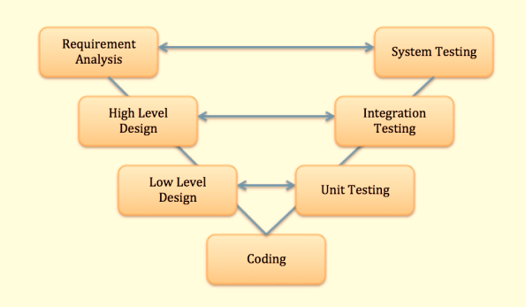

# Testing
## 生命週期
### 軟體開發 SDLC：
從軟體構想開始到軟體退役結束的整個過程，包括規劃、開發、測試、部署、維護等階段。
階段：通常包括需求收集、分析、設計、開發、測試、部署和維護等階段。不同的方法論（例如瀑布模型、敏捷開發）可能在這些階段上有所差異。
### 軟體測試 STLC：
是軟體開發生命週期中的一部分，專注於測試階段和相關活動。
階段：包括測試計劃、測試設計、測試執行、結果評估和報告、問題管理、測試關閉等階段。這些階段通常會根據不同的測試類型和需求而有所調整。

## 軟體開發方法
### 瀑布模型：
* 順序性: 一種線性、順序式的開發方法。開發過程按照固定的階段進行，如需求定義、設計、開發、測試和維護，每個階段在上一階段完成後才開始。
* 固定需求: 需求在開始時被確定並且不易更改。整個開發過程以這些固定的需求為基礎進行。
* 全面計劃: 開發前需要制定全面的計劃和文檔，並且通常在後續階段才能進行修改。

瀑布模型的問題：測試僅在實現完成後才開始；為了解決這個問題，開發了V 測試模型，其中開發生命週期中的每個階段都有相應的測試階段。

* 模型左邊是軟體開發生命週期－SDLC
* 模型右邊是軟體測試生命週期－STLC

### 敏捷開發：
* 靈活性和迭代性: 強調靈活性和迭代。開發過程被分為短小的時間框架，稱為迭代或者衝刺，在每個迭代中持續進行需求、設計、開發和測試。
* 變化接受度: 允許需求的變化和修正。團隊能夠靈活地應對新的需求或者改變現有的需求，以滿足客戶的需求變化。
* 重視互動和溝通: 強調團隊之間的合作和溝通，包括與客戶的緊密合作，以確保開發過程中的透明度和共識。

## 測試的類型
### 功能測試
* 單元測試（Unit Testing）：針對程式碼中的個別模組或功能進行測試，確保其獨立運作正常。
* 整合測試（Integration Testing）：檢驗不同模組或組件結合後的功能性，確保它們在一起協同運作。
### 非功能性測試
* 性能測試（Performance Testing）：評估系統在各種負載條件下的性能，例如效能、伸縮性和穩定性。
* 安全測試（Security Testing）：檢查系統的安全性，發現潛在的安全漏洞和風險。
* 可靠性測試（Reliability Testing）：評估系統在長時間運行下的穩定性和可靠性。
### 測試覆蓋範圍
* 接受測試（Acceptance Testing）：由最終用戶或客戶進行的測試，驗證軟體是否符合需求和預期。
* 回歸測試（Regression Testing）：在修改或新增功能後，重新執行現有測試以確保新的更改沒有破壞先前的功能。
### 使用者體驗測試
* 使用者介面測試（UI Testing）：驗證使用者介面的正確性和易用性。
* 可用性測試（Usability Testing）：評估軟體的使用者友好性和易用性。
### 其他測試類型
* 壓力測試（Stress Testing）：測試系統在極限條件下的表現和穩定性。
* 隨機測試（Random Testing）：通過隨機生成輸入來測試系統，以發現潛在的錯誤和問題。

## 測試方法
### 白盒測試（White Box Testing）
* 焦點：測試者知道軟體內部的結構、程式碼和邏輯。
* 方法：測試者根據程式碼、流程、邏輯和內部結構來設計測試用例，以確保每個程式碼段或路徑都被適當地測試到。
* 工具：常用的測試技術包括程式碼測試（如單元測試、整合測試），程式碼覆蓋率分析等。
### 黑盒測試（Black Box Testing）
* 焦點：測試者沒有內部程式碼或結構的知識，只關注功能和輸入與輸出的關係。
* 方法：測試者基於需求和規格來設計測試用例，測試系統的功能是否符合預期，而不考慮內部實現。
* 工具：測試技術包括功能測試、接受測試、回歸測試等，以確保系統符合預期需求。