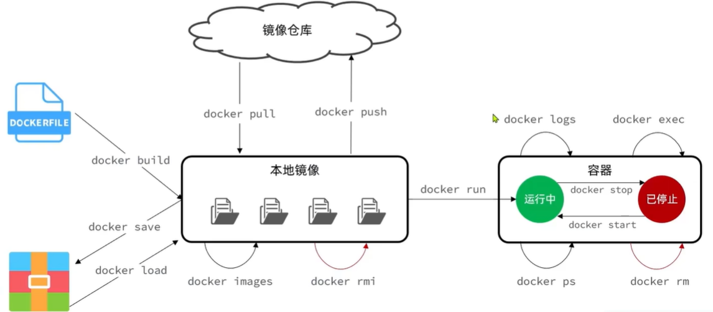
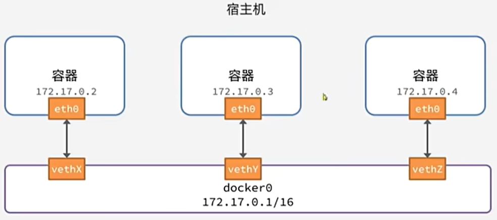

# Docker Highlights
https://docs.docker.com/reference/
以下操作以centOS7為例
## 安裝
1. 如果有舊版本，先解除安裝
```shell=
yum remove docker \
    docker-client \
    docker-client-latest \
    docker-common \
    docker-latest \
    docker-latest-logrotate \
    docker-logrotate \
    docker-engine
```
2. 安裝工具包`yum install -y yum-utils`
3. 配置存儲庫`yum-config-manager --add-repo https://download.docker.com/linux/centos/docker-ce.repo`
4. 安裝docker`yum install -y docker-ce docker-ce-cli containerd.io docker-buildx-plugin docker-compose-plugin`
5. 驗證：先啟動`systemctl start docker` 再檢視鏡像`docker images`、或是`docker -v`

### 快速入門
```shell=
docker run -d \
  --name mysql \
  -p 3306:3306 \
  -e TZ=Asia/Taipei \
  -e MYSQL_ROOT_PASSWORD=123 \
  mysql
  
docker exec -it mysql mysql -uroot -p
```
1. 創建並運行一個容器，-d則是讓容器以後台進程運行
2. 給容器取名字叫mysql
3. 設置端口映射(宿主機端口:容器內端口)
4. 配置容器內進程運行時的一些參數(設置時區)
5. 設置MySQL默認密碼
6. 設置鏡像名稱(REPOSITORY:TAG，在未指定TAG的情況下，默認是最新版本mysql:latest)
7. 進入MySQL

```shell=
docker pull nginx
docker run -d --name nginx -p 80:80 nginx
docker inspect nginx
docker exec -it nginx bash
```
1. 拉取Nginx 鏡像
2. 創建並運行容器
3. 查看容器詳細信息
4. 進入容器，查看容器內目錄


## 服務
* `systemctl start docker`：啟動，開始運行守護程序。
* `systemctl stop docker`：停止，停止運行守護程序。
* `systemctl restart docker`：重啟，停止再啟動守護程序。
* `systemctl status docker`：查看服務的運行狀態。
* `systemctl enable docker`：設置服務開機自動啟動。

## 鏡像
* `docker pull`：拉取鏡像
* `docker push`：推送鏡像到DockerRegistry
* `docker images`：查看本地鏡像
* `docker rmi`：刪除本地鏡像
* `docker run`：創建並運行容器（不能重覆創建）

`-i` 保持運行、通常與`-t` 一起使用，創建後自動進入、退出(exit)後自動關閉。
`-t` 分配偽輸入終端、通常與`-i` 一起使用。
`-d` 背景運行，需要用docker exec進入，退出後不會關閉。
`-it`稱為交互式容器、`-id`稱為守護式容器。

* `docker stop`：停止指定容器
* `docker start`：啟動指定容器
* `docker restart`：重新啟動容器
* `docker rm`：刪除指定容器
* `docker ps`：查看容器
* `docker logs`：查看容器運行日志
* `docker exec`：進入容器
* `docker save`：保存鏡像到本地壓縮文件
* `docker load`：加載本地壓縮文件到鏡像
* `docker inspect`：查看容器詳細信息
* `docker search`：搜尋鏡像

查詢指令`docker 指令 --help`，例如`docker run --help`
### 命令別名
給常用Docker命令起別名，方便我們訪問
```shell=
# 修改/root/.bashrc文件
vi /root/.bashrc
內容如下：
# .bashrc
 
# User specific aliases and functions
 
alias rm='rm -i'
alias cp='cp -i'
alias mv='mv -i'
alias dps='docker ps --format "table {{.ID}}\t{{.Image}}\t{{.Ports}}\t{{.Status}}\t{{.Names}}"'
alias dis='docker images'
 
# Source global definitions
if [ -f /etc/bashrc ]; then
        . /etc/bashrc
fi
```
然後，執行命令使別名生效
`source /root/.bashrc`

## 數據卷
`docker volume create`：創建(實際上不會用到)
`docker volume ls`：查看所有
`docker volume rm`：刪除指定
`docker volume inspect`：查看某個的詳情
`docker volume prune`：清除

容器與數據卷的掛載要在創建容器時配置，而且創建容器的過程中，數據卷會自動創建。

```shell=
# 0.將先前快速入門的Nginx容器刪除
docker rm -f nginx

# 1.首先創建容器並指定數據卷，注意通過 -v 參數來指定數據卷
docker run -d --name nginx -p 80:80 -v html:/usr/share/nginx/html nginx

# -v 數據卷名稱:容器內要掛載的目錄(不指定本地目錄)

# 2.查看數據卷詳情
docker volume inspect html
# 結果
[
    {
        "CreatedAt": "2024-02-21T06:27:41-08:00",
        "Driver": "local",
        "Labels": null,
        "Mountpoint": "/var/lib/docker/volumes/html/_data",
        "Name": "html",
        "Options": null,
        "Scope": "local"
    }
]
 
# 3.查看/var/lib/docker/volumes/html/_data目錄
ll /var/lib/docker/volumes/html/_data
# 可以看到與nginx的html目錄內容一樣，結果如下：
total 8
-rw-r--r-- 1 root root 497 Feb 14 08:03 50x.html
-rw-r--r-- 1 root root 615 Feb 14 08:03 index.html
```

    
### 共享掛載
以上述Nginx 為例
```shell=
docker run -d --name nginx2 -p 81:80 -v /usr/share/nginx/html --volumes-from nginx nginx
docker run -d --name nginx3 -p 82:80 -v /usr/share/nginx/html --volumes-from nginx nginx
```
nginx2、nginx3容器共享掛載nginx

### 指定本地目錄掛載
本地目錄或文件必須以 / 或 ./開頭，如果直接以名字開頭，會被識別為數據卷名而非本地目錄名。
```shell=
-v mysql:/var/lib/mysql # 會被識別為一個數據卷叫mysql，運行時會自動創建這個數據卷
-v ./mysql:/var/lib/mysql # 會被識別為當前目錄下的mysql目錄，運行時如果不存在會創建目錄
```
以快速入門的mysql 容器為例
* 掛載/root/mysql/data到容器內的/var/lib/mysql目錄
* 掛載/root/mysql/init到容器內的/docker-entrypoint-initdb.d目錄（初始化的SQL腳本目錄）
* 掛載/root/mysql/conf到容器內的/etc/mysql/conf.d目錄（這個是MySQL配置文件目錄）

```shell=
# 刪除先前的容器
docker rm -f mysql

docker run -d \
  --name mysql \
  -p 3306:3306 \
  -e TZ=Asia/Taipei \
  -e MYSQL_ROOT_PASSWORD=123 \
  -v /root/mysql/data:/var/lib/mysql \
  -v /root/mysql/conf:/etc/mysql/conf.d \
  -v /root/mysql/init:/docker-entrypoint-initdb.d \
  mysql
```

## Dockerfile
| 指令 | 說明 | 範例 |
| -------- | -------- | -------- |
| FROM  | 指定基礎鏡像  | FROM centos:7  |
| ENV  | 設置環境變量，可在後面指令使用  | ENV key value  |
| COPY  | 拷貝本地文件到鏡像的指定目錄  | COPY ./xx.jar /tmp/app.jar  |
| RUN | 執行Linux的shell命令，一般是安裝過程的命令  | RUN yum install gcc  |
| EXPOSE  | 指定容器運行時監聽的端口，是給鏡像使用者看的  | EXPOSE 8080  |
| ENTRYPOINT  | 鏡像中應用的啟動命令，容器運行時調用  | ENTRYPOINT java -jar xx.jar  |
| MAINTAINER | 作者訊息 | MAINTAINER John Doe |
| LABEL | 標籤 | LABEL version="1.0" description="This is a sample Dockerfile" |
| CMD | 容器啟動命令 | CMD ["java", "-jar", "app.jar"] |
| ADD | 添加文件 | ADD app.jar /app |
| ARG | 構建參數 | ARG BUILD_DATE |
| VOLUME | 定義外部可以掛載的數據卷 | VOLUME /data |
| WORKDIR | 工作目錄 | WORKDIR /app |
| USER | 指定執行用戶 | USER nobody |
| HEALTHCHECK | 健康檢查 | HEALTHCHECK --interval=5m --timeout=3s \ |

範例：基於Ubuntu鏡像來構建一個Java應用
```shell=
# 指定基礎鏡像
FROM ubuntu:16.04
# 配置環境變量，JDK的安裝目錄、容器內時區
ENV JAVA_DIR=/usr/local
ENV TZ=Asia/Taipei
# 拷貝jdk和java項目的包
COPY ./jdk8.tar.gz $JAVA_DIR/
COPY ./docker-demo.jar /tmp/app.jar
# 設定時區
RUN ln -snf /usr/share/zoneinfo/$TZ /etc/localtime && echo $TZ > /etc/timezone
# 安裝JDK
RUN cd $JAVA_DIR \
 && tar -xf ./jdk8.tar.gz \
 && mv ./jdk1.8.0_144 ./java8
# 配置環境變量
ENV JAVA_HOME=$JAVA_DIR/java8
ENV PATH=$PATH:$JAVA_HOME/bin
# 指定項目監聽的端口
EXPOSE 8080
# 入口，java項目的啟動命令
ENTRYPOINT ["java", "-jar", "/app.jar"]
```
Linux系統環境、JDK環境等基礎建置已經有人提供了基礎鏡像，以上可簡化成
```shell=
# 基礎鏡像
FROM openjdk:11.0-jre-buster
# 設定時區
ENV TZ=Asia/Taipei
RUN ln -snf /usr/share/zoneinfo/$TZ /etc/localtime && echo $TZ > /etc/timezone
# 拷貝jar包
COPY docker-demo.jar /app.jar
# 入口
ENTRYPOINT ["java", "-jar", "/app.jar"]
```

### 實作
1. 準備一個Springboot web專案(demo-1.0.0.jar)，簡單一個Helloworld 示例即可
2. 準備Dockerfile 文件
```shell=
# 基礎鏡像
FROM openjdk:17-ea-slim-buster
# 設定時區
ENV TZ=Asia/Taipei
RUN ln -snf /usr/share/zoneinfo/$TZ /etc/localtime && echo $TZ > /etc/timezone
# 拷貝jar包
COPY demo-1.0.0.jar /app.jar
# 入口
ENTRYPOINT ["java", "-jar", "/app.jar"]
```
3. 將以上兩個檔案放到VM `/root/demo` 中
4. 準備基礎鏡像`docker pull openjdk:17-ea-slim-buster`
4. 在`/root/demo` 構建鏡像：`docker build -t docker-demo .`

* `docker build`：就是構建一個docker鏡像
* `-t docker-demo`：`-t` 參數是指定鏡像的名稱（repository:tag，不指定tag 時默認為latest）
* `.`：最後的點是指構建時Dockerfile 所在路徑，由於我們進入了demo 目錄，所以指定的是`.`代表當前目錄，也可以直接指定Dockerfile 目錄：`docker build -t docker-demo /root/demo`

5. 啟用`docker run -d --name myHelloWorld -p 8080:8080 docker-demo`

## 網路
默認情況下，所有容器都是以bridge 方式連接到Docker 的一個虛擬網橋上

但是，容器的IP 其實是一個虛擬的IP，其值並不固定與某一個容器綁定，如果我們在開發時寫死某個IP，而在部署時很可能發生變化，連接失敗。

所以，我們必須借助於docker的網路功能來解決這個問題

| 指令 | 說明 |
| -------- | -------- |
| docker network create | 創建一個網路 |
| docker network ls | 查看所有網路 |
| docker network rm | 刪除指定網路 |
| docker network prune | 清除未使用的網路 |
| docker network connect | 使指定容器連接加入某網路 |
| docker network disconnect | 使指定容器連接離開某網路 |
| docker network inspect | 查看網路詳細信息 |

1. 創建網路：`docker network create myNet`
2. 查看
```shell=
docker network ls
#結果
NETWORK ID     NAME      DRIVER    SCOPE
9f0ae4d3e4ce   bridge    bridge    local
7bbc9145c5ba   host      host      local
eb0c352cb66c   myNet     bridge    local
44c09cafef3d   none      null      local
#除了myNet、其他都是默認的網路
```
3. 指定容器加入網路：`docker network connect myNet mysql`
4. 另一個指定容器加入網路的方式，啟動容器時指定
```shell=
#先將原來的myHelloWorld 刪除
docker rm -f myHelloWorld

docker run -d --name myHelloWorld -p 8080:8080 --network myNet docker-demo
```
5. 驗證
```shell=
docker exec -it mysql bash

bash-4.4# curl myHelloWorld:8080
#結果
HelloWorld
```

## Docker Compose
假設我們要部署一個簡單的java項目，其中包含3個容器：MySQL、Nginx、Java專案，可以透過一個單獨的docker-compose.yml 模板文件來定義一組相關聯的應用容器。

由於service就是在定義某個應用的運行時參數，因此與docker run參數非常相似。

| docker run 參數 | docker compose 指令 | 說明 |
| -------- | -------- | -------- |
| --name | container_name | 容器名稱 |
| -p | ports | 端口映射 |
| -e | environment | 環境變量 |
| -v | volumes | 數據卷配置 |
| --network | networks | 網路 |

範例
```shell=
version: "3.8"
 
services:
  mysql:
    image: mysql
    container_name: mysql
    ports:
      - "3306:3306"
    environment:
      TZ: Asia/Taipei
      MYSQL_ROOT_PASSWORD: 123
    volumes:
      - "./mysql/conf:/etc/mysql/conf.d"
      - "./mysql/data:/var/lib/mysql"
      - "./mysql/init:/docker-entrypoint-initdb.d"
    networks:
      - my-net
  myMall:
    build: 
      context: .
      dockerfile: Dockerfile
    container_name: myMall
    ports:
      - "8080:8080"
    networks:
      - my-net
    depends_on:
      - mysql
  nginx:
    image: nginx
    container_name: nginx
    ports:
      - "18080:18080"
      - "18081:18081"
    volumes:
      - "./nginx/nginx.conf:/etc/nginx/nginx.conf"
      - "./nginx/html:/usr/share/nginx/html"
    depends_on:
      - myMall
    networks:
      - my-net
networks:
  my-net:
    name: myNet
```
編寫好docker-compose.yml 文件，就可以部署項目了。`docker compose [OPTIONS] [COMMAND]`

| 類型 | 參數或指令 | 說明 |
| -------- | -------- | -------- |
| Options | -f | 指定compose文件的路徑和名稱 |
| Options | -p | 指定project名稱。project就是當前compose文件中設置的多個service的集合，是邏輯概念 |
| Commands | up | 創建並啟動所有service容器 |
| Commands | down | 停止並移除所有容器、網路 |
| Commands | ps | 列出所有啟動的容器 |
| Commands | logs | 查看指定容器的日誌 |
| Commands | stop | 停止容器 |
| Commands | start | 啟動容器 |
| Commands | restart | 重啟容器 |
| Commands | top | 查看運行的進程 |
| Commands | exec | 在指定的運行中容器中執行命令 |

1. 將docker-compose.yml 放在`/root` 中
2. 啟動(若有舊容器和鏡像要先刪除)：`docker compose up -d`
3. 驗證：`docker compose ps`