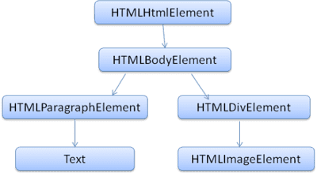

# Browsers
## 主要功能
向伺服器要求該資源，並在瀏覽器視窗中顯示該資源，藉此顯示您選擇的網路服務。 資源通常是 HTML 文件，但也可能是 PDF、圖片或其他類型的內容。 資源的位置是由使用者以 URI (統一資源識別碼) 指定。

瀏覽器解讀及顯示 HTML 檔案的方式請參閱 HTML 和 CSS 規格。 這些規格由 W3C (全球資訊網協會) 機構負責維護，該機構是網路的標準機構。多年來瀏覽器只遵守部分規格，並自行開發出擴充功能，導致網頁作者發生嚴重的相容性問題。現今大多數的瀏覽器都符合規格需求。

瀏覽器的使用者介面之間有許多共通點。常見的使用者介面元素包括：

* 用於插入 URI 的網址列
* 「上一頁」和「下一頁」按鈕
* 書籤選項
* 重新整理及停止按鈕，用於重新整理或停止載入目前的文件
* 前往首頁按鈕

瀏覽器使用者介面並未指定任何正式規格，只是來自多年經驗和瀏覽器模仿彼此的良好做法。 HTML5 規格不會定義瀏覽器必須加入的 UI 元素，但會列出部分常見元素。包括網址列、狀態列和工具列。當然，有些瀏覽器專用的功能，例如 Firefox 的下載管理員。
## 主要元件
* 使用者介面：包含網址列、上一頁/下一頁按鈕、書籤選單等。
* 瀏覽器引擎：在使用者介面和渲染引擎之間運作。
* 渲染引擎render engine ：負責顯示要求的內容。舉例來說，如果要求的內容是 HTML，則渲染引擎會剖析 HTML 和 CSS，並在螢幕上顯示剖析的內容。
* 網路：用於 HTTP 要求等網路呼叫，針對平台獨立介面背後的不同平台使用不同的實作方式。
* UI 後端：用於繪製基本小工具，例如下拉式方塊和視窗。
* JavaScript 解譯器：用於剖析及執行 JavaScript 程式碼。
* 資料儲存：這是持久層。瀏覽器可能需要將所有類型的資料 (例如 Cookie) 儲存在本機。瀏覽器也支援儲存機制，例如 localStorage、IndexedDB、WebSQL 和 FileSystem。


請注意，Chrome 這類瀏覽器會執行多個渲染引擎執行個體，每個分頁各一個執行個體。而各個分頁會以獨立程序執行。
### 渲染引擎
不同的瀏覽器使用不同的渲染引擎：Internet Explorer 使用 Trident，Firefox 使用 Gecko，Safari 是 WebKit。Chrome 和 Opera (第 15 版) 使用 Blink，這是 WebKit 的分支。

剖析 HTML 文件，然後將元素轉換成樹狀結構中的 DOM 節點。引擎會剖析外部 CSS 檔案和樣式元素中的樣式資料。系統會利用 HTML 中的視覺化操作說明來為資訊設定樣式，藉此建立另一個樹狀結構：渲染樹狀結構render tree 。
渲染樹狀結構後，系統會進行「layout」程序。提供每個節點在畫面上顯示的確切座標。下一階段是繪製 - 系統會穿越渲染樹狀結構，並使用 UI 後端層繪製每個節點。

為提供更優質的使用者體驗，渲染引擎會盡快嘗試在螢幕上顯示內容。 等到所有 HTML 剖析完畢後，才開始建構及配置渲染樹狀結構。系統會剖析並顯示內容的某些部分，同時處理來自網路的其餘內容。

以WebKit 為例

## HTML 剖析
將 HTML 標記剖析為剖析樹狀結構，使用的語法是「軟」語法，而非 XML 的相對語法及要求嚴苛的語法，即 HTML 網頁一律不會顯示「語法無效」錯誤、瀏覽器會修正所有無效的內容並繼續作業。

DOM 是 Document Object Model (文件物件模型) 的簡稱。
```
<html>
  <body>
    <p>
      Hello World
    </p>
    <div> </div>
  </body>
</html>
```
系統會將這個標記轉譯為下列 DOM 樹狀結構：

## CSS 剖析
CSS 是一種沒有架構的文法，不同瀏覽器也會在CSS 文法檔案中建立各自的剖析器，不論是由上而下或是由下而上。
每個 CSS 檔案都會剖析為 StyleSheet 物件。每個物件都包含 CSS 規則。CSS 規則物件包含選取器和宣告物件，以及與 CSS 文法對應的其他物件。


## script和style sheet
剖析器達到`<script>` 標記時，系統會暫停剖析文件，直到script指令碼執行為止。如果是外部的指令碼，那麼必須先從網路擷取資源；系統會同步完成這項作業，並停止剖析資源，直到資源擷取完成為止。 這種模式已有多年的歷史，也按 HTML4 和 5 規格指定。 作者可以在指令碼中加入「defer」屬性，如此一來，文件就不會停止剖析，而且會在文件剖析後執行。HTML5 新增了將指令碼標示為非同步的選項，以便讓不同執行緒剖析及執行該指令碼。

而style sheet不會變更 DOM 樹狀結構，因此沒有必要等待文件，並停止剖析文件。但是，在文件剖析階段中，script指令碼可能會要求提供樣式資訊。如果尚未載入並剖析樣式，指令碼將會出現錯誤，不同瀏覽器會有各自的解決方案；如果樣式表仍在載入及剖析，Firefox 會封鎖所有指令碼。WebKit 只有在嘗試存取可能受到未載入樣式表影響的特定樣式屬性時，才會封鎖指令碼。

## 渲染樹狀結構
建構 DOM 樹狀結構時，瀏覽器會建構另一個樹狀結構 (即渲染樹狀結構)，用途是允許依正確順序繪製內容。
建構渲染樹狀結構時，必須計算每個渲染物件的視覺屬性。其方法是計算每個元素的樣式屬性；此樣式包含 HTML 中不同來源的樣式表、內嵌樣式元素和視覺屬性 (例如「bgcolor」屬性)。

## 版面配置
建立渲染器並新增至樹狀結構時，沒有位置和大小。計算這些值時稱為版面配置或重排。

HTML 使用以流為基礎的版面配置模型，這表示在大多數情況下，都能計算一次幾何圖形。在流中晚形成的元素通常不會影響到早形成的元素，因此版面配置可以由左至右、由上到下依序瀏覽文件。例外狀況如下：舉例來說，HTML 表格可能需要多次傳遞。

版面配置也有分為全域和漸進式、非同步和同步。
## 繪畫
在繪圖階段，系統會掃遍渲染樹狀結構，然後呼叫渲染器的「paint()」方法，以在螢幕上顯示內容。 繪製作業使用 UI 基礎架構元件。