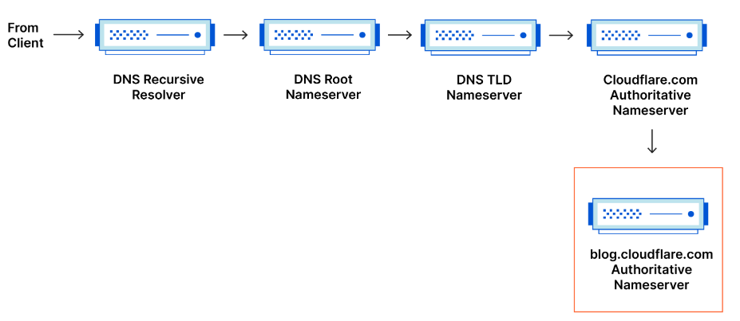

# DNS and how it works?
Domain Name System (DNS)，人們透過網域在線上存取訊息，例如 nytimes.com 或 espn.com。Web 瀏覽器透過Internet 協定 (IP)位址進行互動。DNS 將網域名稱轉換為IP 位址，以便瀏覽器載入 Internet 資源。

## 載入網頁涉及 4 個 DNS 伺服器
* DNS 遞歸器DNS recursor - 遞歸器可以被視為圖書館員，他被要求去圖書館的某個地方查找特定的書籍。DNS 遞歸器是一種伺服器，旨在透過 Web 瀏覽器等應用程式接收來自用戶端電腦的查詢。通常，遞歸器負責發出額外的請求，以滿足客戶端的 DNS 查詢。
* 根名稱伺服器Root nameserver - 根伺服器是將人類可讀的主機名稱轉換（解析）為 IP 位址的第一步。它可以被認為是圖書館中的索引，指向不同書架 - 通常它用作其他更具體位置的參考。
* TLD 名稱伺服器TLD nameserver - 頂級網域伺服器 (top level domain server) 可以被視為圖書館中的特定書架。此名稱伺服器是搜尋特定 IP 位址的下一步，它託管主機名稱的最後部分（在 example.com 中，TLD 伺服器是「com」）。
* 權威名稱伺服器Authoritative nameserver - 這個最終名稱伺服器可以被認為是書架上的一本字典，其中特定名稱可以翻譯為其定義。權威網域名稱伺服器是網域名稱伺服器查詢的最後一站。如果權威名稱伺服器有權存取所請求的記錄，它會將所請求主機名稱的 IP 位址傳回給發出初始請求的 DNS 遞歸器（圖書館員）。
### 遞迴 DNS 解析器Recursive DNS resolver
回應客戶端遞歸請求並花時間追蹤DNS 記錄的電腦。它透過發出一系列請求來實現此目的，直到到達所請求記錄的權威 DNS 名稱伺服器（如果未找到記錄，則逾時或傳回錯誤）。
快取是一種資料持久性過程，可透過在 DNS 中找到的早期提供所請求的資源記錄來協助縮短必要的請求。
解析器伺服器通常是您的 網路服務提供者 (ISP Internet service provider) 。所有解析器都必須知道一件事：根伺服器的位置。
### 權威DNS伺服器Authoritative DNS server
實際保存並負責DNS資源記錄的伺服器。這是 DNS 查找鏈底部的伺服器，它將回應查詢的資源記錄，最終允許發出請求的 Web 瀏覽器到達訪問網站或其他 Web 資源所需的 IP 位址。

值得一提的是，在查詢子網域（例如 foo.example.com 或 blog.cloudflare.com ）的情況下，將在權威網域名稱伺服器之後的序列中新增一個額外的網域伺服器，該網域伺服器負責儲存子域名的CNAME 記錄。

## DNS 查找的步驟
1. 使用者在 Web 瀏覽器中輸入 example.com，查詢就會傳送到 Internet 並由 **DNS 遞歸解析器**接收。
2. 然後解析器查詢 **DNS 根伺服器**。
3. 然後，根伺服器使用**頂級網域 (TLD) DNS 伺服器**（例如 .com 或 .net）的位址回應解析器，該伺服器儲存其網域的資訊。搜尋 example.com 時，我們的請求指向 .com TLD。
4. 然後解析器向 .com TLD 發出請求。
5. 然後，TLD 伺服器使用網域名稱伺服器的 IP 位址 example.com 進行回應。
6. 最後，遞歸解析器向網域的名稱伺服器發送查詢。
7. 然後 example.com 的 IP 位址從名稱伺服器返回解析器。
8. 然後，DNS 解析器使用最初要求的網域的 IP 位址來回應 Web 瀏覽器。

一旦 DNS 查找的 8 個步驟傳回了 example.com 的 IP 位址，瀏覽器就可以發出對該網頁的請求：

9. 瀏覽器向 IP 位址發出HTTP請求。
10. 該 IP 上的伺服器會傳回要在瀏覽器中呈現的網頁。

## DNS 查詢的類型
1. 遞歸查詢 - 在遞歸查詢中，DNS 用戶端要求 DNS 伺服器（通常是 DNS 遞歸解析器）使用所要求的資源記錄或錯誤訊息（如果解析器找不到該記錄）來回應用戶端。
2. 迭代查詢 - DNS 客戶端將允許 DNS 伺服器返回其所能返回的最佳答案。如果查詢的 DNS 伺服器沒有與查詢名稱相符的內容，它將傳回對權威DNS伺服器而言較低層級的網域命名空間的參考。然後 DNS 客戶端將查詢引用位址。此程序將繼續使用查詢鏈中的其他 DNS 伺服器，直到發生錯誤或逾時。
3. 非遞歸查詢 - 通常，當 DNS 解析器客戶端向 DNS 伺服器查詢它有權存取的記錄時，就會發生這種情況，因為它對該記錄具有權威性，或者該記錄存在於其快取內。通常，DNS 伺服器會快取 DNS 記錄，以防止額外的頻寬消耗和上游伺服器的負載。
## 快取
DNS 快取會將資料儲存在更靠近請求客戶端的位置，以便可以更早解析 DNS 查詢。
### 瀏覽器 DNS 快取
現代 Web 瀏覽器預快取 DNS 記錄。DNS 快取離 Web 瀏覽器越近，檢查快取並向 IP 位址發出正確請求所需的處理步驟就越少。瀏覽器快取也是檢查所請求記錄的第一個位置。

在 Chrome 中，可以透過前往 chrome://net-internals/#dns 查看 DNS 快取的狀態。
### 作業系統 (OS) 等級 DNS 快取：
是DNS 查詢離開您的電腦之前的第二個也是最後一個本機停止點。
作業系統內用於處理此查詢的程序稱為「存根解析器stub resolver」或 DNS 客戶端。當存根解析器從應用程式取得請求時，它會先檢查自己的快取是否有記錄。如果沒有，就會在本機網路外部向 ISP 內部的 DNS 遞歸解析器發送 DNS 查詢。

當 ISP 內部的遞歸解析器收到 DNS 查詢時，與先前的所有步驟一樣，它還會檢查請求的主機到 IP 位址的轉換是否已儲存在其自身持久層內。

遞歸解析器還具有附加功能，具體取決於其快取中的記錄類型：
1. 如果解析器沒有A 記錄，但有權威網域名稱伺服器的NS 記錄，它將直接查詢這些網域名稱伺服器，繞過 DNS 查詢中的幾個步驟。此捷徑可防止從根名稱伺服器和 .com 名稱伺服器（在我們搜尋 example.com 中）進行查找，並有助於更快地解析 DNS 查詢。
2. 如果解析器沒有 NS 記錄，它將向 TLD 伺服器（在我們的例子中為 .com）發送查詢，跳過根伺服器。
3. 萬一解析器沒有指向 TLD 伺服器的記錄，它將查詢根伺服器。此事件通常在 DNS 快取被清除後發生。