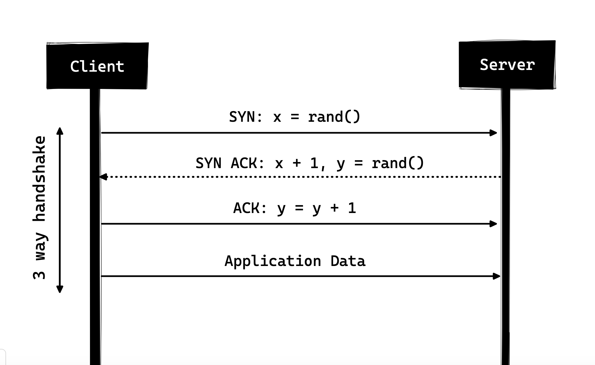

# What is HTTP?
HTTP 是基於 TCP/IP 的應用層通訊協議，它標準化了客戶端和伺服器之間的通訊方式。它定義了如何透過網路請求和傳輸內容。HTTP 本身依賴 TCP/IP 來取得客戶端和伺服器之間的請求和回應。預設情況下，使用 TCP port 80，但也可以使用其他port。然而，HTTPS 使用 443。
## HTTP/0.9 - The One Liner (1991)
HTTP 的第一個有記錄的版本是1991 年提出的HTTP/0.9。它是有史以來最簡單的協定；有一個名為 GET 的方法。如果客戶端必須存取伺服器上的某個網頁，它會發出如下所示的簡單請求
``` 
GET /index.html
```
伺服器的回應如下所示
```
(response body)
(connection closed)
```
也就是說，伺服器將收到請求，回覆 HTML 作為回應，一旦內容傳輸完畢，連線就會關閉。
* 無標題
* GET是唯一允許的方法
* 回應必須是 HTML
## HTTP/1.0 - 1996 年
可以處理其他回應格式，即圖像、視訊檔案、純文字或任何其他內容類型。它添加了更多方法（即 POST 和 HEAD）、更改了請求/回應格式、將 HTTP 標頭添加到請求和回應中、添加了狀態代碼來識別回應、引入了字元集支援、多部分類型、授權、快取、內容編碼等都包含在內。
```
GET / HTTP/1.0
Host: cs.fyi
User-Agent: Mozilla/5.0 (Macintosh; Intel Mac OS X 10_10_5)
Accept: */*
```
除了請求之外，客戶端還發送了它的個人資訊、所需的回應類型等。
對上述請求的回應範例可能如下
```
HTTP/1.0 200 OK 
Content-Type: text/plain
Content-Length: 137582
Expires: Thu, 05 Dec 1997 16:00:00 GMT
Last-Modified: Wed, 5 August 1996 15:55:28 GMT
Server: Apache 0.84

(response body)
(connection closed)
```
回應的開頭是 HTTP/1.0（HTTP 後面跟著版本號），然後是狀態代碼 200，後面跟著原因短語（或狀態代碼的描述，如果您願意的話）
在此較新版本中，請求和回應標頭仍保留為 ASCII 編碼，但回應正文可以是任何類型，即圖像、視訊、HTML、純文字或任何其他內容類型。
HTTP/1.0 的主要缺點之一是每個連線不能有多個請求。也就是說，每當客戶端需要從伺服器取得某些內容時，它都必須開啟一個新的 TCP 連接，並且在滿足該單一請求後，連接就會關閉。
### 三向握手
所有 TCP 連線都以三向握手開始，其中客戶端和伺服器在開始共用應用程式資料之前共用一系列資料封包。

* SYN - 客戶端選取一個隨機數（假設為 x），並將其傳送至伺服器。
* SYN ACK - 伺服器透過將 ACK 封包傳送回客戶端來確認請求，該封包由隨機數組成，假設為 y 和數字 x+1，其中 x 是客戶端發送的數字
* ACK - 客戶端遞增從伺服器接收的數 y，並發送回帶有數 y+1 的 ACK 封包

一旦三向握手完成，客戶端和伺服器之間的資料共享就可以開始。應該注意的是，客戶端可以在發送最後一個 ACK 資料封包後立即開始發送應用程式數據，但伺服器仍然必須等待收到 ACK 資料包才能滿足請求。


除了無連接之外，HTTP 也是一種無狀態協議，即伺服器不維護有關客戶端的信息，因此每個請求也無需與先前請求有任何關聯。
## HTTP/1.1 - 1997
* 新增了新的 HTTP 方法，其中引入了 PUT、PATCH、OPTIONS、DELETE
* 主機名稱識別-在 HTTP/1.0 中，主機標頭不是必需的，但 HTTP/1.1 使其成為必需的。
* 持久連線Persistent Connections -如上所述，在 HTTP/1.0 中，每個連線只有一個請求，一旦請求完成，連線就會關閉，這會導致嚴重的效能影響和延遲問題。HTTP/1.1 引入了持久連接，即連接預設不會關閉，而是保持開啟狀態，從而允許多個順序請求。若要關閉連接，請求頭 Connection: close 必須可用。客戶端通常在最後一個請求中發送此標頭以安全地關閉連線。
* 管道化Pipelining -它還引入了對管道化的支持，客戶端可以在同一連接上向伺服器發送多個請求，而無需等待伺服器的回應，並且伺服器必須按照接收請求的順序發送回應。
> 為了從持久連接或管道中受益，Content-Length標頭必須在回應上可用，因為這會讓客戶端知道傳輸何時完成並且可以發送下一個請求（以正常的順序方式）或開始等待下一個回應（啟用管道時）。

* 分塊傳輸Chunked Transfers -在動態內容的情況下，當伺服器在傳輸開始時無法真正找出 Content-Length 時，它可能會開始分塊（逐塊）發送內容，並在發送時為每個塊添加 Content-Length 。當所有區塊都發送完畢（即整個傳輸已完成）時，它會發送一個空區塊（即 Content-Length 設定為零的區塊），以標識傳輸已完成的客戶端。為了通知客戶端有關分塊傳輸的信息，伺服器會加入標頭 Transfer-Encoding: chunked
* 與僅具有基本驗證的 HTTP/1.0 不同，HTTP/1.1 加入摘要digest 和代理身份驗證proxy authentication
* 快取
* 位元組範圍Byte Ranges
* 字元集Character sets
* 語言談判Language negotiation
* 客戶端的cookie
* 增強的壓縮支持
* 新的狀態代碼
* ..和更多

一個簡單的網頁必須打開 30 多個連線。既然HTTP/1.1有持久連接，那為什麼有這麼多連接呢？原因是，在 HTTP/1.1 中，任何時刻只能有一個未完成的連線。
HTTP/1.1 試圖透過引入管道化來解決這個問題，但它並沒有完全解決這個問題，因為隊頭阻塞，緩慢或繁重的請求可能會阻塞後面的請求，一旦請求卡在管道中，它就會被阻塞。為了克服 HTTP/1.1 的這些缺點，開發人員開始實作解決方法，例如使用 spritesheet、CSS 中的編碼圖片、單一龐大的 CSS/Javascript 檔案、網域分片等。
## SPDY-2009
Google繼續嘗試替代協議，以提高網路速度並提高網路安全性，同時減少網頁延遲。2009 年，他們宣布了 SPDY。
> SPDY 是 Google 的商標，而不是縮寫。

如果我們不斷增加頻寬，網路效能一開始會有所提高，但到了某個階段，效能增益就不會太大了。但如果你對延遲也採取同樣的做法，即如果我們不斷降低延遲，那麼效能就會持續提高。這是 SPDY 背後效能增益的核心思想，減少延遲以提高網路效能。
SPDY 並沒有真正嘗試取代 HTTP；它是 HTTP 上的轉換層，存在於應用程式層並在將請求傳送到線路之前對其進行修改。
2015 年，Google 不想出現兩個競爭的標準，因此決定將其合併到 HTTP 中，同時誕生了 HTTP/2 並棄用了 SPDY。
## HTTP/2 - 2015
HTTP/2 專為低延遲內容傳輸而設計。
### 二進位協議(由二進位Binary 取代文本Textual)
HTTP/2 傾向於透過使其成為二進位協定來解決 HTTP/1.x 中存在的延遲增加的問題。作為一種二進制協議，它更容易解析，但與 HTTP/1.x 不同，它不再是人眼可讀的。HTTP/2 的主要構建塊是幀Frames 和流Streams。

HTTP 訊息現在由一個或多個幀組成。有一個用於meta data的 HEADERS frame和用於有效負載的 DATA frame，並且存在多種其他類型的幀（HEADERS、DATA、RST_STREAM、SETTINGS、PRIORITY 等）

每個 HTTP/2 請求和回應都會被賦予一個唯一的stream ID，並被分成幀。幀只不過是二進位資料。幀的集合稱為流。每個幀都有一個stream ID，用於標識其所屬的流，並且每個幀都有一個公共標頭。另外，除了stream ID是唯一的之外，值得一提的是，客戶端發起的任何請求都使用奇數，而伺服器回應的stream ID則為偶數。

值得一提的另一個幀類型是RST_STREAM，用於中止某些流，即客戶端可以發送此幀以讓伺服器知道我不需要此流。在 HTTP/1.1 中，使伺服器停止向客戶端發送回應的唯一方法是關閉連接，這會導致延遲增加，因為必須為任何連續請求開啟新連線。在 HTTP/2 中，客戶端可以使用 RST_STREAM 並停止接收特定串流，同時保持連線。
### 多路復用Multiplexing(單一連線上的多個非同步 HTTP 請求)
由於HTTP/2 現在是一個二進制協議，使用幀和流來進行請求和響應，因此一旦打開TCP 連接，所有流都將通過同一連接異步發送，而無需打開任何其他連接。反過來，伺服器以相同的非同步方式回應，即回應沒有順序，客戶端使用分配的stream ID 來識別特定資料包所屬的流。這也解決了 HTTP/1.x 中存在的阻塞問題。
### 使用 HPACK 進行Header 壓縮
當我們不斷地從同一個客戶端訪問伺服器時，我們會在標頭中一遍又一遍地發送大量冗餘數據，有時可能會有 cookie 增加標頭大小，從而導致頻寬使用和延遲增加。為了克服這個問題，HTTP/2 引入了標頭壓縮。

與請求和回應不同，標頭不會以gzip 或compress 等格式壓縮，但標頭壓縮有不同的機制，即使用霍夫曼代碼Huffman code 對文字值進行編碼；標頭表由客戶端和伺服器維護，客戶端和伺服器在後續請求中省略任何重複的標頭，並使用兩者維護的標頭表來引用它們。

標頭仍然與 HTTP/1.1 中的相同，除了添加了一些偽標頭，即`:method`、`:scheme`、`:host`、`:path`
### 伺服器推播(單一請求的多個回應)
伺服器知道客戶端將請求某個資源，可以將其推送給客戶端，甚至無需客戶端請求。

伺服器推播允許伺服器透過推送它知道客戶端將需要的資料來減少往返次數。其工作原理是，伺服器發送一個名為 PUSH_PROMISE 的特殊幀，通知客戶端：「嘿，我即將將此資源發送給您！別向我要。」 PUSH_PROMISE 幀與導致推播發生的流相關聯，它包含承諾的stream ID，即伺服器將在其上發送要推播的資源流。
### 請求優先級
客戶端可以透過在流的 HEADERS frame 中加入優先權資訊來為流分配優先權。在任何其他時間，用戶端都可以傳送 PRIORITY frame 來更改流的優先權。

沒有任何優先級訊息，伺服器非同步處理請求，即沒有任何順序。如果為流分配了優先級，則伺服器根據此優先級資訊決定需要分配多少資源來處理哪個請求。
### 安全
儘管 HTTP/2 不要求按規範進行加密，但在預設情況下已成為強制性的。HTTP/2 在透過 TLS 實現時提出了一些要求，必須使用 TLS 版本 1.2 或更高版本，必須有一定程度的最小金鑰大小，需要臨時金鑰等。
## HTTP/3 - 2021
HTTP/3 的一個重要區別是它在一種新的傳輸通訊協定 QUIC 上執行。QUIC 專為行動密集型網際網路使用而設計，在這種環境中，人們攜帶的智慧型手機會在一天中不斷地從一個網路切換到另一個網路。開發第一個網際網路通訊協定時情況並非如此：當時裝置的可攜性較差，且不經常切換網路。

QUIC 的使用意味著 HTTP/3 依賴於 User Datagram Protocol (UDP)，而不是傳輸控制通訊協定 (TCP)。切換到 UDP 將使線上瀏覽時的連線速度和使用者體驗更快。